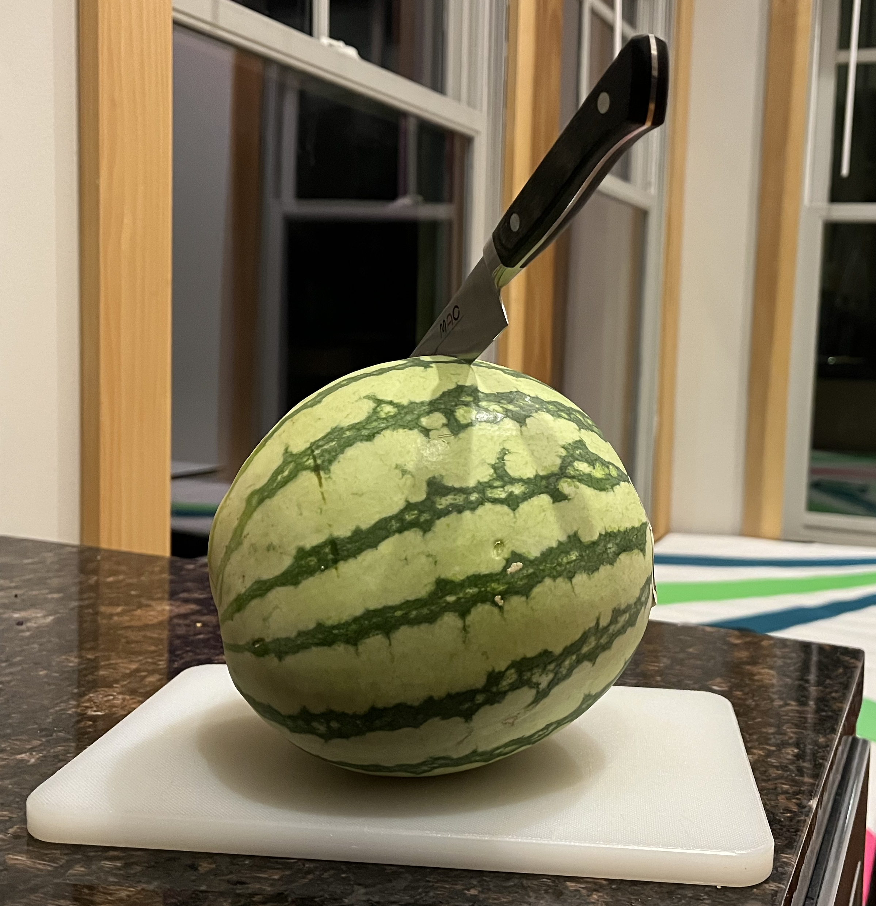

## Today, We Make An Important Decision



```{=html}
<style>
.reveal { background: #ffffff; }
</style>
```

```{webr}
#| label: ggplot-theme
#| include: false

library(ggplot2)

lightgray = "#bbbbbb"
gridcolor = rgb(0,0,0,.1, maxColorValue=1)

lab.theme = theme(
        plot.background = element_rect(fill = "transparent", colour = NA),
        panel.background = element_rect(fill = "transparent", colour = NA),
                    legend.background = element_rect(fill="transparent", colour = NA),
                    legend.box.background = element_rect(fill="transparent", colour = NA),
                    legend.key = element_rect(fill="transparent", colour = NA),
        axis.ticks.x = element_blank(),
        axis.ticks.y = element_blank(),
        axis.text.x  = element_text(colour = lightgray),
        axis.text.y  = element_text(colour = lightgray),
        axis.title.x  = element_blank(),
        axis.title.y  = element_blank(),
        panel.grid.major=element_line(colour=gridcolor),
        panel.grid.minor=element_line(colour=gridcolor, linewidth=0.25))

theme_set(lab.theme)
```


- I'm going to need six participants to help.
  - This is a paid position, but the pay isn't great.
  - The real benefit of participating is influence.
- These people will be our **population**.
- And we're going to *poll them* to find out which of two things they tend to prefer.
- We're not, of course, going to talk to our whole population. That's just too much work.

## Sampling



- By sampling, we're going to cut our effort by half. That's what sampling is for.
- Often, people aren't clear about how they actually get their sample.
  - Or they are clear, but do the math as if they'd sampled some other way.
  - Maybe that's ok. If doing the math 'right' and doing it 'wrong' lead to the same inferences ...
  - ... go ahead and do it wrong. You might say you're using a *simplifying approximation*.
- Today, we're going to look into how much **how we sample** affects inference. 
  
## Our Population

 - Now we've got a population. You know who you are. 
  - When we're doing math and we say 'the population', we tend to refer to a version without irrelevant detail.
  - We boil them down to a list of numbers. Here, that's preferences. 0 for thing A. 1 for thing B.
  
$$
y_1 \ldots y_m \qqtext{ is the standard notation.}
$$

 - To get a sense of what a population looks like, we can plot one.
 - But because we're not going to talk to our whole population, we'll have to make one up.

```{webr}
#| label: define-population
 
m = 6
pop = data.frame(j=1:m, 
                 y=rep(c(0,1), m/2))
                 
scales = list(scale_x_continuous(breaks = 1:m),
              scale_y_continuous(breaks = (0:3/3), labels=sprintf("%d/3", 0:3))) 

pop.plot = ggplot(pop, aes(x = j, y = y)) + 
           geom_point(shape='circle', alpha=.1, size=5) + 
           scales               
pop.plot
```


::: {.panel-tabset}
### Set Up

- *Step 1*. We define our population. 
  - We have $m=6$ people. We'll use the letter $j$ when we're counting them out.
  - We record their preferences. 

- *Step 2*. To make our plots nice, we calculate x and y 'scales' describing the grid we want.

- *Step 3*. We plot their preferences. What does the $\color{gray} x$-coordinate here mean?

### What We're Estimating

- ... is the proportion of these people who prefer *B*, i.e. who have $y_j=1$.
- This could be pretty easy because we've just looked at all the *y*s. 
- But we're going to make it hard for ourselves by acting as if we haven't.
- This practice of *fake data simulation* is an important tool when understanding methods.
  
  1. We make up a fake population.
  2. Run a fake (i.e. simulated) study on them exactly like we're planning to do.
  3. Compare the resulting estimate to the thing we wanted to estimate.
  
- Because it's fake, we get to poll the whole population so ...
 
  1. We know what the right answer is. If we don't, we don't have a well-defined question.
  2. We can run the study over and over again to look at the *distribution* of estimates.
 
- If we're not satisfied with that distribution, that's evidence it's a study we shouldn't be running.
- Once we've done this for a few study designs and seen what works --- or at least what doesn't,...
- ... we'll choose one to use on our actual population. One that, according to plan, hasn't been polled yet.

::: { .fg style="color: gray; font-size: 10pt" } 
If you're not convinced this is a good idea, check out [what Andrew Gelman has to say about it](https://statmodeling.stat.columbia.edu/2019/03/23/yes-i-really-really-really-like-fake-data-simulation-and-i-cant-stop-talking-about-it/).
:::

### ... in Math

$$
\text{estimand} = \frac{1}{m}\sum_{j=1}^m y_j  
$$

### ... in Code
```{webr}
#| label: calculate-estimand
estimand = mean(pop$y)       
estimand
```

### ... Visually

```{webr}
pop.plot + geom_hline(yintercept=estimand,
                      color='green', linewidth=2, alpha=.2)
```

:::

## Estimating It 

- Let's assume we've been *given* a sample. Some list of preferences.

$$
Y_1 \ldots Y_N \qqtext{ is the standard notation.}
$$

- This one. I've taken my plot of the population and *colored in* the dots I talked to.

```{webr}
sampling.rate = 1/2

N = round(m * sampling.rate)
sam = pop[1:N, ]

sam.plot = pop.plot + geom_point(aes(x=j, y=y), data=sam, 
                                 size=5, color='blue', alpha=.5) 
sam.plot 
```

::: {.panel-tabset}
### in Math
$$
\text{estimator} = \frac{1}{N}\sum_{i=1}^N Y_i  \qqtext{ where } Y_1 \ldots Y_N \qqtext{ is our sample } 
$$


### in Code

```{webr}
estimator = function(sam) { 
  Y = sam$y     
  mean(Y) 
}
estimator(sam)
```

### Visually

```{webr}
sam.plot + geom_hline(yintercept=estimator(sam))
```

- The horizontal line shows the mean of my sample $Y_1 \ldots Y_n$. 
- That is, the fraction of times I head 'I prefer B' when I ask someone's preference.

### Terminology

- People often talk as if both $Y_i$ and $y_j$ are the same kind of thing. e.g. people's preferences.
  - That's a source of a lot of confusion because they aren't.
  - To make this clear, it helps to be a bit concrete.
- Let's suppose we're doing a poll by phone. The way we find out someone's preference is to call them.
  - $y_j$ is *a person's preference*. A real person. e.g. the $j$th one in the phone book. 
  - $Y_i$ is *an utterance*. It's *what we hear*  on our $i$th call.
- In this class, no matter what the context, I'll say '$i$th call' and '$j$th' person.
  - It could be a quality control application in a brewery. 
  - I'm opening and pouring a few beers to check that we haven't overcarbonated.
  - My $j$th person is a can and my $i$th call is a glass.
- As you can imagine, that's not what people do in real life. And that's ok.
  - Once you're used to this stuff, you know what they mean.
  - And if you don't, you can ask. You can say, e.g., do you mean 'little $y$' or 'big $Y$'?

### Notation

Why $Y_i$ and $y_j$?

  - This notation helps remind us of what's similar and what's different.
    - We use the same letter to communicate that each (big) $Y$ is *somebody's* (little) $y$. 
    - We capitalize to communicate that $Y_1$ isn't $y_1$.
    - In this class, I like to count them out with different letters too.  
      - $Y_i$ for $i$ from $1$ to $n$. $y_j$ from $j$ from $1$ to $m$
      - The other stuff is common practice. This counting stuff less so. 
  - This same-but-capitalized thing is helpful in writing but not so great speaking.
    - It gets confusing because $Y$ and $y$ are usually pronounced the same.
    - Often, it's clear from context what you mean. 
      - Especially if you say the subscript. 
      - $Y_i$ and $y_j$ sound like 'why eye' and 'why j'
    - But when it's not, we say 'big $Y$' and 'little $y$'

:::

## Repeatedly

We're going to repeat the process this many times.

```{webr}
R = 1000
```

To do that, I'm going to use the function *map_vec* from the package **purrr**.

```{webr}
plus.one = function(x) { x + 1 }
one.to.ten = 0:9 |> map_vec(plus.one)
one.to.ten
```

::: {.panel-tabset}
### What it Does
- It takes two arguments --- a list and a function --- and calls the function on every element of the list.
  - Then gives you back a list --- or actually a vector, hence '_vec' --- of the results. 
  - Lists and vectors being different in **R**. You can *give it* either.
- vs. writing a for loop, this saves us the 'filing'
  - It allocates the output vector and puts each function value into it.
  - To make it a one-liner, you can use an *anonymous function*.

```{webr}
one.to.ten.again = 0:9 |> map_vec(\(x) x+1)
one.to.ten.again
```  

### Mapping and How We're Using It

- This is a built-in function most modern lanuages. Python, Julia, Scheme, Haskell, ML, etc. 
  - And it's always called 'map'. Except in **R**. It's built in, but it's called 'sapply'.
  - I tend to use the **purrr** version just because the name is better.
  - People speak the code above this way: 'map [the function] plus.one over the vector zero through nine'
- We're using it for a reason that's common but not the 'usual reason' people do.
  - We don't actually care about getting passed every element of the list.
  - We just want to *repeat* something --- something random --- a bunch of times. 
  - So we'll pass it a list with the same thing repeated a bunch of times.
- We'll write a function that ...
    - takes as input a population
    - samples the population
    - returns a sample mean---an estimate of the population mean.
- We'll run it `R` times on our population by *mapping* our function over a list containing `R` copies the population.

```{webr}
pops = rep(list(pop), R)
```


### Pipe Syntax

- You may have noticed that I said `map_vec` is function of two arguments.
  - A list. Above, that's `0:9`.
  - A function. Above, that's `plus.one`.
- You'd think I'd call it like this.

```{webr}
map_vec(0:9, plus.one)
```

- Instead, I called it like this.
```{webr}
0:9 |> map_vec(plus.one)
```

- This is called 'piping'. We say the list `0:9` is 'piped in'.
  - `a |> f(...)` is the same as `f(a,...)` for any function `f` and list of arguments `...`.
- We use piping for the same reason we might say ...
  - 'take the list zero to nine and map plus.one over it' ...
  - vs. 'map plus.one over the list zero to nine'. 
- It's especially natural when you want to do a sequence of things to a list.
  - e.g., if we want to take the list zero to nine, add one to each element, then square each result.

```{webr}
square = function(x) { x^2 }
0:9 |> map_vec(plus.one) |> map_vec(square) # in piped form
map_vec(map_vec(0:9, plus.one), square)     # in unpiped form
```


:::

## Step 1. Sampling with Replacement

- To sample *with* replacement, roll a ($m$-sided) die $N$ times.
  - We're using $m=6$, so it's the kind of die you see a lot. 
  - And we're rolling $N=3$ times.
- The first roll tells you who we call first. The second, the second. etc.
  - If your $i$th roll is $4$, $Y_i=y_4$.
- You can also pick balls numbered 1...m out of a hat. Or an urn. Whatever is at hand.
- But you have to *replace* the ball you picked before you pick again.

::: {.panel-tabset}
### Do it 

```{webr}
estimate = NaN                                       
sam.plot = pop.plot + geom_hline(yintercept=estimate)    
sam.plot          
```

- Color in the dots you talked to. 
  - If talked to the same one multiple times, draw in another dot.
- Then draw a horizontal line indicating your estimate: the mean of your sample  $Y_1 \ldots Y_n$.
- I've made the variable *estimate* NaN. That stands for Not a Number. Change it to a number.
  - ggplot will just ignore it until you do, but it'll draw it in once you have. 
  - That'll give you a sense of how precisely you've drawn your line.
- You can **use the built-in whiteboard tool** to do draw with your stylus, mouse, trackpad, etc.
  - You should be able to just draw with a stylus. If you want to scroll and change tabs instead, use a finger.
  - With a mouse or trackpad, double-click to open it the tool.
  - While in whiteboard mode, you can't scroll, type, etc. Click the 'x' on the bottom panel to get out.


### ... Again and Again

```{webr}
with.replacement = function(pop, sampling.rate=1/2) { 
  N = round(m * sampling.rate) 
  J = sample(1:m, N, replace=TRUE)
  sam = pop[J,]
  estimator(sam)
}

estimator.samples =  pops |> map_vec(with.replacement)

ggplot(data.frame(sample=estimator.samples, rep=(1:R)/R)) + 
  geom_bar(aes(x=sample, y=after_stat(prop)), alpha=.3) +
  geom_point(aes(x=sample, y=rep), position=position_jitter(w=.01,h=0), color='purple', alpha=.3) + 
  geom_vline(xintercept=estimate) 
```


**Q.** Why are there four bars?

### Thoughts

- Some of you may have called the same person twice. That feels a little wasteful.
  - If you were willing to make three calls, you could've gained more information.
  - People tend not to like this kind of sampling in real life.
- But there is something to like. The math is easy. 
- We say the $Y$s in our sample are [independent]{.teal} and [identically distributed]{.pink}.
  - [What you hear on one call tells you nothing about what you'll hear on another *if* you've seen the population.]{.teal} 
  - [No two calls are different. The probability of each possible response is the same on all calls.]{.pink}
- The *independent* thing can feel counterintuitive because they could be calls to the same person.
  - The second time you wouldn't have to ask. You'd know their response. 
  - **Q**. Why---informally---does this not make our $Y$s dependent?
  
  ::: fragment 
    - Because it's knowledge about a person, *not a call*. 
    - If you've seen the population already, you wouldn't have to ask *anyone*. 
  :::
  
:::

## Design 2. Sampling *without* Replacement

- To sample *without* replacement, we're picking balls from a hat.
- But this time,  you don't replace the ball you picked.


::: {.panel-tabset}
### Do it 

```{webr}
estimate = NaN                                       
sam.plot = pop.plot + geom_hline(yintercept=estimate)    
sam.plot          
```

### ... Again and Again

```{webr}
# editor-code-line-numbers: 2
without.replacement = function(pop, sampling.rate=1/2) {
  N = round(m * sampling.rate) 
  J = sample(1:m, N, replace=FALSE)
  sam = pop[J,]
  estimator(sam)
}

estimator.samples =  pops |> map_vec(without.replacement)

ggplot(data.frame(sample=estimator.samples, rep=(1:R)/R)) + 
  geom_bar(aes(x=sample, y=after_stat(prop)), alpha=.3) +
  geom_point(aes(x=sample, y=rep), position=position_jitter(w=.01,h=0), color='purple', alpha=.3) + 
  geom_vline(xintercept=estimate) 
```

In **R**, this a one line change to the sampling code.

### Thoughts

- People like this because it doesn't feel wasteful. You don't call the same person twice.
- But it makes the math a bit harder. Calls *aren't independent*.
- So people often *do* this, and *do the math* as if they'd sampled with replacement.
- The justification is that, with enough balls, you weren't going to pick the same one twice anyway.
- What do you think of this? Do you think it makes sense?

:::


## Design 3. Randomization a.k.a. Bernoulli Sampling

- To sample by randomization, we have everyone in our population flip a coin.
- Our sample is everyone who flips heads. 

::: {.panel-tabset}
### Do it  

```{webr}
estimate = NaN                                       
sam.plot = pop.plot + geom_hline(yintercept=estimate)    
sam.plot          
```

### ... Again and Again

```{webr}
# editor-code-line-numbers: 2-3
by.randomization = function(pop, sampling.rate=1/2) {
  flips = rbinom(m, 1, sampling.rate)
  sam = pop[flips==1,]
  estimator(sam)
}

estimator.samples =  pops |> map_vec(by.randomization)

ggplot(data.frame(sample=estimator.samples, rep=(1:R)/R)) + 
  geom_bar(aes(x=sample, y=after_stat(prop)), alpha=.3) +
  geom_point(aes(x=sample, y=rep), position=position_jitter(w=.01,h=0), color='purple', alpha=.3) + 
  geom_vline(xintercept=estimate) 
```
 
- The binomial distribution sampled by `rbinom(m,k,1/2)` is the distribution of the sum of $k$ flips.
- Taking $k=1$, we get the sum of one flip. A flip. 
- **Q.** We're getting more than 4 values. Why?

### Thoughts

- This one combines the benefits of the last two.
  - We don't call anyone twice.
  - The math is easy because *flips* are independent.
- But there's a price. What is it? 

::: fragment
 - Sample size is random. And zero is an option. 
:::
  

### Generalization

- When we do this, our sample size is usually roughly half our population size.
- What should we do if we want to get a sample roughly *a sixth* our population size? Or *a third*?
- Are you equipped to do that?

:::

## Design 4. Convenience Sampling

- A convenience sample is what it sounds like. 
- Pick any 3 people you want. Minimize effort.

::: {.panel-tabset}
### Do it  

```{webr}
estimate = NaN                                       
sam.plot = pop.plot + geom_hline(yintercept=estimate)    
sam.plot          
```

### ... Again and Again

```{webr}

```

### Thoughts

- What do you think about this? How do you analyze it?
- Do you have enough intuition to sketch the distribution? Even a caricature?

:::


## Design 5. Shuffling

- To sample by shuffling, put cards labeled 1...m in random order. e.g., by hand-shuffling well.
- To get a sample of size N, pick N cards off the top. 


::: {.panel-tabset}
### Do it 

```{webr}
estimate = NaN                                       
sam.plot = pop.plot + geom_hline(yintercept=estimate)    
sam.plot          
```

- It's hard to shuffle six cards by hand, so I'm going to give you 24. 
-  Ace-6 in all suits. Ace is 1. 
-  Shuffle all of them, then take out the diamonds without changing their order.
-  That's 1-6 shuffled. The other cards were just filler to help you shuffle. 

### ... Again and Again


```{webr}
# editor-code-line-numbers: 2
by.shuffling = function(pop, sampling.rate=1/2) {
  N = round(m * sampling.rate) 
  shuffled = sample(1:m, replace=FALSE) 
  sam = pop[shuffled[1:N],]
  estimator(sam)
}

estimator.samples =  pops |> map_vec(by.shuffling)

ggplot(data.frame(sample=estimator.samples, rep=(1:R)/R)) + 
  geom_bar(aes(x=sample, y=after_stat(prop)), alpha=.3) +
  geom_point(aes(x=sample, y=rep), position=position_jitter(w=.01,h=0), color='purple', alpha=.3) + 
  geom_vline(xintercept=estimate) 
```

- This is how you shuffle in **R.**  Why does it work? What does that tell you?

### Thoughts


:::


## Design 6. Randomization then Sampling

- First, our population flips flips. Then, treating the heads-flippers as our new population,... 
- ... we roll an appropriately-sized die to make calls. As many calls as we want in our sample.

::: {.panel-tabset}
### Do it 

```{webr}
estimate = NaN                                       
sam.plot = pop.plot + geom_hline(yintercept=estimate)    
sam.plot          
```

- You probably don't have the right die for this. Here's a trick. 
  - Roll a die with enough sides. Too many is fine.
  - Keep rolling until you get a number &leq; your sample size.
- The result of your last roll is as if you'd rolled the right die.
- This is called *rejection sampling*. 

### ... Again and Again


```{webr}
# editor-code-line-numbers: 2
randomization.then.sampling = function(pop, sampling.rate=1/2) {
  flips = rbinom(m, 1, sampling.rate)
  heads.pop = pop[flips==1,]
  
  N = round(m * sampling.rate) 
  N.heads = nrow(heads.pop) 
  J = sample(1:N.heads, N, replace=TRUE)
  sam = heads.pop[J, ]
  estimator(sam)
}

estimator.samples =  pops |> map_vec(randomization.then.sampling)

ggplot(data.frame(sample=estimator.samples, rep=(1:R)/R)) + 
  geom_bar(aes(x=sample, y=after_stat(prop)), alpha=.3) +
  geom_point(aes(x=sample, y=rep), position=position_jitter(w=.01,h=0), color='purple', alpha=.3) + 
  geom_vline(xintercept=estimate) 
```

### Thoughts

- **Q.**  Why are we talking about this? Have we talked about a two-step scheme?

:::


## Comparing the Results


```{webr}
sampling.rate = 1/2
all.samples = pops |> map(function(...) {
  data.frame(with.replacement=with.replacement(pop, sampling.rate),
             without.replacement=without.replacement(pop, sampling.rate),
             by.randomization=by.randomization(pop, sampling.rate),
             by.shuffling=by.shuffling(pop, sampling.rate),
             randomization.then.sample=randomization.then.sampling(pop, sampling.rate))
}) |> bind_rows() |> 
      pivot_longer(cols=everything(), 
      names_to='sampling', values_to='estimate') 

ggplot(all.samples) + 
  geom_histogram(aes(x=estimate, y=after_stat(density), fill=sampling), alpha=.2) +
  facet_wrap(.~sampling, ncol=5)
```