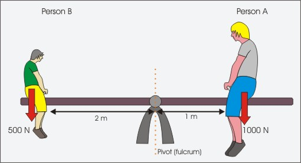

```{r libraries}
library(ggplot2)
library(dplyr)
library(magrittr)
library(knitr)
library(scales)
options(knitr.kable.NA = '')

library(cpsR)
census.api.key = '8084f81e4f71e4d32638dac15f188b424f72d063'
# for cps variable interpretation see https://www2.census.gov/programs-surveys/cps/datasets/2022/march/asec2022_ddl_pub_full.pdf
```

```{r ggplot-themes}
class.theme = theme(plot.background = element_rect(fill = "transparent", colour = NA),
		    panel.background = element_rect(fill = "transparent", colour = NA),
                    legend.background = element_rect(fill="transparent", colour = NA),
                    legend.box.background = element_rect(fill="transparent", colour = NA),
                    legend.key = element_rect(fill="transparent", colour = NA),
		    axis.ticks.x = element_blank(),
		    axis.ticks.y = element_blank(),
		    axis.text.x  = element_text(colour = "#aaaaaa"),
		    axis.text.y  = element_text(colour = "#aaaaaa"),
		    axis.title.x  = element_text(colour = "#aaaaaa"),
		    axis.title.y  = element_text(colour = "#aaaaaa", angle=90)
)

theme_set(class.theme)
theme_update(axis.title.x  = element_blank(),
             axis.title.y  = element_blank())
simplified.theme = theme_get()

theme_update(axis.text.x   = element_blank(), 
   	         axis.text.y   = element_blank())
blank.theme = theme_get()

theme_update(panel.grid.major=element_line(color=rgb(1,0,0,.1,  maxColorValue=1)),
	         panel.grid.minor=element_line(color=rgb(0,1,0,.1, maxColorValue=1)))
grid.theme = theme_get()

theme_set(simplified.theme)
```

```{r table-styling}
ellipsis <- function(df, nhead=5L, ntail=2) {
    rownames(df) = as.character(1:nrow(df))
    stopifnot("data.frame" %in% class(df))
    els <- rep(NA, ncol(df)) %>% 
        matrix(nrow=1, dimnames=list(NULL, names(df))) %>% 
        data.frame(stringsAsFactors=FALSE) %>% 
        tibble::as_tibble()
    rownames(els) = "⋮"
    dplyr::bind_rows(head(df, nhead), els, tail(df, ntail))
}
```


```{r get-california-data}
#| cache: true

california.state.code = 6
cps.data = cpsR::get_asec(year=2022, vars=c('pearnval', 'gestfips', 'h_numper', 'htotval', 'a_age', 'a_hga','gereg', 'a_maritl', 'a_sex','peafever','a_wkstat'), key=census.api.key)
```

```{r process-california-data}
all.earnings = data.frame(age=cps.data$a_age,
                          state.code = cps.data$gestfips,
                          income=cps.data$htotval, 
                          education=case_match(cps.data$a_hga,
                                          0  ~ 0,   # child
                                          31 ~ 0,   # < grade 1
                                          32 ~ 4,   #  grade 1-4
                                          33 ~ 6,   #  grade 5-6
                                          34 ~ 8,   #  grade 7-8 
                                          35 ~ 9,   #  grade 9
                                          36 ~ 10,  #  grade 10
                                          37 ~ 11,  #  grade 11
                                          38 ~ 11,  #  grade 12 no diploma
                                          39 ~ 12,  #  high school grad
                                          40 ~ 13,  #  some college
                                          41 ~ 14,  #  associate degree(vocational)
                                          42 ~ 14,  #  associate degree (academic)
                                          43 ~ 16,  #  bachelors degree
                                          44 ~ 18,  #  masters degree
                                          45 ~ 20,  #  professional school degree
                                          46 ~ 20)) #  doctorate

in.interval = function(X, interval) { interval[1] <= X & X <= interval[2] }
all.earnings$employed<- ifelse(cps.data$a_wkstat >5, 0,ifelse(cps.data$a_wkstat<2,NA,1))
all.earnings$fouryrdegree = all.earnings$education >=16
all.earnings$degree = factor(all.earnings$fouryrdegree,
                    levels=c(FALSE, TRUE), 
                    labels=c('no 4-year degree','4-year degree')) 

earnings = all.earnings[all.earnings$age %>% in.interval(c(25,35)) & 
                        all.earnings$state.code == california.state.code &
                        all.earnings$education > 8, ]

rownames(earnings)=NULL
earnings$person = 1:nrow(earnings)
```

## Context: 2022 CPS Wage Data
- Today, to stay grounded, I want to focus on some real survey data.
- The Current Population Survey is a survey run by Census Bureau and Bureau of Labor Statistics
    - Each year, about 1/2500 US residents is surveyed.
    - It's approximately correct to think of these residents as being chosen randomly 
    from the set of all residents with equal probability.
    - This approximation gets better if you focus on a single state.
- We'll look at surveyed California residents 
    - between the ages of 25 and 35
    - with at least an 8th-grade education
- This sample includes `r nrow(earnings)` people. Here's a partial view of their responses.

 \ \

```{r}
cols = c('income', 'age', 'education')
earnings[,cols] %>% ellipsis(nhead=4, ntail=2) %>% kable() 
```

## Here is a Complete View of Their Incomes

```{r}
lims = c(-.5e5, 5e5)
scatter = ggplot(earnings) + 
            geom_point(aes(x=person, y=income), alpha=.05) +
            scale_y_continuous(limits=lims, labels=label_dollar())
scatter
```

- Each person gets a dot.
- The y-coordinate of the dot shows their income.
- The x-coordinate of the dot is arbitrary.
    - It's their row in the table.
- The plot, in effect, shows our people 
    - lined up in some arbitrary order
    - standing as tall as their income.
- The problem with this is that it's hard to make sense of by looking at it.
- It often helps to look at *data summaries*, a.k.a. *descriptive statistics*.

## What are descriptive statistics?

-   Descriptive statistics are summaries of the data we have.
-   The data we have might be
    -   a random sample (e.g. an exit poll) from a population (e.g. voters) we're interested in.
    -   the whole population (e.g., administrative vote counts). Sometimes we call this a census.
-   Having the whole population is becoming more common in the era of Big Data.
    -   In particular, companies like facebook, google, and amazon are mostly interested in their users.
    -   And, for the most part, they don't have to poll them. They're always recording.
-   That said, if you are interested in the causal inference, that's impossible.
    -   We tend to phrase causal questions in terms of multiple versions of the same person.
    -   Versions who take different drugs, are exposed to different policies etc.
    -   And you can never see all of them. There's only one real version of each person.
-   More on that in a few weeks.


## What makes a good summary?

-  It should be brief
    -   Maybe a number or two.
    -   Or an-easy-to-understand plot.
-  It should tell you what you want to know.
    -   This one's more context specific.
-  Let's look at a couple common types of summary.
    - Location
    - Spread
    - Distribution

## Location

```{r}
#| out-height: 500px
x.med  = 1300
x.mean = 1400
size.mean = 3
size.med = 3

summaries = earnings %>% 
    summarize(mean=mean(income), 
              median=median(income), 
              sd=sd(income), 
              mad=mad(income, constant=1))
scatter + geom_point(aes(x=x.mean, y=mean), size=size.mean, color='red', data=summaries) + 
          geom_hline(aes(yintercept=mean), color='red', data=summaries) +
          geom_point(aes(x=x.med, y=median), size=size.med, color='orange', data=summaries) +
          geom_hline(aes(yintercept=median), color='orange', data=summaries)
```

- The **location** of the data is where it is.
- It's about approximating the data by a *constant*.
$$ Y_i \approx \mu \qfor i=1,\dots,n $$

- Depending on your criteria, you may get different answers.
    - e.g. the [Median]{.fg style="--col: orange"}
    - e.g. the [Mean]{.fg style="--col: red"}
- More on this later today.

## Spread

```{r}
#| out-height: 500px
scatter + geom_pointrange(aes(x=x.mean, y=mean, ymin=mean-sd, ymax=mean+sd), color='red', data=summaries)  +
          geom_hline(aes(yintercept=mean), color='red', data=summaries) +
          geom_pointrange(aes(x=x.med, y=median, ymin=median-mad, ymax=median+mad), color='orange', data=summaries) +
          geom_hline(aes(yintercept=median), color='orange', data=summaries)
```

- The **spread** of the data is how far it is from its location.
- Different measures of spread tend to be used with different measures of location.
    - the [Median Absolute Deviation]{.fg style="--col: orange"} is used with the Median.
    - the [Standard Deviation]{.fg style="--col: red"} is used with the Mean.


## Spread and Residuals
```{r}
#| layout-ncol: 2
#| layout-nrow: 2

scatter + geom_hline(aes(yintercept=median(income)), color='orange') +
          geom_segment(aes(x=person, xend=person, y=income, yend=median(income)), color='gray', alpha=.1)
scatter + geom_hline(aes(yintercept=mean(income)), color='red') + 
          geom_segment(aes(x=person, xend=person, y=income, yend=mean(income)), color='gray', alpha=.1)

res.lims = c(-2.5e5, 2.5e5)
ggplot(earnings) + geom_point(aes(x=person, y=income-median(income)), color='orange', alpha=.3) +
    scale_y_continuous(labels=label_dollar(), limits=res.lims) 
ggplot(earnings) + geom_point(aes(x=person, y=income-mean(income), size=abs(income-mean(income))), color='red', alpha=.3) +
    scale_y_continuous(labels=label_dollar(), limits=res.lims) + scale_size_area() + guides(size=FALSE) 
```

- Spread summarizes the size of the *residuals* $\hat\varepsilon_i = Y_i - \hat\mu$ left over after constant approximation.
- The median absolute deviation is the median size of the residuals.
- The standard deviation is the root mean squared size of the residuals.
  - variance
  - think: size-weighted avg of size of the residuals.
  - that's what we're showing in the plot: area of the dots is proportional to the size of the residuals
  - so two dots at 100k count like ...?

## Distribution

```{r}
#| layout-ncol: 2
h=ggplot(earnings) + geom_histogram(aes(x=income, y=after_stat(density)), 
                                  colour="black", fill="blue") + coord_flip() + xlim(0,5e5)
h 
scatter + ylim(0,5e5)
```

- This is called a histogram
- It tells us where ...
    - This is California. There are people off the the right, but who cares.
    - Mark Zuckerberg, Marc Benioff, etc. All the Marks.
- You can more or less read location and spread off histogram
    - It's instructive to try...

## Activity: Find the Rough Location of the Median

:::: r-stack
::: {.fragment .fade-out data-fragment-index="0"}

```{r}
#| out-height: 500px
#| layout-ncol: 2 

scatter 
h 
```

:::
::: {.fragment .current-visible data-fragment-index="0"}

```{r}
#| out-height: 500px
#| layout-ncol: 2 

scatter + geom_vline(aes(xintercept=median(income)),colour="orange", alpha=.5, size=1) 
h +  geom_vline(aes(xintercept=median(income)),colour="orange", alpha=.5, size=1)
```

:::
::::

- Algorithm: Scatterplot version
    - You want to find ... where equal # above and below
    - Conceptually--pick off largest and smallest, then next largest and smallest, etc.
    - When you've one (or two) left, you've found the median.
- Algorithm: Histogram version.
    - Cross equal and increasing (area) off the left and right.
    - You'll meet at the median. [TODO: fix up]


## Pre-Activity Idea: the mean as a balance point



-  What's equal on the left and right ...?
-  Leverage --- income above/below the mean.

::: fragment
$$
\begin{aligned}
\bar Y = \frac{1}{n}\sum_{i=1}^n Y_i 
&\implies 
\sum_{i=1}^n (Y_i - \bar Y) = \sum_{i=1}^n Y_i - n\bar Y = \sum_{i=1}^n Y_i - \sum_{i=1}^n Y_i = 0 \\
&\implies \sum_{i: Y_i-\bar Y > 0} (Y_i - \bar Y) = - \sum_{i: Y_i-\bar Y < 0} (Y_i - \bar Y)
\end{aligned}
$$
:::

## Activity: Find the Rough Location of the Mean

Or, to make things easier, choose among these 2 options
```{r}
#| out-height: 500px
#| layout-ncol: 2 

scatter + geom_hline(aes(yintercept=mean), data=summaries) +
          geom_hline(aes(yintercept=median), data=summaries)
h + geom_vline(aes(xintercept=mean), data=summaries) +
    geom_vline(aes(xintercept=median), data=summaries)
```

- Algorithm: Scatterplot version
    - Remember: 2 at distance x count for 1 at distance 2x
- Algorithm: Histogram version


# Optimality of the Mean and Median

## Mix and Match

:::: columns
::: column

1. MSR
2. MAR
:::
::: column

a. Mean
b. Median
:::
::::

**Activity**. Which minimizes which?

## MSE

-   Suppose we want to pick a single number ($\hat\mu$) for the center of the data
-   And we'll do it by minimizing the mean of squared residuals (i.e., least squares).

$$
$$

:::: columns

::: {.column width="45%"}

$$
MSR(m) = \sum_{i=1}^n (Y_i - m)^2
$$

```{r}
#| out-width: 500px
#| fig-asp: .7
Y <- earnings$income
ms <- mean(Y) + 4*sd(Y)*seq(-1,1,by=.01)
MSR = function(m) { mean((Y-m)^2) }

plot.data = data.frame(m=ms, MSR=sapply(ms,MSR))

suboptimal.m = mean(Y)+2*sd(Y)
suboptimal.slope = -2*mean(Y-suboptimal.m)
suboptimal.intercept = MSR(suboptimal.m) - suboptimal.m*suboptimal.slope

ggplot(plot.data) + geom_line(aes(x=m,y=MSR)) + 
                    geom_point(aes(x=mean(Y), y=MSR(mean(Y))), color='blue', size=3, alpha=.3) +
                    geom_abline(aes(slope=0, intercept=MSR(mean(Y))), color='blue', linetype='dashed') +
                    geom_point(aes(x=suboptimal.m, y=MSR(suboptimal.m)), color='magenta', size=3, alpha=.3) +
                    geom_abline(aes(slope=suboptimal.slope, intercept=suboptimal.intercept), color='magenta', linetype='dashed') +
                    guides(color=FALSE)
```

:::

::: {.column width="55%}

**Activity**. Derive the least squares estimator.

Steps

1.  Calculate the derivative of $MSR(m)$ with respect to $m$
2.  Set that derivative equal to 0. 
   
    - This equation characterizes the point \
      [$m$]{.fg style="--col: blue"} where $SSR(m)$ is minimized. 
    - That point is our number $\hat\mu$.

3.  Solve for $\hat\mu$.

:::

::::


## Solution: It's the Mean

1.  

::: fragment
$$
\begin{aligned}
MSR(m) 
  &= \frac1n\sum_{i=1}^n (Y_i - m)^2\\
\end{aligned} 
$$

and therefore

:::


::: fragment
$$
\frac{\partial MSR(m)}{\partial m} = \frac1n\sum_{i=1}^n -2(Y_i - m)
$$
:::

2.  

::: fragment
$$
0 = \frac1n\sum_{i=1}^n -2( Y_i - m) \quad \text{ at the minimizer } \quad m=\hat\mu
$$(+ 2
:::

3.  

::: fragment
$$
m = \frac1n\sum_{i=1}^n  Y_i \quad \text{ at the minimizer } \quad m=\hat\mu
$$frac{1}{n}\
:::


## What About A Least Absolute Value Summary

-   Suppose we want to pick a single number ($\hat\mu$) for the center of the data
-   And we'll do it by minimizing the sum of *absolute residuals* (i.e., least absolute deviations).

:::: columns

::: {.column width="45%"}

$$
SAR(m) = \frac1n\sum_{i=1}^n | Y_i - m |
$$

```{r}
#| out-width: 500px
#| fig-asp: .7
Y <- earnings$income
ms <- median(Y) + 4*sd(Y)*seq(-1,1,by=.001)
MAR = function(m) { mean(abs(Y-m)) }

plot.data = data.frame(m=ms, MAR=sapply(ms,MAR))

suboptimal.m = mean(Y)+2*sd(Y)
suboptimal.slope = mean(Y-suboptimal.m <= 0) - mean(Y-suboptimal.m >= 0)
suboptimal.intercept = MAR(suboptimal.m) - suboptimal.m*suboptimal.slope

ggplot(plot.data) + geom_line(aes(x=m,y=MAR)) + 
                    geom_point(aes(x=median(Y), y=MAR(median(Y))), color='blue', size=3, alpha=.3) +
                    geom_abline(aes(slope=0, intercept=MAR(median(Y))), color='blue', linetype='dashed') +
                    geom_point(aes(x=suboptimal.m, y=MAR(suboptimal.m)), color='magenta', size=3, alpha=.3) +
                    geom_abline(aes(slope=suboptimal.slope, intercept=suboptimal.intercept), color='magenta', linetype='dashed') +
                    guides(color=FALSE)
```

:::


::: {.column width="55%"}


Why is this harder to solve? Any guesses?

:::: {.r-stack}

::: {.fragment .fade-out}

-   In a sense, it is because $|x|$ isn't differentiable.
-   But it isn't really much harder. 
-   You can use same steps to show $\hat\mu$ is the median.
-   You just need the right generalization of the derivative.
    -   Informally, $\frac{d}{dx}|x|$ is a piecewise-constant function. 
    -   It's $+1$ on the right of zero and $-1$ on the left.
    -   *At zero*, who knows. Maybe we can pretend it's $+1$.
$$
\begin{aligned}
\frac{d}{dx} \abs{x} 
  &= \frac{d}{dx} \begin{cases} +x & \qfor x \geq 0 \\ -x & \qfor x < 0 \end{cases} \\
  &\overset{?}{=} \begin{cases} \frac{d}{dx} +x & \qfor x \geq 0 \\ \frac{d}{dx} -x & \qfor x < 0 \end{cases} \\
  &= \begin{cases} +1 & \qfor x \geq 0 \\ -1 & \qfor x < 0 \end{cases}
\end{aligned}
$$

:::

::: {.fragment .current-visible}

**Optional Activity** 

- Solve for the LAD estimator using our 3-step approach.
    - Does the solution depend on our pretense that \
    $\frac{d}{dx}|x|=1$ at $x=0$? 
    - e.g., does it change if we instead pretend that \
     $\frac{dx}{dx}|x| = -1$ at $x=0$?

:::
::::
:::
::::


## Why we focus on means
-   Means often provide a good summary of the data.
    -   We know that's not always true. 
    -   e.g. Harvard dropouts (Gates, Zuckerberg)
    -   But there are hints about when it'll be a bad summaries
    -   e.g. look for observations with high leverage.
    Not really a selling pt over the median etc, but ...
-   The properties of means are relatively easy to understand and describe.
    -   In fact, one of the most common ways to understand the median is in terms of a mean.
    -   In particular, the mean of absolute residuals that it minimizes.
-   Randomized experiments only identify mean causal effects.
-   Same goes, at best, for approaches to estimating causal effects using observational data.
    -   e.g. regression and matching


## Why Variance and Standard Deviation? 


TODO: Individual and ? Avg Histograms side-by-side

-   Means and standard deviations completely describe the distribution of normally distributed data.
    - Normality isn't common in individual-level data, e.g. individual income has skew 
    - But it is common in *aggregate data*, e.g. ?
-   For non-normal data, means and standard deviations imply some constraints on the distribution via
    -   Chebyshev's inequality (in complete generality)
    -   Other concentration inequalities (given additional assumptions)

## Normally-Shaped Histograms

```{r}
xs = seq(-2e5,5e5,by=1000)
normal.approx = data.frame(x=xs, y=dnorm(xs, mean=mean(earnings$income), sd=sd(earnings$income)))

attach(earnings)
h + geom_vline(aes(xintercept=mean(income)), color='red') +
    geom_vline(aes(xintercept=mean(income)-sd(income)), color='red', linetype='dashed') +
    geom_vline(aes(xintercept=mean(income)+sd(income)), color='red', linetype='dashed') +
    geom_vline(aes(xintercept=mean(income)-2*sd(income)), color='red', linetype='dotted') +
    geom_vline(aes(xintercept=mean(income)+2*sd(income)), color='red', linetype='dotted') + 
    geom_line(aes(x=x, y=y), data=normal.approx, color='green') +
    xlim(-2e5,5e5) + guides(color=FALSE, linetype=FALSE)
```

-   If our data were normally distributed, i.e., if the histogram looked like the green line
    -   66% of the data would be within one standard deviation of the mean
    -   95% of the data would be within two standard deviations of the mean
-   It doesn't, so we may want another approach.


## Chebyshev for Non-Normal Histograms

```{r}
attach(earnings)
h + geom_vline(aes(xintercept=mean(income)), color='red') +
    geom_vline(aes(xintercept=mean(income)-sd(income)), color='red', linetype='dashed') +
    geom_vline(aes(xintercept=mean(income)+sd(income)), color='red', linetype='dashed') +
    geom_vline(aes(xintercept=mean(income)-2*sd(income)), color='red', linetype='dotted') +
    geom_vline(aes(xintercept=mean(income)+2*sd(income)), color='red', linetype='dotted') +
    xlim(-2e5,5e5) + guides(color=FALSE, linetype=FALSE)
```

-   In complete generality, Chebyshev's inequality says
    -   at least 75% of the data is within 2 standard deviations of the mean
    -   at least 89% of the data is within 3 standard deviations of the mean.
    -   at least $100 \times (1-1/k^2)$% of the data is within $k$ standard deviations of the mean.
-   Not as good, but it's all we have in general.

# The Special Case of Binary Variables

## Context

$$
\begin{array}{r|r}
Person & Employed   \\
\hline
1 & 1  \\
\vdots & \vdots\\
64 & 0 \\
65 & 1 \\
\vdots & \vdots \\
1874 & 1 \\
1874 & 0 \\
\hline
Proportion & 1746/1824\\
\end{array}
$$

## Mean and Variance for Employment Status

$$
\begin{aligned}
\bar{Y} &= \frac{1}{N}\sum_{i=1}^{n} Y_i \\
&= \frac{1 + \dots+ 1+ 1 + \dots + 1 + 0 + \dots+ 1}{1824} \\
&= \frac{1746}{1824}\\
&\\
S^2 &= \frac{\sum_{i=1}^{n} (Y_i-\bar{Y})^2}{n} \\ 
&= \frac{(0-0.9572)^2 + \dots+ (1-0.9572)^2}{1824}  \\ 
&=  \left(\frac{1824}{1824}\right)[\bar{Y} \cdot(1-\bar{Y})]
\end{aligned}
$$

TODO: FORESHADOW BERNOULLI

## What's with this last step?

$$
\begin{aligned}
S^2 &= \frac{\sum_{i=1}^{n} (Y_i-\bar{Y})^2}{n} \\ 
&= \frac{(0-0.9572)^2 + \dots+ (1-0.9572)^2}{1824}  \\ 
&=  \left(\frac{1824}{1824}\right)[\bar{Y} \cdot(1-\bar{Y})]
\end{aligned}
$$

-   Look at the numerator of $S^2$.
    -   It's got $1746=n\bar Y$ copies of $(1-\bar Y)^2$
    -   And $(n-1746)=n(1-\bar Y)$ copies of $(0-\bar Y)^2$.
-   Summing and pulling out common factors, we get what we claim. 
$$
    n\bar Y (1-\bar Y)^2 + n(1-\bar Y)\bar Y^2 = n\bar Y (1-\bar Y) \{ (1-\bar Y) + \bar Y \} = n \bar Y (1-\bar Y) 
$$

# Descriptive Regression with a Binary Covariate

## Subsample Means

-   In this class, we focus on a single 'outcome' variable. 
    - We'll write $Y$ for this.
-   Typically, we'll look at the mean of this outcome $Y$ within subsamples.
-   We call this *Regression Analysis*
-   We define those subsamples in terms of our other variables called covariates. 
    - We'll write $X$ for this.
    - Often, we'll work with several covariates, so we'll have to think of $X$ as a vector.
    - But to keep things simple early in the semester, we'll use only one, so $X$ is a scalar.
-   Today we'll consider *binary* covariate $X$ that indicates whether a person has a 4-year degree.
    - $X_i=0$ if person $i$ doesn't have a 4-year degree.
    - $X_i=1$ if they do.
    
## Our Data as A Table

:::: columns
::: column
### In English
$$
\begin{array}{r|r r}
\text{person} & \text{household income} & \text{4-year degree}   \\
\hline
1 & \$250000  & \text{yes} \\
2 & \$32086   & \text{yes} \\
\vdots & \vdots & \vdots   \\
11 & \$300640  & \text{no} \\
\vdots & \vdots  & \vdots\\
2258 & \$24000     & \text{yes} \\
\hline
\end{array}
$$
:::

::: column
### In Mathematical Notation
$$
\begin{array}{r|r r}
i & Y_i & X_i \\
\hline
1 & 250000  & 1  \\
2 & 32086   & 1  \\
\vdots & \vdots & \vdots \\
11 & 300640  & 0 \\
\vdots & \vdots  & \vdots\\
2258 & 24000 & 1  \\
\hline
\end{array}
$$

:::
::::


## From Univariate to Regression

```{r}
showhist = function(earnings) { 
    summaries = earnings %>% 
        summarize(mean=mean(income), median=median(income))
    ggplot(earnings) +
        geom_histogram(aes(x=income, y=after_stat(density)), colour="black", fill="blue",bins=100) + 
        geom_vline(aes(xintercept=mean),  data=summaries, colour="red", alpha=.5, size=1) + 
        geom_vline(aes(xintercept=median), data=summaries, colour="orange", alpha=.5, size=1) + 
        scale_x_continuous(limits=c(0,5e5)) + coord_flip()
}

showhist(earnings) 
```

- The mean is at the red line. 
- The median is at the orange line.

## Binary Covariate Regression

```{r}
#| layout-ncol: 2
#| output-height: 600px
#| fig-asp: 1
#| fig-subcap:
#|    - People without 4-year degrees
#|    - People with 4-year degrees
showhist(earnings[earnings$fouryrdegree==0, ]) 
showhist(earnings[earnings$fouryrdegree==1, ]) 
```

- Here we've got a side-by-side comparison of our two subsamples.
    - Subsample means in red, subsample medians in orange. 
- That's what analysis based on a binary covariate is. It's a comparison of two subsamples.
- Analysis based on a more complex covariate involves more subsamples. 
    - And you could imagine trying to compare 4 or 8 or 1000 histograms like this.
    - It gets hard to do visually, so we'll use some other techniques. 
    
- **Activity**. In pairs, discuss ... [was this good?]

    1.  What do the income mean and median represent for respondents with and without four-year degrees?
    2.  What does it mean for the mean to be larger those with four-year degrees than those without?
    3.  What does it mean for the difference in means to be larger than the difference in medians?


## A Scatter Plot of Our Data [Handled more or less above, but fix/explain jitter vs person-index stuff]
```{r}
attach(earnings)
summaries = earnings %>% group_by(degree) %>%
                         summarize(mean=mean(income), sd=sd(income))

ggplot(earnings) + geom_point(aes(x=degree, y=income, color=degree), shape=1, alpha=.1) +
                   geom_point(aes(x=degree, y=mean), data=summaries) +
                   scale_y_continuous(limits=c(-.5e5,5e5)) + guides(color=FALSE)
```

- This is a way of displaying everyone in our sample. Each person is a dot.
    - Their horizontal position---their $x$-coordinate---is determined by the covariate $X_i$.
    - Their vertical position---their $y$ coordinate---is determined by the outcome $Y_i$.
- We've overlaid a black dot to show the subsample means.
- It's a bit hard to see what's going on because everyone is plotted on top of one another.
- That's because $X_i$ is binary---it takes on only two values. But it's an easy fix.


## Borrow An Idea From Our Plot Earlier
-  don't put everyone on top of each other
-  line People up in Arbitary Order to create spacing
-  This lets us see variation in our outcome within groups
-  Can be useful to add summary; subsample standard deviation 

## A Jitter Plot of Our Data

```{r}
attach(earnings)

ggplot(earnings) +  geom_point(aes(x=degree, y=income, color=degree), 
                                position=position_jitter(width=.3), alpha=.1) + 
                   geom_point(aes(x=degree, y=mean), data=summaries) +
                   scale_y_continuous(limits=c(-.5e5,5e5)) + guides(color=FALSE)
```

- This plot tweaks the x-coordinate to give the dots more space. 
  - We have the same dots, but with a bit of random noise added to each one's x-coordinate.
  - This makes it easier to see how many dots there are at a given income level (i.e. y-coordinate).
  - We keep the noise small so we can still see the real value of $X_i$
  - Each vertical tube is a set of people with the same degree status.


## Subsample Standard Deviations

```{r}
ggplot(earnings) +  geom_point(aes(x=degree, y=income, color=degree), 
                                position=position_jitter(width=.3, height=0), alpha=.1) + 
                   geom_pointrange(aes(x=degree, y=mean, ymin=mean-sd, ymax=mean+sd), data=summaries) +
                   scale_y_continuous(limits=c(-.5e5,5e5)) + guides(color=FALSE)
```

- To summarize spread, we can draw in the subsample standard deviations.
- I've drawn in bars extending one standard deviation above and below the mean.


## Special Case: Binary Outcomes

- Let's revisit our data thinking of *employment* as the outcome.
- That's binary. You're either employed or not.
- So we have a binary covariate *and* a binary outcome.

$$
$$

:::: columns

::: column
### In English
$$
\begin{array}{r|rr}
\text{Household} & \text{Degree} & \text{Employed}  \\
\hline
1 & 0 & 1 \\
2 & 1  & 1 \\
\vdots & \vdots & \vdots \\
2245 & 0 & 1\\
\hline
\end{array}
$$

:::

::: column
### In Mathematical Notation
$$
\begin{array}{r|rr}
i & X_i & Y_i  \\
\hline
1 & 0 & 1 \\
2 & 1  & 1 \\
\vdots & \vdots & \vdots \\
2245 & 0 & 1\\
\hline
\end{array}
$$
:::

::::


## Binary Outcome Regression

```{r}
laborforce<- subset(earnings,!(is.na(employed)))

summaries = laborforce %>% group_by(fouryrdegree) %>%
                         summarize(mean=mean(employed), sd=sd(employed))

ggplot(laborforce) +  geom_point(aes(x=fouryrdegree, y=employed, color=degree), 
                                position=position_jitter(width=.3, height=.01), alpha=.1) + 
                      geom_pointrange(aes(x=fouryrdegree, y=mean, ymin=mean-sd, ymax=mean+sd), data=summaries) +
                    guides(color=FALSE)

```
To give our dots a little space, we've added little vertical jitter here as well.

**Activity**. In pairs, discuss ...

- The substantive interpretation of the subsample means and their difference.
- Why is the SD smaller for those with four-year degrees than those without? 
    - Hint: look at the variance formula for binary variables.
  
