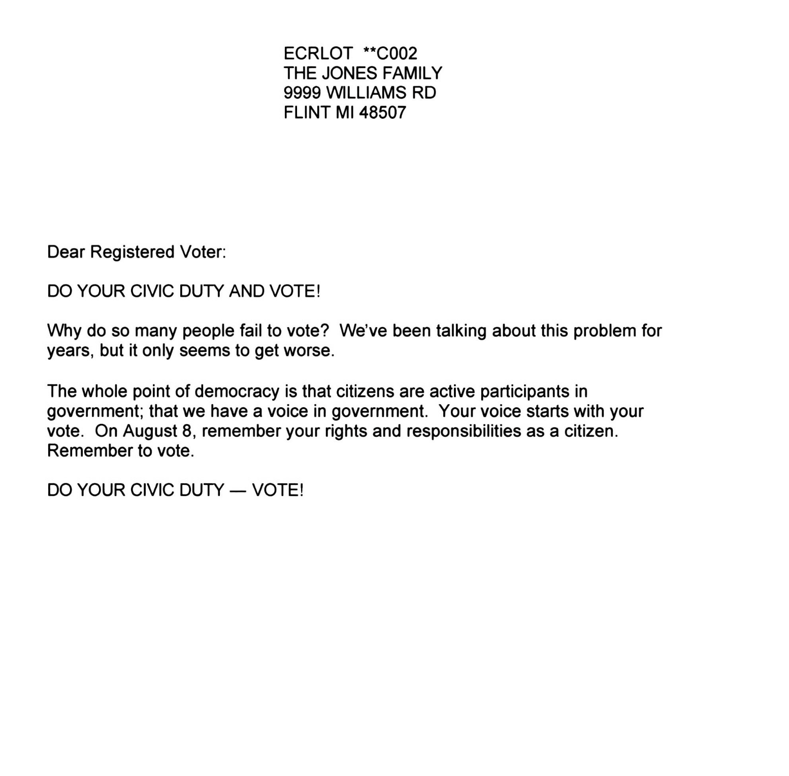
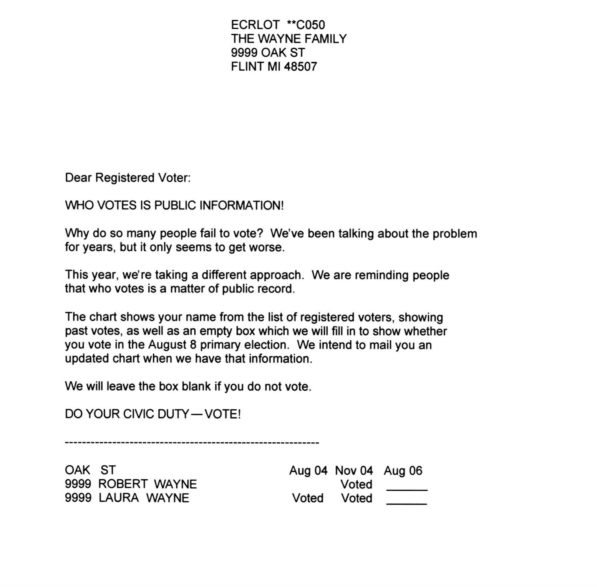
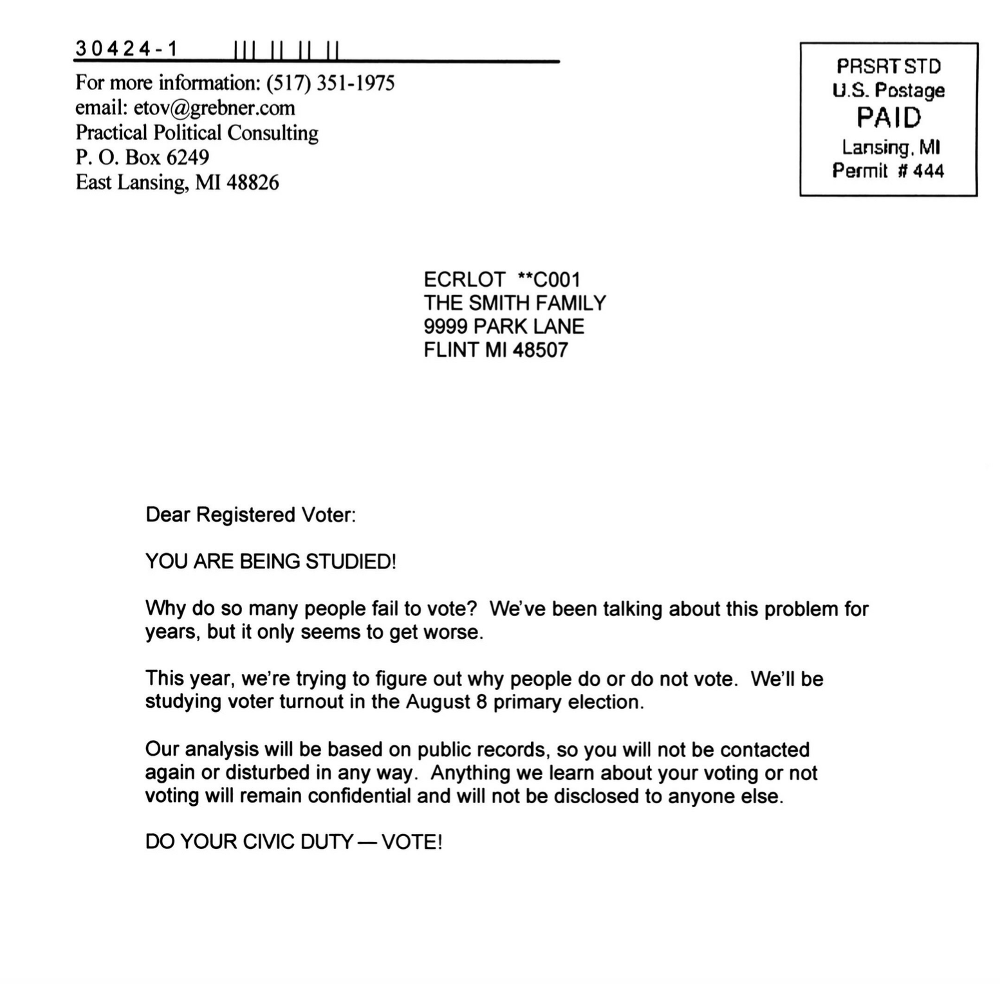

# What This Class Is About

:::{ .center }
Prediction, Inference, and Causality. And how they fit together.
:::

## The Social Pressure Experiment



```{r}
set.seed(0)
social.pressure = read.csv('data/social-pressure-data.csv') 
social.pressure$age = 2006-social.pressure$yob

pop = social.pressure[social.pressure$treatment %in% c(' Control', ' Neighbors'), ] 

J = sample(1:nrow(pop), , replace=TRUE)
sam = pop[J,]
```

```{r}
j.plot = sample(1:nrow(pop))[1:2300]
xco = function(w,x,scale=.3) { x + (scale/2)*(2*as.numeric(w) - 1) }

social.pressure.plot = ggplot(pop[j.plot,], aes(x=xco(treatment==' Neighbors', age), y=as.numeric(voted=='Yes'), color=treatment, shape=p2002)) +
  geom_point(alpha=.2, size=.5, position=position_jitter(h=.1, w=.05)) +
  guides(color='none', shape='none') + 
  scale_y_continuous(breaks=c(0,.5, 1), labels=c('No','','Yes')) + 
  scale_x_continuous(breaks=seq(20,105,5)) 

annotated.social.pressure.plot = social.pressure.plot + stat_summary(geom='point', fun=mean)
```

```{r}
#| label: fig-social-pressure
social.pressure.plot
```

::: {.panel-tabset}

### The Idea 

- In 2006, Gerber, Green, and Larimer ran an experiment in Michigan.
- They wanted to see what kinds of messages would get people to vote in the primary.
- So they wrote five letters exercising increasing levels of social pressure.
  1. No letter. This one was easier to write and cheaper to mail. Let's still count it as 'a letter'.
  2. A letter saying it was your civic duty to vote. @fig-civic-duty-letter
  3. A letter saying that your vote is public record. @fig-public-record-letter
  4. A letter saying that they'd be watching to see if you voted. @fig-watched-letter
  5. A letter saying that they'd tell your neighbors whether you voted. @fig-neighbors-letter
    - This one was pretty intense. It included a list of your neighbors.
    - And it told you whether they'd voted in the last couple elections.
  
     
### The Experiment

 Starting with the complete list of registered voters in Michigan ...

1. They randomly selected 180,000 households to include in their experiment.
2. They randomly assigned each of these households one of five letters.
3. They mailed the letters 11 days before the primary.
4. Then they checked to see who voted.

 - We have that data. We're looking at some of it. 
 - We're looking at the people in the households sent either [no letter]{.groupa} or the [*neighbors* letter] letter]{.groupb}.
 - We've got a dot for each one--- `r nrow(pop)` dots in all. 

### The Data

```{r}
triangle =  '&#9650;'
circle = '&#9679;'
```

Each person is a dot
- Their current age determines where it is on the x-axis.
- It's a `r triangle` if they voted in the 2002 primary and a `r circle` if they didn't.
- It's [green]{.groupb} if they got the [neighbors letter]{.groupb} and [red]{.groupa} if they got [no letter]{.groupa}.
- Its location on the y-axis indicates whether they voted in the 2006 primary.  
  - Yeses in the top row; nos on the bottom.

:::

::: aside
We're not really showing a dot for each person. It's hard for your browser to display that many, so we're choosing a tenth of the randomly and showing those.
:::

## A Missed Opportunity?

```{r}
social.pressure.plot
```

- Let's say you work on some candidate's campaign and they lost by a small margin.
- You heard about this experiment and you want to know whether you might have won  ...
- ... if you'd sent out a high-pressure letter, e.g. the neighbors letter.
- Obviously you would ...
    - only send it to people you're confident would vote for your candidate.
    - do it anonymously, so it wouldn't influence *how* people voted. Hopefully.
- You want to work out many additional votes you'd have gotten if you'd done it.

## Your Imaginary Mailer Campaign

```{r}
social.pressure.plot
```

- Let's suppose people aged 25-35 are extremely likely to vote for your candidate. 
  - Let's say every one of them votes for your candidate every time they vote.
  - The problem is that many of them don't vote in mid-term primaries.
- You know how many of them actually voted. It's public record.
- What you want to know is how many of them would have voted if they'd gotten the [neighbors letter]{.groupb}.
- That difference is the number of votes you'd have gotten from your imaginary mailer campaign.

## Step 1a. Individual-Level Prediction


```{r}
social.pressure.plot
```


- Let's start small. Let's try to predict turnout for one person at a time.
- We get out our list of voters aged 25-35 and look at the first two.


 Name | Age | Voted 2002 | Voted 2006 | Voted 2006 given Letter 
------|-----|------------|------------|------------------------ 
 Rush Hoogendyk | 27 | Yes | No  | ?
 Mitt DeVos     | 31 | No  | No  | ?


```{r}
mitt.votes = pop$voted[pop$treatment==' Neighbors' & pop$age==31 & pop$p2002=='no'] == 'Yes'
rush.votes = pop$voted[pop$treatment==' Neighbors' & pop$age==27 & pop$p2002=='yes'] == 'Yes'
al.votes = pop$voted[pop$treatment==' Neighbors' & pop$age==34 & pop$p2002=='yes'] == 'Yes'

dpop = pop[j.plot,]
dmitt.votes = dpop$voted[dpop$treatment==' Neighbors' & dpop$age==31 & dpop$p2002=='no'] == 'Yes'
drush.votes = dpop$voted[dpop$treatment==' Neighbors' & dpop$age==27 & dpop$p2002=='yes'] == 'Yes'
```

::: {.panel-tabset}
### A Question

- How do you think Rush and Mitt would have voted if they'd gotten the [neighbors letter]{.groupb}? Use the plot. 
- *Hint*. What information do you have to help you guess?

### An Answer Or Two

- My guess is that neither would have voted. Letter or no, very few people did. 
- To be more precise, let's take a look the [people who got the letter]{.groupb} features matching Rush and Mitt.
  - Rush-types are [`r triangle`s]{.groupb} in the x=27 column. 
   `r sum(rush.votes)`/`r length(rush.votes)` voted. `r percent(mean(rush.votes))`.
  - Mitt-types are [`r circle`s]{.groupb} in the x=31 column. 
    `r sum(mitt.votes)`/`r length(mitt.votes)` voted. `r percent(mean(mitt.votes))`.
- Looking at rates within-group, which seems better, doesn't change our conclusion: They probably didn't. 
- Note the percentages above are based all data from the experiment, not just the dots shown. Using only those ...
  - `r sum(drush.votes)`/`r length(drush.votes)` (`r percent(mean(drush.votes))`) *displayed* Rush-types voted.
  - `r sum(dmitt.votes)`/`r length(dmitt.votes)` (`r percent(mean(dmitt.votes))`), *displayed* Mitt-types voted.
:::


## Step 1b. Summary Prediction

:::: r-stack
::: {.fragment .fade-out data-fragment-index="0"}

```{r}
social.pressure.plot
```

:::
::: {.fragment .current-visible data-fragment-index="0"}

```{r}
annotated.social.pressure.plot
```

:::
::::

- Now that we've worked out how to make predictions for Rush and Mitt, we can do it for everyone in our list.
- That is, we can fill in all the **?**s in our table below.
 made a prediction for each person. I did one more.

 Name | Age | Voted 2002 | Voted 2006 | Voted 2006 given Letter 
------|-----|------------|------------|------------------------ 
 Rush Hoogendyk | 27 | Yes | No  | No (`r percent(mean(rush.votes))` of Rush-types voted) 
 Mitt DeVos     | 31 | No  | No  | No (`r percent(mean(mitt.votes))` of Mitt-types voted)
 Al   Granholm  | 34 | No  | No  | No (`r percent(mean(al.votes))`   of Al-types voted)
 ...            | ...|...  |...  | ?


::: {.panel-tabset}
### Question
- This doesn't quite answer our question. 
- We want to know how many votes we'd have gotten if we mailed everyone in this table the [letter]{.groupb}.
- How can we use the table to find out?


### Something That Doesn't Work

```{r}
summary = social.pressure |>
    filter(age >= 25 & age <= 35 & treatment==' Neighbors') |>
    group_by(age, p2002) |> 
    summarize(mean.voted=mean(voted=='Yes'))  


voting_rate = function(letter, data=social.pressure) {
  summary = data |>
    filter(age >= 25 & age <= 35 & treatment==letter) |>
    group_by(age, p2002) |> 
    summarize(mean.voted=mean(voted=='Yes'))  

  proportions = data |>
   filter(age >= 25 & age <= 35) |>
    group_by(age, p2002) |>
    summarize(count=n())

  joined = left_join(summary, proportions, by=c('age', 'p2002'))
  letter.rate = sum(joined$mean.voted * joined$count) / sum(joined$count)
  letter.rate
}
```

 - The obvious thing is to just count up the number of Yeses in the last column. 
 - It turns out that doesn't work. We were choosing Yes/No by majority rule.
 - But the majority within almost every group is No. 
  - To illustrate this, let's draw in the fraction of Yeses within each group as a bigger dot. [Do it!]{.button .navigate-next} 
  - Think of 'Yes' as 1 and 'No' as 0, so majority rule says 'No' if that dot is below the midline.
- For people in our list---the 25-35s---the majority says 'No' in almost every group: `r sum(summary$mean.voted <= 1/2)`/`r nrow(summary)`.
  
### Something That Does Work

- We're still going to count. But this time, we're not going to think of Rush, Mitt, and Al as 3 Nos.
- We're going to think of Rush as `r percent(mean(rush.votes))` of a Yes; Mitt as `r percent(mean(mitt.votes))` of a Yes; and Al as `r percent(mean(al.votes))` of a Yes.
  - Even though the thing we're predicting is binary, our prediction is a fraction.
  - This sounds a bit odd but the math tends to work out.
- That way, when we count up our predictions for 100 people like Rush, we get `r 100*mean(rush.votes)` Yeses. Not zero.
  - And when we do it for `r length(rush.votes)` people like Rush, we get `r sum(rush.votes)`. 
  - That's the number of [green dots]{.groupb} like Rush in the experiment and the number of them that voted yes.
- Some people call this kind of fractional answer to a Yes/No question *probabilitic classification*.

### Doing It

- I don't actually have the list of all voters registered in Michigan in 2006. 
  - Rush, Mitt, and Al are all made up names with 2006 primary theme.
  - So I can't sum up the number of Yeses in the last column.
  - I could make the last column if I had the others, but I don't.
- This is theoretically something that's available, but it's probably hard to get.
- In any case, what I can do is act as if the participants in my experiment were the list of all voters in Michigan.
  - They are, after all, randomly selected from that list. 
  - Then both our predictions and the people whose votes were counting ...
  - ... depend on the random selection of people to participate in our experiment.
  - This adds a bit of randomness to our predictions, but it's not a big deal.

$$
\color{gray}
\begin{aligned}
\text{predicted turnout among 25-35s}  
=& \ \ingroupb{`r 100*round(voting_rate(' Neighbors'),3)`\%} 
&& \text{ with the Neighbors letter} \\
vs. =& \ \ingroupa{`r 100*round(voting_rate(' Control'),3)`\%}
&& \text{ with no letter }
\end{aligned}
$$

```{r}
n.age = sum(social.pressure$age <= 35 & social.pressure$age >= 25)
```

- Even just counting the 25-35s in the experiment, that's $`r n.age` \times  `r round(voting_rate(' Neighbors') - voting_rate(' Control'), 3)` \approx `r round(n.age * (voting_rate(' Neighbors') - voting_rate(' Control')))`$ more votes.

- What do you make of this?
:::


## Step 2. Inference

```{r}
#| cache: true
#| label: bootstrap-neighbors-rate 
bootstrap.rate = replicate(400, voting_rate(' Neighbors', social.pressure[sample(1:nrow(social.pressure), replace=TRUE), ]))
```

```{r}
neighbors.rate = voting_rate(' Neighbors')
control.rate = voting_rate(' Control')

estimates = data.frame(treatment=c(' Neighbors', ' Control'), 
                       mean=c(voting_rate(' Neighbors'), voting_rate(' Control')),
                       y=c(1,1))
vlines = data.frame(x=c(24.7, 100*bootstrap.rate[1]), treatment=c(' Control',' Neighbors'))

scales = list(scale_x_continuous(breaks=c(24:33), labels=sprintf('%d%%', 24:33)),
              scale_y_continuous(breaks=c(), labels=c()),
              coord_cartesian(xlim=c(24,33), ylim=c(0,2)))
estimates.plot = 
ggplot() + 
  geom_point(aes(x=100*mean, y=y, color=treatment), data=estimates) +  
  geom_vline(aes(xintercept=x, color=treatment), data=vlines) +
  guides(color='none', linetype='none') 
```

:::: r-stack
::: {.fragment .fade-out data-fragment-index="0"}
```{r}
estimates.plot + scales 
```
:::
::: {.fragment .current-visible data-fragment-index="0"}
```{r}
estimates.plot + scales
```
:::
::: {.fragment .current-visible data-fragment-index="1"}
```{r}
B = length(bootstrap.rate)
bootstrap.reps = data.frame(rate=100*bootstrap.rate, y=2*(1:B)/B)
estimates.plot + geom_point(aes(x=rate, y=y), data=bootstrap.reps, color='purple', alpha=.2) + scales
```
:::
::: {.fragment .current-visible data-fragment-index="2"}
```{r}
estimates.plot +
    geom_histogram(aes(x=rate, y=3*after_stat(density)), alpha=.2, data=bootstrap.reps, binwidth=.2) +
    geom_point(aes(x=rate, y=y), data=bootstrap.reps, color='purple', alpha=.2) + 
    scales
```
:::
::::

:::: r-stack
::: {.fragment .fade-out data-fragment-index="0"}

- We've predicted that the letter makes a big difference. That, itself, is not that interesting.
- What would be interesting is to know that prediction is accurate.
  - i.e. if the letter actually improved that age-group's turnout from about [`r percent(control.rate)`]{.groupa} to about [`r percent(neighbors.rate)`]{.groupb}.
  - e.g. if we knew that the actual with-letter turnout was the [green line]{.groupb}, not the [red one]{.groupa}
- What's real here is complicated. 
  - We're asking about what would have happened if we'd done something we didn't do. 
  - Let's put that aside for a moment. We'll come back to it.
:::
::: {.fragment .current-visible data-fragment-index="0"}

- Let's imagine that we really did mail the letter to every voter in Michigan.
  - And the data we've used for our predictions, the [green dots]{.groupb} in @fig-social-pressure, is just a random sample of voters. 
  - Like if we'd chosen them by rolling a really big die, with a side for each voter, `r sum(social.pressure$treatment==' Neighbors')` times.
 - If that *were* the case, we'd be dealing with a statistical inference problem.
 - We'd want to 

:::
::: {.fragment .current-visible data-fragment-index="1"}

 SAMPLING STUFF
 
:::
::: {.fragment .current-visible data-fragment-index="2"}

 DISTRIBUTIONSTUFF
 
:::
::::

## Step 3. Causality


- Now let's come back to the issue we put aside. 
  - We didn't actually mail the letter to everyone in Michigan.
  - So an assumption underpinning all the math we've been talking about is false.
  - And our conclusions are, if not false, not necessarily true.
- Blah turnout polling etc


# The Syllabus

[qtm285-1.github.io](https://qtm285-1.github.io)

# Letters

##

{#fig-civic-duty-letter}

##

{#fig-public-record-letter}

## 

{#fig-watched-letter}

## 

{#fig-neighbors-letter}
