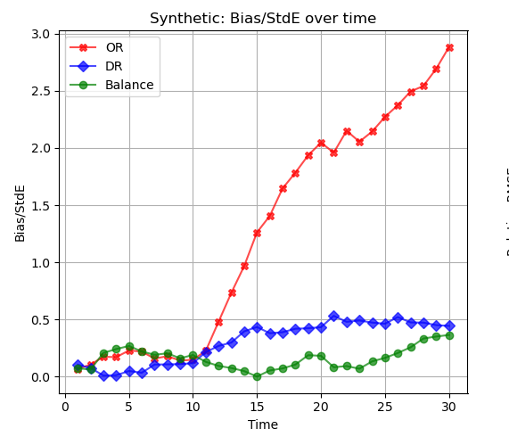

## Summary

- We'll try out a misspecified regression model in a simple causal inference problem. 
  - We'll get biased point estimates. 
  - We'll look at the implications for inference.
  - And we'll see that misspecification is an increasingly big deal as sample size grows.

# A Simple Example
## An Experiment




```{r}
options(scipen = 1, digits = 2)
```

```{r fake-data}
set.seed(3)

# Sampling 250 employees. Our population is an even mix of ...
#   'blue guys', who go 1/4 days no matter what
#   'green guys', who go more if it's free but --- unlike the ones in our table earlier --- don't care about classes

n=250
is.blue = rbinom(n,1, 1/2)
Yblue   = rbinom(n, 30, 1/4) 
Ygreen0 = rbinom(n, 30, 1/10)
Ygreen50 = rbinom(n, 30, 1/5)

Y0   = ifelse(is.blue, Yblue, Ygreen0)
Y50  = ifelse(is.blue, Yblue, Ygreen50)
Y100 = Y50   ### <--- this tells us we've got no effect.

# Randomizing by rolling two dice. R is their sum
R = sample(c(1:6), size=n, replace=TRUE) + sample(c(1:6), size=n, replace=TRUE)
W = case_match(R, 1:6~0, 7:12~50, 7~100)
Y = case_match(W, 0~Y0, 50~Y50, 100~Y100)

# Randomizing by rolling two dice. R is their sum
R = sample(c(1:6), size=n, replace=TRUE) + sample(c(1:6), size=n, replace=TRUE)
W = case_match(R,
  1:6~0,
  7:10~50,
  11:12~100)
Y = case_match(W,
  0~Y0,
  50~Y50,
  100~Y100)

real.data = tibble(W=W, Y=Y)
summaries = tibble(W=W, Y=Y) %>% group_by(W) %>% summarize(mean=mean(Y), sd=sd(Y), n=length(Y))

scatter = ggplot() + geom_point(aes(x=W, y=Y), color="red", data=tibble(W=W,Y=Y),
                                     position=position_jitter(w=10,h=0, seed=0), alpha=.3) +
           geom_pointrange(aes(x=W, y=mean, ymin=mean-sd, ymax=mean+sd), data=summaries, alpha=.8) +
           scale_x_continuous(breaks=c(0,50,100)) + labs(x="W", y="Y") + ylim(-3,15)

model=lm(Y ~ W, data=tibble(W=W, Y=Y))
predictions = tibble(W=c(0,50,100), muhat=predict(model, newdata=data.frame(W=c(0,50,100))))

dif.point.estimate = mean(Y[W==100]) - mean(Y[W==50])
slope.point.estimate = predictions$muhat[3]-predictions$muhat[2]
``` 

```{r}
boot.distn = function(data, B=1000) { 
  rows = purrr::map(1:B, function(i) {
    data.boot = data[sample(1:nrow(data), replace=TRUE),]
    summaries.boot = data.boot %>% group_by(W) %>% summarize(mean=mean(Y), sd=sd(Y), n=length(Y))
    model = lm(Y ~ W, data=data.boot)
    muhat = predict(model, newdata=data.frame(W=c(0,50,100)))

    tauhat.dif = mean(data.boot$Y[data.boot$W==100]) - mean(data.boot$Y[data.boot$W==50]) 
    tauhat.slope = muhat[3]-muhat[2]
    data.frame(dif=tauhat.dif, slope=tauhat.slope)
  })
  rows %>% bind_rows() 
}
```

```{r plotting-code}
width = function(samples, center=mean(samples), alpha=.05) {
  covg.dif = function(w) { 
    actual = mean( center - w/2 <= samples & samples <= center + w/2)
    nominal = 1-alpha 
    actual - nominal  
  }
  uniroot(covg.dif, interval=c(0, 2*max(abs(samples-center))))$root
}

distribution.plot = function(boot.samples, point.estimate, w=width(boot.samples), interval.replications=0, point.replications=0) { 
  drange = c(0, dnorm(0, mean=0, sd=sd(boot.samples)))
  p = ggplot(data.frame(samples=boot.samples)) + 
    geom_histogram(aes(x=samples, y=after_stat(density)), alpha=.3, bins=50)  +
    geom_pointrange(aes(y=dnorm(2*sd(samples), mean=0, sd=sd(samples)), 
      x=point.estimate, xmin=point.estimate - w/2, xmax=point.estimate + w/2)) + 
      geom_vline(xintercept=mean(boot.samples), color='blue') + 
      geom_vline(xintercept=quantile(boot.samples, c(.025,.975)), color='blue', linetype='dotted') 
  if(interval.replications > 0) { 
    K = interval.replications
    p = p + geom_pointrange(aes(y=y, x=x, xmin=xmin, xmax=xmax), 
          data=data.frame(y=seq(min(drange), max(drange), length.out=K), 
                  x=boot.samples[1:K], xmin=boot.samples[1:K] - w/2, xmax=boot.samples[1:K] + w/2), color='purple', alpha=.2)
  }
  if(point.replications > 0) { 
    K = point.replications
    p = p + geom_point(aes(y=y, x=x), 
          data=data.frame(y=seq(min(drange), max(drange), length.out=K), 
                  x=boot.samples[1:K], xmin=boot.samples[1:K] - w/2, xmax=boot.samples[1:K] + w/2), color='purple', alpha=.2)
  }
  p
}
```


::: {.hidden}
$$
\newcommand{\alert}[1]{\textcolor{red}{#1}}
\DeclareMathOperator{\E}{E}
\DeclareMathOperator{\V}{V}
\DeclareMathOperator{\Var}{\V}
\DeclareMathOperator*{\argmin}{argmin}
\newcommand{\inred}[1]{\textcolor{red}{#1}}
\newcommand{\inblue}[1]{\textcolor{blue}{#1}}
$$ 
:::

- We're going to talk about causal inference with a multivalued treatment.
- Our context will be a randomized experiment with three treatments.
- A large employer is experimenting with a new benefit for their employees: subsized gym memberships.
  - They're randomly selecting employees to participate in a trial program.
  - Then randomizing these participants into three plans.
    - Plan 1: No gym membership. It costs them \$0/month.
    - Plan 2: A gym membership that covers entry but not classes. It costs \$50/month.
    - Plan 3: A gym membership that covers entry and classes. It costs \$100/month.
  - Then surveying them to see how often they go to the gym, e.g. in days/month.
- They'll be able to use this information to decide what plan to offer everyone next year.

## How We Think

- We'll think about this using potential outcomes.
- We imagine, for each employee, that there's a number of times they'd go to the gym given each plan.
  - $y_j(0)$: The number of days/month they'd go to the gym if they had no membership.
  - $y_j(50)$: The number of days/month they'd go to the gym if they had a \$50 membership.
  - $y_j(100)$: The number of days/month they'd go to the gym if they had a \$100 membership.
- And we'll think about the effect of each plan on each employee.
  - $\tau_j(50)  = y_j(50)  - y_j(0)$: The effect of a \$50 gym membership vs none.
  - $\tau_j(100) = y_j(100) - y_j(50)$: The effect of a \$100 gym membership vs \$50.

$$
\small{
\begin{array}{c|ccc|cc}
j & y_j(0) & y_j(50) & y_j(100) & \tau_j(50) & \tau_j(100) \\
1 & 5  & 10 & 10 & 5 & 0 \\
2 & 10 & 10 & 10 & 0 & 0 \\
\vdots & \vdots & \vdots & \vdots & \vdots & \vdots \\
327 & 0 & 0  &  20 & 0 & 20 \\
\vdots & \vdots & \vdots & \vdots & \vdots & \vdots \\
358 & 15 & 18 & 20 & 3 & 2 \\
\vdots & \vdots & \vdots & \vdots & \vdots & \vdots \\
m & 10 & 10 & 5  & 0 & -5 \\
\end{array}
}
$$

## Randomization
```{r}
filled.circ = 19
empty.circ = 1
prop.scale = 20
jx = 10*runif(length(W), -1, 1)
jy = runif(length(W), -1, 1)
shape0 = case_match(W, 0~filled.circ, 50~empty.circ, 100~empty.circ)
shape50 = case_match(W, 0~empty.circ, 50~filled.circ, 100~empty.circ)
shape100 = case_match(W, 0~empty.circ, 50~empty.circ, 100~filled.circ)
ggplot() + 
  geom_point(aes(x=jx, y=Y0+jy, shape=I(shape0)), alpha=.2) + 
  geom_point(aes(x=50+jx, y=Y50+jy, shape=I(shape50)), alpha=.2) +
  geom_point(aes(x=100+jx, y=Y100+jy, shape=I(shape100)), alpha=.2) +
  geom_segment(aes(x=0+jx, xend=50+jx, y=Y0+jy, yend=Y50+jy), alpha=.2, linewidth=.1) +
  geom_segment(aes(x=50+jx, xend=100+jx, y=Y50+jy, yend=Y100+jy), alpha=.2, linewidth=.1) + 
  geom_bar(aes(x=W, y=prop.scale*after_stat(prop)), alpha=.1, fill='purple') + 
  scale_y_continuous(sec.axis = sec_axis(~./prop.scale, name="Proportion"))
```

- Treatment is randomized by rolling two dice for each of our `r n` participants.^[Each participant's potential outcomes are plotted as three connected circles. The realized outcome is filled in; the others are hollow. The proportion of participants receiving each treatment are indicated by the purple bars.]
  - If we roll 1-6: No membership.  This happens `r sum(W==0)` times.
  - If we roll 8-12: \$50 membership.  This happens `r sum(W==50)` times.
  - If we roll exactly 7: \$100 membership.  This happens `r sum(W==100)` times.

```{r}
#| echo: true
#| eval: false
roll = sample(c(1:6), size=n, replace=TRUE) + sample(c(1:6), size=n, replace=TRUE)
W = case_match(roll,
  1:6~0,
  8:12~1,
  7~100)
```

## Estimating An Average Treatment Effect

```{r}
scatter 
```

- Let's say we're interested in the average effect of a \$100 gym membership vs. a \$50 gym membership.
- Because we've randomized, there's a natural unbiased estimator of this effect.^[See our [Lecture on Causal Inference](`r lecture(10)`).]
- It's the difference in means for the groups receiving these two types of membership.

$$
\tau(100) = \E\qty[\frac{1}{N_{100}}\sum_{i:W_i=100} Y_i - \frac{1}{N_{50}}\sum_{i:W_i=50} Y_i ] \quad \text{ for } N_x = \sum_{i:W_i=x} 1
$$

- They want to know is whether paying for the \$100 membership will increase attendance by at least 1 day /month.
- Why? Maybe their insurance company will cover the extra \$50 if it has that effect.


## Uninformative Interval Estimates 

```{r}
#| cache: true
boots = boot.distn(real.data)
```

::: {#fig-sampling-dist}
```{r}
point.estimate = dif.point.estimate
se = sqrt( var(Y[W==100])/sum(W==100) + var(Y[W==50])/sum(W==50) )
x = seq(point.estimate-4*se, point.estimate+4*se, length.out=1000)
dif.se = se # for use below. this code could use some refactoring. 
normal.distribution.plot = ggplot() + 
    geom_histogram(aes(x=dif, y=after_stat(density)), bins=50, alpha=.2, data=boots) +
    geom_area(aes(x=x, y=density),
      data=data.frame(x=x, density=dnorm(x, mean=point.estimate, sd=se)),
      color='purple', fill='purple', alpha=.08) +  
    geom_vline(aes(xintercept=pe),
      data=data.frame(pe=point.estimate),
      color='purple', linetype='solid') +
    geom_vline(aes(xintercept=pe-1.96*se),
      data=data.frame(pe=point.estimate, se=se),
      color='purple', linetype='dotted') +
    geom_vline(aes(xintercept=pe+1.96*se),
      data=data.frame(pe=point.estimate, se=se),
      color='purple', linetype='dotted') + 
    geom_pointrange(aes(y=h, 
      x=pe, xmin=pe - 1.96*se, xmax=pe + 1.96*se),
      data=data.frame(pe=point.estimate, se=se, h=dnorm(2*se, mean=0, sd=se)))

limits = c(min(x), max(x))
breaks = seq(-3,3,by=1) 
scale_x = list(scale_x_continuous(breaks=breaks),
                coord_cartesian(xlim=limits))
normal.distribution.plot + scale_x
```
Two estimates of our estimator's sampling distribution: the bootstrap sampling distribution and one based on the normal approximation. A 95% confidence interval calibrated using the normal approximation is shown as well.
:::

- So what we want to know is whether this effect is at least 1.
  - And we can't rule that out.
  - But we can't 'rule it in' either. 
- We just don't have compelling evidence in one direction or the other.
- So let's look at why that is. What did we do wrong when designing this experiment? 


## Variance
```{r}
normal.distribution.plot + scale_x
``` 

- Let's estimate the variance of our point estimate to see where the problem is.^[See our [Lecture on Inference for Complex Summaries](`r lecture(8)`).]
$$
\Var\qty[\sum_w \hat\alpha(w) \hat\mu(w)]  = \sum_w \sigma^2(w) \times \E\qty[ \frac{\hat\alpha^2(w)}{N_w} ]
$$

- We can use this table. What do you see?


$$
\begin{array}{c|ccc}
w & 0 & 50 & 100 \\
\hline
\hat\sigma^2(w) & `r approx(var(Y[W==0]))` & `r approx(var(Y[W==50]))` & `r approx(var(Y[W==100]))` \\
\hat\alpha^2(w) & 0 & 1 & 1 \\
N_w & `r approx(sum(W==0))` & `r approx(sum(W==50))` & `r approx(sum(W==100))` \\
\frac{\hat\sigma^2(w) \hat\alpha^2(w)}{N_w} & 0 & `r approx(var(Y[W==50])/sum(W==50))` & `r approx(var(Y[W==100])/sum(W==100))` \\
\end{array}
$$


## Variance
```{r}
normal.distribution.plot + scale_x
``` 


$$
\begin{array}{c|ccc}
w & 0 & 50 & 100 \\
\hline
\hat\sigma^2(w) & `r approx(var(Y[W==0]))` & `r approx(var(Y[W==50]))` & `r approx(var(Y[W==100]))` \\
\alpha^2(w) & 0 & 1 & 1 \\
N_w & `r approx(sum(W==0))` & `r approx(sum(W==50))` & `r approx(sum(W==100))` \\
\frac{\hat\sigma^2(w) \alpha^2(d)}{N_w} & 0 & `r approx(var(Y[W==50])/sum(W==50))` & `r approx(var(Y[W==100])/sum(W==100))` \\
\end{array}
$$

- What I see is that we don't have enough people randomized to the $W=100$ treatment.
  - The variance we get from just that one term is $`r approx(var(Y[W==100])/sum(W==100))`$.
  - Meaning the contribution to our standard error is 
  $\sqrt{`r approx(var(Y[W==100])/sum(W==100))`} \approx `r approx(sqrt(var(Y[W==100])/sum(W==100)))`$ 
  - And since we multiply standard error by 1.96 to get an 'arm' for our interval ...
  - This ensures our arms are at least $1.96 \times `r approx(sqrt(var(Y[W==100])/sum(W==100)))`  \approx `r approx(1.96*sqrt(var(Y[W==100])/sum(W==100)))`$ days wide.

## If We Could Do It Again
```{r}
n = 250
nW = sample(c(50,100), size=n, replace=TRUE) 
nY = case_match(nW,
  50~Y50,
  100~Y100)

newdata = tibble(W=nW, Y=nY)
summaries.new = newdata |> 
  group_by(W) |> 
  summarize(mean=mean(Y), sd=sd(Y), n=length(Y))
point.estimate = summaries.new$mean[summaries.new$W==100] - summaries.new$mean[summaries.new$W==50]

scatter.new = ggplot() + 
  geom_point(aes(x=W, y=Y), color="red", data=newdata,
                                     position=position_jitter(w=10,h=0), alpha=.3) +
           geom_pointrange(aes(x=W, y=mean, ymin=mean-2*sd, ymax=mean+2*sd), data=summaries.new) +
           scale_x_continuous(breaks=c(0,50,100)) + labs(x="W", y="Y") + ylim(-3,15)
scatter.new
```

- We'd assign more people to the $W=100$ treament to get a more precise estimate.
- Here's what we'd get if we assigned people to each of our 2 *relevant* treatments with probability $1/2$.
- This does what we need it to do: it gives us a confidence interval that's all left of $1$.

```{r}
#| cache: true
boots.ifwecould = boot.distn(newdata)
```

```{r}
#| fig-asp: .3
se = sqrt( var(nY[nW==100])/sum(nW==100) + var(nY[nW==50])/sum(nW==50) )
x = seq(point.estimate-4*se, point.estimate+4*se, length.out=1000)
normal.distribution.plot = ggplot() + 
    geom_histogram(aes(x=dif, y=after_stat(density)), bins=50, alpha=.2, data=boots.ifwecould) +
    geom_area(aes(x=x, y=density),
      data=data.frame(x=x, density=dnorm(x, mean=point.estimate, sd=se)),
      color='purple', fill='purple', alpha=.08) +  
    geom_vline(aes(xintercept=pe),
      data=data.frame(pe=point.estimate),
      color='purple', linetype='solid') +
    geom_vline(aes(xintercept=pe-1.96*se),
      data=data.frame(pe=point.estimate, se=se),
      color='purple', linetype='dotted') +
    geom_vline(aes(xintercept=pe+1.96*se),
      data=data.frame(pe=point.estimate, se=se),
      color='purple', linetype='dotted') +
    geom_pointrange(aes(y=h, 
      x=pe, xmin=pe - 1.96*se, xmax=pe + 1.96*se),
      data=data.frame(pe=point.estimate, se=se, h=dnorm(2*se, mean=0, sd=se)))

  
normal.distribution.plot + scale_x
``` 

## But We Can't

```{r}
#| out-height: 300px
#| fig-asp: .3 

model=lm(Y ~ W, data=real.data)
mu.hat = predict(model, newdata=data.frame(W=c(0,50,100)))
slope.point.estimate = mu.hat[3]-mu.hat[2]

scatter.with.lsq = scatter + geom_line(aes(x=c(0,50,100), y=mu.hat), color='blue', linetype='dashed')
scatter.with.lsq
```

- This is our data. We have to do what we can. So we get clever.
- Instead of estimating each subpopulation mean separately, we *fit a line* to the data.
- We take $\hat\mu(w)$ to be the height of the line at $w$ and $\hat\tau(w)=\hat\mu(100)-\hat\mu(50)$ as before.
- And when we bootstrap it ... 
  - We get a much narrower interval than the one we had before.
  - But it's not in the same place at all.


```{r}
#| layout-ncol: 2 
#| fig-width: 7 
#| fig-asp: .4
#| fig-subcap:
#|   - "Difference in Sample Means Sampling Dist"
#|   - "Fitted-Line-Based Sampling Dist" 

real.point.estimate = mean(real.data$Y[real.data$W==100]) - mean(real.data$Y[real.data$W==50])
distribution.plot(boots$dif,   real.point.estimate) + scale_x 
distribution.plot(boots$slope, slope.point.estimate) + scale_x 
```

## What's Going On?

```{r}
#| out-height: 300px
#| fig-asp: .3 

scatter.with.lsq + coord_cartesian(ylim=range(summaries$mean) + .5*c(-1,+1))
```

- Let's zoom in. It looks like our like our blue line ...
  - *overestimates* $\mu(100)$
  - *underestimates* $\mu(50)$
  - therefore *overestimates* $\tau(100)=\mu(100)-\mu(50)$.
- That's what it looks like when we compare to the subsample means, anyway.
- And that's why we get a bigger estimate than we did *using* the subsample means.

## Implications
```{r}
#| layout-ncol: 2 
#| fig-width: 7 
#| fig-cap:
#|   - "Difference in Sample Means Sampling Dist"
#|   - "Fitted-Line-Based Sampling Dist" 

distribution.plot(boots$dif,   real.point.estimate) + scale_x
distribution.plot(boots$slope, slope.point.estimate)  + scale_x 
```

- This isn't a disaster if all we want to know is whether our effect $\tau(100)$ is &gt;1
  - i.e, if we want to know whether the \$100 plan gives us an additional gym day over the \$50 one.
  - No matter which approach we use, we get the same answer: we don't know.
  - Our interval estimates both include numbers above and below 1.
- But if what we wanted to know was whether $\tau(100) > 0$, we'd get different answers.
  - The difference in subsample means approach would say we don't know.
  - The fitted line approach would say we do know---in fact, that $\tau(100) > 1/2$.
- And this is a problem. This is fake data, so I can tell you it's wrong. The actual effect is exactly zero.
- In the data we're looking at, the potential outcomes $Y_i(50)$ and $Y_i(100)$ are *exactly the same*.

## The Data

```{r}
#| eval: false
#| echo: true
#| code-line-numbers: "13"

# Sampling 250 employees. Our population is an even mix of ...
#   'blue guys', who go 1/4 days no matter what
#   'green guys', who go more if it's free but --- unlike the ones in our table earlier --- don't care about classes

n=250
is.blue = rbinom(n,1, 1/2)
Yblue   = rbinom(n, 30, 1/4) 
Ygreen0 = rbinom(n, 30, 1/10)
Ygreen50 = rbinom(n, 30, 1/5)

Y0   = ifelse(is.blue, Yblue, Ygreen0)
Y50  = ifelse(is.blue, Yblue, Ygreen50)
Y100 = Y50   ### <--- this tells us we've got no effect.

# Randomizing by rolling two dice. R is their sum
R = sample(c(1:6), size=n, replace=TRUE) + sample(c(1:6), size=n, replace=TRUE)
W = case_match(R, 1:6~0, 7:10~50, 11:12~100)
Y = case_match(W, 0~Y0, 50~Y50, 100~Y100)
``` 

## The Line-Based Estimator is **Biased**

```{r}

estimates = purrr::map(1:1000, function(b) {
  n=250
  is.blue = rbinom(n,1, 1/2)
  Yblue   = rbinom(n, 30, 1/4) 
  Ygreen0 = rbinom(n, 30, 1/10)
  Ygreen50 = rbinom(n, 30, 1/5)

  Y0   = ifelse(is.blue, Yblue, Ygreen0)
  Y50  = ifelse(is.blue, Yblue, Ygreen50)
  Y100 = Y50   ### <--- this tells us we've got no effect.

  # Randomizing by rolling two dice. 'roll' is their sum
  roll = sample(c(1:6), size=n, replace=TRUE) + 
         sample(c(1:6), size=n, replace=TRUE)
W = case_match(roll,
  1:6~0,
  8:12~1,
  7~100)
  W = case_match(R, 1:6~0, 7:10~50, 11:12~100)
  Y  = case_match(W, 0~Y0, 50~Y50, 100~Y100)

  model=lm(Y ~ W, data=tibble(W=W, Y=Y))
  mu.hat = predict(model, newdata=data.frame(W=c(0,50,100)))
  data.frame(
    mean.estimate = mean(Y[W==100]) - mean(Y[W==50]),
    line.estimate =  mu.hat[3]-mu.hat[2], se = sqrt(vcov(model)[2,2])*50)
}) %>% bind_rows()

```

```{r}
#| layout-ncol: 2 
#| fig-width: 7 
#| fig-cap:
#|   - "Difference-in-Means Sampling Dist"
#|   - "Fitted-Line-Based Sampling Dist"

estimates$i = 1:nrow(estimates)
slope.se = sqrt(vcov(model)[2,2])*50
line.sampling.dist = ggplot() + 
  geom_histogram(aes(x=line.estimate, y=after_stat(density)), bins=50, alpha=.2, data=estimates) +
  geom_vline(aes(xintercept=mean(line.estimate)), color='blue', data=estimates) +
  geom_pointrange(aes(x=slope.point.estimate, y=dnorm(2*slope.se, mean=0, sd=slope.se), 
                      xmin=slope.point.estimate - 1.96*slope.se, 
                      xmax=slope.point.estimate + 1.96*slope.se)) + 
                      geom_vline(aes(xintercept=0), color='green') + scale_x 

mean.based.estimate = dif.point.estimate
mean.sampling.dist = ggplot() + 
  geom_histogram(aes(x=mean.estimate, y=after_stat(density)), bins=50, alpha=.2, data=estimates) +
  geom_vline(aes(xintercept=mean(mean.estimate)), color='blue', data=estimates) +
  geom_pointrange(aes(x=mean.based.estimate, y=dnorm(2*dif.se, mean=0, sd=dif.se), 
                      xmin=mean.based.estimate - 1.96*dif.se, 
                      xmax=mean.based.estimate + 1.96*dif.se)) + 
                      geom_vline(aes(xintercept=0), color='green') + scale_x
mean.sampling.dist
line.sampling.dist
``` 

- We can do a little simulation to see that.
- We'll generate 1000 fake datasets like the one we've been looking at.
  - And calculate our estimator for each one. 
  - This gives us draws from our estimator's *actual* sampling distribution. 
  - I've used them to draw a histogram.
- The mean of these point estimates is $`r approx(mean(estimates$line.estimate))`$. 
    - Since our actual effect is zero, that's our bias. The blue line.
- Our actual point estimate is off in the same direction---but a bit more than usual.
  - It's shown in black with a corresponding 95% interval.
  - An interval that fails to cover the actual effect of zero. The green line.

## The Resulting Coverage Is **Bad**

```{r}
#| out-height: 400px
#| fig-asp: .4
#| 
covers =  abs(estimates$line.estimate) <= 1.96*estimates$se 
line.sampling.dist + geom_pointrange(aes(x=line.estimate, y=(8*i/100)*dnorm(2*slope.se, mean=0, sd=slope.se), 
                      xmin=line.estimate - 1.96*slope.se, 
                      xmax=line.estimate + 1.96*slope.se), data=estimates[1:100,], color='purple', alpha=.3) 
```

- We can construct 95% confidence intervals the same way in each fake dataset.
  - I've drawn 100 of these intervals in purple. 
  - You can see that they sometimes cover zero, but not as often as you'd like.
- `r sum(covers)` / `r nrow(estimates)` &asymp; `r percent(mean(covers))` of them cover zero. That's not good. 
- If that's typical of our analysis, people really shouldn't trust us. 
- So why have statisticians gotten away with fitting lines for so long?
- In essence, it's by pretending we were trying to do something else.

## What We Pretend To Do

```{r}
#| out-height: 400px
#| fig-asp: .4

dicepmf = (1/36) * c((1:7)-1, 13-(8:12))
px = c(sum(dicepmf[1:6]), sum(dicepmf[7:10]), sum(dicepmf[11:12]))
mu = (1/2)*(30/4) + (1/2)*c(30/10, 30/5, 30/5)
model.pop = lm(Y~W, data=tibble(W=c(0,50,100), Y=mu), weights=px)
mutilde = predict(model.pop, newdata=tibble(W=c(0,50,100)))
pop.summary = 50*coef(model.pop)[2]

covers =  abs(estimates$line.estimate-pop.summary) <= 1.96*slope.se 
line.sampling.dist + geom_pointrange(aes(x=line.estimate, y=(8*i/100)*dnorm(2*slope.se, mean=0, sd=slope.se), 
                      xmin=line.estimate - 1.96*slope.se, 
                      xmax=line.estimate + 1.96*slope.se), data=estimates[1:100,], color='purple', alpha=.4) + 
                      geom_vline(aes(xintercept=pop.summary), color='red') +
                      scale_x 
```

- Our estimator --- 50 times the slope of the least squares line --- *is* a good estimator of something.
- It's a good estimate of the analogous population summary: 50 &times; the *population least squares slope*. 
- That's the [red line]{.fg style="color:red"}. `r sum(covers)` / `r nrow(estimates)` &asymp; `r percent(mean(covers))` of our intervals cover it. That sounds pretty good. 

$$
\small{
\begin{aligned}
\hat\tau(100) &= \hat\mu(100) - \hat\mu(50) = \qty(100 \hat a + \hat b) - \qty(50 \hat a + \hat b) = 50\hat a \\
\qqtext{where} & \hat\mu(x) = \hat a x + \hat b \qfor \hat a,\hat b = \argmin_{a,b} \sum_{i=1}^n \qty{Y_i - (aX_i + b)}^2 \\
\tilde\tau(100) &= \tilde\mu(100) - \tilde\mu(50)) = \qty(100 \tilde a + \tilde b) - \qty(50 \tilde a + \tilde b) = 50\tilde a \\ 
\qqtext{where} & \tilde\mu(x) = \tilde a x + \tilde b \qfor \tilde a,\tilde b = \argmin_{a,b} \E\qty[\qty{Y_i - (aX_i + b)}^2]
\end{aligned}
}
$$


## **Problem**: That's Not What We Wanted To Estimate

```{r}
#| out-height: 400px
#| fig-asp: .4

pop.predictions = tibble(W=c(0,50,100), mu=mutilde) 
pop.summaries = tibble(W=c(0,50,100), mu=mu)
pop.scatter = scatter.with.lsq +
          geom_line(aes(x=W, y=mutilde), color='red', linetype='dashed',  pop.predictions) + 
          geom_point(aes(x=W, y=mutilde), color='red',  pop.predictions) + 
          geom_point(aes(x=W, y=mu), color='green', size=3, data=pop.summaries) +
          geom_line(aes(x=W, y=mu), color='green', data=pop.summaries) + coord_cartesian(ylim=c(2,10))
pop.scatter
```

- The effects we want to estimate are, as a result of randomization, differences in subpopulation means.
$$
\tau(50) = \mu(50) - \mu(0) \qand \tau(100) = \mu(100) - \mu(50) 
$$

- The population [least squares line]{.fg style="color:red"} *doesn't go through these means*. It can't. 
- They don't lie along a line. They lie along a [hockey-stick shaped curve]{.fg style="color:LimeGreen"}. 
- This means no line---including the population least squares line---can tell us what we want to know.
- We call this **misspecification**. We've specified a shape that doesn't match the data.
- This problem has a history of getting buried in technically correct but opaque language. 


## Language Games

```{r}
#| out-height: 400px
#| fig-asp: .4

pop.scatter
```


- The widespread use of causal language is a recent development.
- In the past, people would do a little linguistic dance to avoid talking about causality.
- They'd talk about what they were really estimating as if it were what you wanted to know.
- This not only buried issues of causality, it buried issues of bias due to *misspecification*.
  - e.g., due to trying to use a line to estimate a hockey-stick shaped curve.
- They'd say 'The regression coefficient for $Y$ on $W$ is $`r approx(coef(model)[2])`$.'
  - You'd be left to intepret this as saying the treatment effect was roughly $50 \times `r approx(coef(model)[2])`$.
  - That's wrong, but it's 'your fault' for interpreting it that way. **They set you up**.


## Misspecification and Inference 

```{r}
#| out-height: 400px
#| fig-asp: .4

line.sampling.dist + geom_pointrange(aes(x=line.estimate, y=(8*i/100)*dnorm(2*slope.se, mean=0, sd=slope.se), 
                      xmin=line.estimate - 1.96*slope.se, 
                      xmax=line.estimate + 1.96*slope.se), data=estimates[1:100,], color='purple', alpha=.4) + 
                      geom_vline(aes(xintercept=pop.summary), color='red') +
                      scale_x 
```


- In particular, we'll think about its implications for statistical inference. This boils down to...
- what happens when our estimator's sampling distribution isn't centered on what we want to estimate.
- We can see that, if our sampling distribution is narrow enough, the coverage of interval estimates is *awful*.
- Today, we'll think about how sample size impacts that. Something interesting happens. 
- From a point-estimation perspective, more data is always good. Our estimators do get more accurate.
- But from an inferential perspective, it can be very bad. 
- When we use misspecified models, our coverage claims will get *less accurate* as sample size grows.

## Misspecification's Impact as Sample Size Grows

```{r}

sampling.dist = function(n) { 
  purrr::map(1:1000, function(b) {
  is.blue = rbinom(n,1, 1/2)
  Yblue   = rbinom(n, 30, 1/4) 
  Ygreen0 = rbinom(n, 30, 1/10)
  Ygreen50 = rbinom(n, 30, 1/5)

  Y0   = ifelse(is.blue, Yblue, Ygreen0)
  Y50  = ifelse(is.blue, Yblue, Ygreen50)
  Y100 = Y50   ### <--- this tells us we've got no effect.

  # Randomizing by rolling two dice. R is their sum
  R = sample(c(1:6), size=n, replace=TRUE) + sample(c(1:6), size=n, replace=TRUE)
  W = case_match(R, 1:6~0, 7:10~50, 11:12~100)
  Y  = case_match(W, 0~Y0, 50~Y50, 100~Y100)

  model = lm(Y~W)
  mu.hat = predict(model, newdata=data.frame(W=c(0,50,100)))
  rbind(data.frame(n=n, estimate =  mu.hat[3]-mu.hat[2], se = sqrt(vcov(model)[2,2])*50, type='line'),
        data.frame(n=n, estimate = mean(Y[W==100])-mean(Y[W==50]), se = sqrt(var(Y[W==100])/sum(W==100) + var(Y[W==50])/sum(W==50)), type='dif'))
}) %>% bind_rows()
}

bootstrap.sampling.dist.plot = function(estimates, type='histogram', integration.range=NULL, plot.first.interval=TRUE) { 
  drange = c(0, dnorm(0, mean=0, sd=sd(estimates$estimate, na.rm=TRUE)))
  if(type=='histogram') { 
    base = ggplot() + geom_histogram(aes(x=estimate, y=after_stat(density)), bins=50, alpha=.2, data=estimates) 
  } else { 
    x = mean(estimates$estimate,na.rm=T) + seq(-1,1,by=.01)*5*sd(estimates$estimate,na.rm=T)
    normal.approx = data.frame(x=x, fx=dnorm(x, mean=mean(estimates$estimate,na.rm=T), sd=sd(estimates$estimate,na.rm=T)))
    base = ggplot() + geom_area(aes(x=x, y=fx), data=normal.approx, color='purple', fill='purple', alpha=.08)
    if(!is.null(integration.range)) { 
      in.range = integration.range[1] <= x & x <= integration.range[2]
      base = base +  geom_area(aes(x=x, y=fx), data=normal.approx[in.range,], color=NA, fill='yellow', alpha=.4)
    }
    estimates$se = sd(estimates$estimate,na.rm=T)
  }
  with.lines = base +
    geom_vline(aes(xintercept=mean(estimate)), color='blue', data=estimates) +
    geom_vline(aes(xintercept=0), color='green') + 
    geom_vline(aes(xintercept=pop.summary), color='red') 
  if(plot.first.interval) {
    with.lines +
      geom_pointrange(aes(x=estimate, y=dnorm(2*se, mean=0, sd=se), 
                        xmin=estimate - 1.96*se, 
                        xmax=estimate + 1.96*se), 
                        data=estimates[1,]) +
      geom_pointrange(aes(y=seq(min(drange), max(drange), length.out=99), x=estimate, 
                        xmin=estimate - 1.96*se, 
                        xmax=estimate + 1.96*se), 
                        data=estimates[2:100,], alpha=.1, color='purple')        
  } else { 
    with.lines + 
      geom_pointrange(aes(y=seq(min(drange), max(drange), length.out=100), x=estimate, 
                        xmin=estimate - 1.96*se, 
                        xmax=estimate + 1.96*se), 
                        data=estimates[1:100,], alpha=.1, color='purple')    
  }
}
```

```{r}
#| cache: true

set.seed(10)
estimates50 = sampling.dist(50)
estimates100 = sampling.dist(100)
estimates200 = sampling.dist(200)
```

```{r}
#| layout-ncol: 3
#| layout-nrow: 2 
#| fig-width: 4.5 

limits = c(-5,5)
breaks = floor(min(limits)):ceiling(max(limits))
scale_x = scale_x_continuous(breaks=breaks, limits=limits) 

bootstrap.sampling.dist.plot(estimates50[estimates50$type=='dif',]) + scale_x
bootstrap.sampling.dist.plot(estimates100[estimates100$type=='dif',]) + scale_x
bootstrap.sampling.dist.plot(estimates200[estimates200$type=='dif',]) + scale_x

bootstrap.sampling.dist.plot(estimates50[estimates50$type=='line',]) + scale_x
bootstrap.sampling.dist.plot(estimates100[estimates100$type=='line',]) + scale_x
bootstrap.sampling.dist.plot(estimates200[estimates200$type=='line',]) + scale_x
```

- Here we're seeing the sampling distributions of our two estimators at three sample sizes.
  - Left/Right: Sample size 50,100,200
  - Top/Bottom: Difference in Subsample Means / Difference in Values of Fitted Line
- The green line is the actual effect. 
- The red one is the effect estimate we get using the population least squares line: 50 &times; the slope of the red line.
- I've drawn 100 confidence intervals based on normal approximation for each estimator.
- We can see that the line-based estimator's coverage gets increasingly bad as sample size increases. 

## Coverage

```{r}
estimates = rbind(estimates50, estimates100, estimates200)
covg = estimates %>% group_by(n,type) %>% summarize(coverage = mean(abs(estimate) <= 1.96*se, na.rm=T))

ggplot(covg) + geom_line(aes(x=n, y=coverage, color=type)) + geom_point(aes(x=n, y=coverage, color=type))  + 
    scale_y_continuous(limits=c(0,1), breaks=seq(0,1,by=.05)) + labs(y='Coverage', x='Sample Size') +
    geom_hline(aes(yintercept=.95), color='black', linetype='dashed') 
```

- Here are the coverage rates for each estimator at each sample size.
- The difference in sample means works more or less as we'd like.
  - Coverage is always pretty good and is roughly 95% --- what we claim --- in larger samples.
- The line-based estimator does the opposite.
  - Coverage is bad in small samples and worse in larger ones.
- Now, we're going to do some exercises. We're going to work out how to calculate coverage by hand.
  - The point is to get some perspective on what it means to have 'just a little bit of bias'.
  - This'll come in handy when people around you say a bit of misspecification isn't a big deal.

# Exercises

## Set Up

```{r}
#| layout-ncol: 2
#| fig-width: 7 
limits = c(-2,3)
breaks = floor(min(limits)):ceiling(max(limits))
scale_x = scale_x_continuous(breaks=breaks, limits=limits) 
bootstrap.sampling.dist.plot(estimates[estimates$type=='line' & estimates$n == 50,]) + scale_x
bootstrap.sampling.dist.plot(estimates[estimates$type=='line' & estimates$n == 50,], type='normal') + scale_x
```

- Above, I've drawn the sampling distribution for the estimator $\hat\tau$ and a normal approximation to it.
- We're going to calculate that estimator's coverage rate. Approximately. We'll make some simplifications.
- We'll act as if the normal approximation to the sampling distribution were perfect.
- We'll assume our intervals are perfectly calibrated.
  - i.e., for a draw $\hat\tau$ from the sampling distribution ...
  - the interval is $\hat\tau \pm 1.96\sigma$ where $\sigma$ is our estimator's actual standard error.


## Exercise 1

```{r}
#| output-height: 300px
#| fig-asp: .3
se = sd(estimates[estimates$type=='line' & estimates$n == 50,]$estimate)
bootstrap.sampling.dist.plot(estimates[estimates$type=='line' & estimates$n == 50,], type='normal') + scale_x +
  geom_vline(aes(xintercept=x), data=tibble(x=1.96*se*c(-1,1)), color='green', linetype='dashed', size=1)
```

- Let's think about things from the treatment effect's perspective. The solid green line. 
- Let's give it arms the same length as our intervals have. They go out to the dashed green lines.
- An interval's arms touch the effect if and only if the effect touches the interval's center, i.e., the corresponding point estimate.
- So we're calculating the proportion of point estimates covered by *the treatment effect's arms*.
- **Exercise**. Write this in terms of the sampling distribution's [probability density f(x)]{.fg color="purple"}
  - This is a calculation you can illustrate with a sketch on top of the plot above. You may want to start there.

## Exercise 1

```{r}
#| output-height: 300px
#| fig-asp: .3
se = sd(estimates[estimates$type=='line' & estimates$n == 50,]$estimate)
bootstrap.sampling.dist.plot(estimates[estimates$type=='line' & estimates$n == 50,], 
                             type='normal', integration.range=1.96*se*c(-1,1)) +
  geom_vline(aes(xintercept=x), data=tibble(x=1.96*se*c(-1,1)), color='green', linetype='dashed', size=1) + scale_x
```

- To calculate the proportion of point estimates covered by *the treatment effect's arms* 
- We integrate the sampling distribution's probability density from one to the other.

$$
\text{coverage} = \int_{-1.96\sigma}^{1.96\sigma} f(x) dx \qqtext{ where } f(x)=\frac{1}{\sqrt{2\pi} \sigma} e^{-\frac{(x-\tilde\tau)^2}{2\sigma^2}}
$$

- Here I've written in the actual formula of the density of the normal I drew.
  - The one with mean $\tilde\tau$ and standard deviation $\sigma$.
  - I'm not expecting you to have that memorized, but it does come in handy from time to time.
- This doesn't yet give us all that much *generalizable* intution. 
- But we'll derive some by, to some degree, simplifying that integral.

## Exercise 2

```{r}
#| output-height: 300px
#| fig-asp: .3
se = sd(estimates[estimates$type=='line' & estimates$n == 50,]$estimate)
bootstrap.sampling.dist.plot(estimates[estimates$type=='line' & estimates$n == 50,], 
                             type='normal', integration.range=1.96*se*c(-1,1)) +
  geom_vline(aes(xintercept=x), data=tibble(x=1.96*se*c(-1,1)), color='green', linetype='dashed', size=1) + scale_x
```

- Now we'll rewrite our coverage as an integral of the [standard normal density]{.fg style="color:blue"}
- To do it, we're going back to intro calculus. We're making a *substitution* $u=(x-\tilde\tau)/\sigma$.
- This means we have to change the limits.
  - As $x$ goes from $-1.96\sigma$ to $1.96\sigma$ ...
  - $u$ goes from $-1.96-\tilde\tau/\sigma$ to $1.96-\tilde\tau/\sigma$.
- And make a substitution into the integrand.
  - For $(x-\tilde\tau)^2/\sigma^2$, we subtitute $u^2$.
- And multiply by $dx/du$ so we get to integrate over $u$.
  - $x= u\sigma + \tilde\tau$ so $dx=\sigma du$

$$
\text{coverage} 
= \int_{-1.96\sigma}^{1.96\sigma} e^{-\frac{(x-\tilde\tau)^2}{2\sigma^2}} dx \\
= \class{fragment}{\int_{-1.96-\tilde\tau/\sigma}^{1.96-\tilde\tau/\sigma} \frac{1}{\sqrt{2\pi} \sigma} e^{-\frac{u^2}{2}} \sigma du \\
= \int_{-1.96-\tilde\tau/\sigma}^{1.96-\tilde\tau/\sigma} \textcolor{blue}{\frac{1}{\sqrt{2\pi}} e^{-\frac{u^2}{2}}} du }
$$


## Summary and Generalization 

```{r}
#| output-height: 300px
#| fig-asp: .3

lines50 = estimates[estimates$type=='line' & estimates$n == 50,]
se = sd(lines50$estimate, na.rm=T)
#bootstrap.sampling.dist.plot(lines50, type='normal', integration.range=1.96*se*c(-1,1)) +
#  geom_vline(aes(xintercept=x), data=tibble(x=1.96*se*c(-1,1)), color='green', linetype='dashed', size=1) + scale_x +
#  theme(axis.text.x=element_text(angle = -90, hjust = 0))

tau.tilde = pop.summary
x = mean(lines50$estimate, na.rm=T)/se + seq(-2,2,by=.01)*5
xin = x[ -1.96 - tau.tilde/se <= x & x <= 1.96 - tau.tilde/se ]
breaks = c(seq(-3,2,by=1), c(-1.96-tau.tilde/se, 1.96-tau.tilde/se))
labels = c(sprintf('%d', seq(-3,2,by=1)), "-1.96-bias/se", "1.96-bias/se")
scale_x_standardized = scale_x_continuous(breaks=breaks, labels=labels, limits=(limits-tau.tilde)/se) 
ggplot() + geom_area(aes(x=x, y=dnorm(x)), color='purple', fill='purple', alpha=.2) +
  geom_area(aes(x=xin, y=dnorm(xin)), color=NA, fill='yellow', alpha=.4) + 
  scale_x_standardized +
  theme(axis.text.x=element_text(angle = -90, hjust = 0)) 

```

- We can calculate the coverage of a biased, approximately normal estimator easily.
- It's an integral of the standard normal density over the range $\pm 1.96 -\text{bias}/\text{se}$.
- The **R** function call **pnorm(x)** calculates that integral from $-\infty$ to $x$. All we need to do is subtract.

### Math Version
$$
\small{
\begin{aligned} 
\text{coverage} 
&=\int_{-1.96-\frac{\text{bias}}{\text{se}}}^{+1.96-\frac{\text{bias}}{\text{se}}} \frac{1}{\sqrt{2\pi}} e^{-\frac{u^2}{2}} du \\
&= \int_{-\infty}^{+1.96-\frac{\text{bias}}{\text{se}}} \frac{1}{\sqrt{2\pi}} e^{-\frac{u^2}{2}} du 
 \ - \ \int_{-\infty}^{-1.96-\frac{\text{bias}}{\text{se}}} \frac{1}{\sqrt{2\pi}} e^{-\frac{u^2}{2}} du
\end{aligned}
}
$$

### R Version
```{r}
#| echo: true

coverage = function(bias.over.se) {  pnorm(1.96 - bias.over.se) - pnorm(-1.96 - bias.over.se)  }
```

## Examples

:::: columns
::: column
```{r}
#| fig-width: 7
#| fig-asp: .35 

normal.integral.plot = function(bias.over.se) {  
  x = seq(-5,5,by=.01)
  xin = x[ -1.96 - bias.over.se <= x & x <= 1.96 - bias.over.se ]
  normal.plot = ggplot() + geom_area(aes(x=x, y=dnorm(x)), color='purple', fill='purple', alpha=.2) + 
                           geom_area(aes(x=xin, y=dnorm(xin)), color=NA, fill='yellow', alpha=.4) 
  normal.plot + scale_x_continuous(breaks=seq(-5,5), limits=c(-5,5))  
}
normal.integral.plot(1/2)
```

:::
::: column
\ \
\ \
$$
\frac{\text{bias}}{\text{se}} = \frac{1}{2} \quad \implies \quad \text{coverage} = `r round(100*coverage(1/2))`\%
$$

:::
::::

:::: columns
::: column
```{r}
#| fig-width: 7
#| fig-asp: .35
normal.integral.plot(1)
```

:::
::: column
\ \
\ \
$$
\frac{\text{bias}}{\text{se}} = 1 \quad \implies \quad \text{coverage} = `r round(100*coverage(1))`\%
$$

:::
::::

:::: columns
::: column
```{r}      
#| fig-width: 7
#| fig-asp: .35 
normal.integral.plot(2)
```

:::
::: column
\ \
\ \
$$
\frac{\text{bias}}{\text{se}} = 2 \quad \implies \quad \text{coverage} = `r round(100*coverage(2))`\%
$$

:::
::::

:::: columns
::: column
```{r}      
#| fig-width: 7
#| fig-asp: .35 
normal.integral.plot(3)
```

:::
::: column
\ \
\ \
$$
\frac{\text{bias}}{\text{se}} = 3 \quad \implies \quad \text{coverage} = `r round(100*coverage(2))`\%
$$

:::
::::

## People Report This


:::: columns 
::: column
{height=400px}

\ \

From *Stable Estimation of Survival Causal Effects*. Pham et al. [arXiv:2310.02278](https://arxiv.org/pdf/2310.02278.pdf)
:::
::: column

$\abs{\frac{\text{bias}}{\text{se}}}$ | coverage of $\pm 1.96\sigma$ CI
---|---
$\frac{1}{2}$ | `r round(100*coverage(1/2))`\%
$1$ | `r round(100*coverage(1))`\%
$2$ | `r round(100*coverage(2))`\%
$3$ | `r round(100*coverage(3))`\%

:::
::::

- This plot shows bias/se for 3 estimators of the effect of a treatment on the probability of survival.
- In particular, they're estimators of the effect on survival up to time $t$. $t$ is on the $x$-axis.
- **Q**. For small $t$, all 3 estimators are doing ok. When does the [red one's]{.fg style="color:red"} coverage drop below 92%? What about 83%? And 48%?
- **Q**. What can we say about the coverage of the [blue one]{.fg style="color:blue"} and the [green one]{.fg style="color:green"}?

::: fragment
- **A**. The red one's coverage drops below 92% after $t=12$. That's where bias/se starts to exceed 1/2. For $t=14$, it's down to 83% (bias/se > 1). And for $t=20$, it's down to 48% (bias/se > 2).
- **A**. Blue and green have bias/se close to or below 1/2 for all times $t$. So their coverage is roughly 92% or higher for all times $t$.
:::

## The Whole Bias/SE vs. Coverage Curve

```{r}
theme_set(class.theme)
x=seq(-5,5,by=.01)
ggplot() + geom_line(aes(x=x, y=sapply(x, coverage))) + 
  scale_y_continuous(breaks=seq(0,1,by=.1), limits=c(0,1)) +
  scale_x_continuous(breaks=seq(-5,5), limits=c(-5,5)) +
  geom_hline(aes(yintercept=.95), color='black', linetype='dashed') + xlab('bias/se') + ylab('coverage') 
```

## A Back-of-the-Envelope Calculation

- Suppose we've got misspecification, but only a little bit.
- We're doing a pilot study with sample size $n=100$.
- And we're sure that our estimator's bias is less than half its standard error.

- **Question 1**. What's the coverage of our 95% confidence intervals?

::: fragment
- **A**. At least 92\%.
:::

- Now suppose we're doing a follow-up study with sample size $n=1600$.
- And we're using the same estimator. Bias is the same.
- **Question 2**. What's the coverage of our 95% confidence intervals?
- Assume our estimator's standard error is proportional to $\sqrt{1/n}$. 
  - They almost always are. For estimators we'll talk about in this class, always.
  - That means it'll be $\sqrt{1/1600} \ / \ \sqrt{1/100}=\sqrt{1/16}=1/4$ of what it was in the pilot study.

::: fragment
- **A**. At least 48\%. Here's why. 
$$
\text{If } \ \frac{\text{bias}}{\text{pilot se}} \le 1/2 \ \text{ and } \ \text{follow-up se} = \frac{\text{pilot se}}{4}, 
\ \text { then } \ \frac{\text{bias}}{\text{follow-up se}} = 4 \times \frac{\text{bias}}{\text{pilot se}} \le 2.
$$

:::
  
# Lessons

## Be Careful Using Misspecified Models {.smaller}

```{r}
#| layout-ncol: 3
#| fig.width: 4.5  
#| fig.cap: 
#|   - sampling distribution for the line-based estimate of gym subsidy effect tau(100) at sample sizes n=10
#|   - sampling distribution for the line-based estimate of gym subsidy effect tau(100) at sample sizes n=40
#|   - sampling distribution for the line-based estimate of gym subsidy effect tau(100) at sample sizes n=160
#| 
all.smallstudy.estimates = rbind(sampling.dist(10), sampling.dist(40), sampling.dist(160))
smallstudy.estimates = all.smallstudy.estimates[all.smallstudy.estimates$type=='line',]
smallstudy.estimates$covers = abs(smallstudy.estimates$estimate) <= 1.96*smallstudy.estimates$se
smallstudy.se = smallstudy.estimates %>% group_by(n) %>% summarize(se=sd(estimate, na.rm=T), coverage=mean(covers))

limits = c(-5,5)
breaks = floor(min(limits)):ceiling(max(limits))
scale_x = scale_x_continuous(breaks=breaks, limits=limits) 
bootstrap.sampling.dist.plot(smallstudy.estimates[smallstudy.estimates$n==10,]) + scale_x
bootstrap.sampling.dist.plot(smallstudy.estimates[smallstudy.estimates$n==40,]) + scale_x
bootstrap.sampling.dist.plot(smallstudy.estimates[smallstudy.estimates$n==160,]) + scale_x
```


- You might have an unproblematic level of bias in a small study.
- That same amount of bias can be a big problem in a larger one.
- In our gym-subsidy example, a line was pretty badly misspecified.
- That means we have to go pretty small to get an unproblematic level of bias. 
- Here are the coverage rates at sample sizes 10, 40, and 160.
- We include two versions.
  - An approximation *calculated* using our formula.
  - The *actual* coverage based on simulation.
- These differ a bit when our simplifying assumptions aren't roughly true.
  - e.g. accuracy of the normal approximation to the sampling distribution.
  - This is a bigger problem in small samples than in large ones.

$$
\small{
\begin{array}{c|ccccc}
n & \text{bias} & \text{se} & \frac{\text{bias}}{\text{se}} & \text{calculated coverage} & \text{actual coverage} \\
\hline
10 & `r approx(tau.tilde)` & `r approx(smallstudy.se[smallstudy.se$n==10,]$se)` & `r approx(tau.tilde/smallstudy.se[smallstudy.se$n==10,]$se)` & `r round(100*coverage(tau.tilde/smallstudy.se[smallstudy.se$n==10,]$se))`\% & `r round(100*smallstudy.se[smallstudy.se$n==10,]$coverage)`\% \\
40 & `r approx(tau.tilde)` & `r approx(smallstudy.se[smallstudy.se$n==40,]$se)` & `r approx(tau.tilde/smallstudy.se[smallstudy.se$n==40,]$se)` & `r round(100*coverage(tau.tilde/smallstudy.se[smallstudy.se$n==40,]$se))`\% & `r round(100*smallstudy.se[smallstudy.se$n==40,]$coverage)`\% \\
160 & `r approx(tau.tilde)` & `r approx(smallstudy.se[smallstudy.se$n==160,]$se)` & `r approx(tau.tilde/smallstudy.se[smallstudy.se$n==160,]$se)` & `r round(100*coverage(tau.tilde/smallstudy.se[smallstudy.se$n==160,]$se))`\% & `r round(100*smallstudy.se[smallstudy.se$n==160,]$coverage)`\% \\ 
\end{array}
}
$$

## It's Best to Use a Model That's Not Misspecified

```{r}
#| layout-nrow: 3
#| layout-ncol: 2 
#| fig-asp: .5
#| fig.width: 7 
#| fig.cap: 
#|   - difference-in-means estimate,  n=10
#|   - line-based estimate,  n=10
#|   - difference-in-means estimate,  n=40
#|   - line-based estimate,  n=40
#|   - difference-in-means estimate,  n=160
#|   - line-based estimate,  n=160
 
limits = c(-10,10)
breaks = floor(min(limits)):ceiling(max(limits))
scale_x = scale_x_continuous(breaks=breaks, limits=limits) 
bootstrap.sampling.dist.plot(all.smallstudy.estimates[all.smallstudy.estimates$n==10 & all.smallstudy.estimates$type == 'dif',], plot.first.interval=FALSE) + scale_x
bootstrap.sampling.dist.plot(all.smallstudy.estimates[all.smallstudy.estimates$n==10 & all.smallstudy.estimates$type == 'line',], plot.first.interval=FALSE) + scale_x
bootstrap.sampling.dist.plot(all.smallstudy.estimates[all.smallstudy.estimates$n==40 & all.smallstudy.estimates$type == 'dif',], plot.first.interval=FALSE) + scale_x
bootstrap.sampling.dist.plot(all.smallstudy.estimates[all.smallstudy.estimates$n==40 & all.smallstudy.estimates$type == 'line',], plot.first.interval=FALSE) + scale_x
bootstrap.sampling.dist.plot(all.smallstudy.estimates[all.smallstudy.estimates$n==160 & all.smallstudy.estimates$type == 'dif',], plot.first.interval=FALSE) + scale_x
bootstrap.sampling.dist.plot(all.smallstudy.estimates[all.smallstudy.estimates$n==160 & all.smallstudy.estimates$type == 'line',], plot.first.interval=FALSE) + scale_x
```

## If You're Fitting a Line, Do It Cleverly

```{r}
```{r}
model.2pt = lm(Y~W, data=real.data[real.data$W %in% c(50,100),])
predictions.2pt = data.frame(W=c(0, 50,100), muhat=predict(model.2pt, newdata=data.frame(W=c(0, 50,100))))
 
scatter.with.lsq + 
  geom_line(aes(x=W, y=muhat), color='magenta', linetype='dashed', data=predictions.2pt) + 
  geom_point(aes(x=W,y=muhat), color='magenta', data=predictions.2pt)
```

- If we're estimating $\tau(100)$, we can use [a line]{.fg style="color:magenta"} fit to the observations with $W=50$ and $W=100$.
- Then, since we've effectively got a binary covariate, it goes through the subsample means.
- And we end up with the difference in means estimator. We know that's unbiased.

### Next Week

- We'll see a more general version of this trick.
  - We can fit misspecified models and still get unbiased estimators of summaries. 
  - We just have to fit them the right way. 
- We'll use *weighted least squares* with weights that depend on the summary. 
- In this case, we give zero weight to observations with $W=0$ and equal weight to the others.
