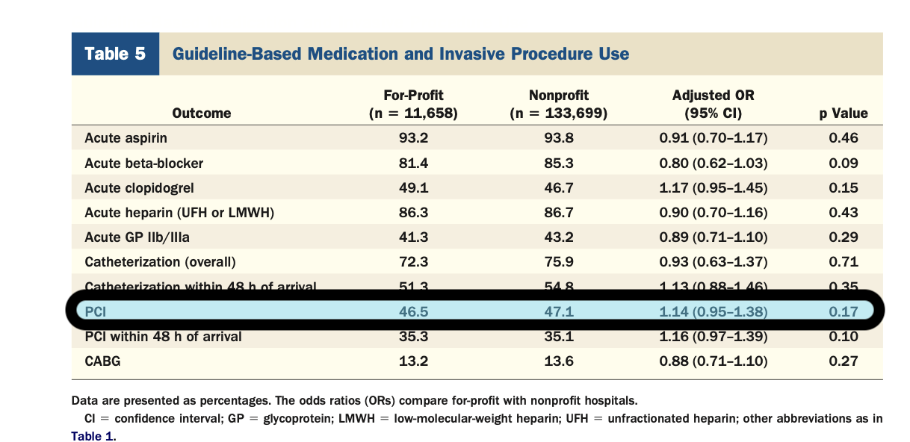

## Summary 

```{=html}
<style>
.reveal { background: #ffffff; }
</style>
```

```{r}
shah2007 = '[Shah et al. (2007)](https://qtm285-1.github.io/assets/borrowed/shah2007mci.pdf)'
kim2023 = '[Kim et al. (2023)](https://arxiv.org/pdf/2311.00568)'
```

::: {.panel-tabset}
###

- We're going to get started looking at real question in health policy.
- **Vague Question**. Do for-profit hospitals prioritize profit over patient outcomes? 
- We'll read two papers that address this question in the context of treatment for heart attacks.
  - `r shah2007` 
  - `r kim2023`

###




###
```{webr}
#| label: scatter-plot
#| autorun: true
                    # hollow versions
circle.shape = 19   # 21
square.shape = 15   # 22
triangle.shape = 17 # 24

no.guides = guides(fill='none', color='none', size='none')
gamma.constant = function(sam) { rep(1, nrow(sam)) }
default.jitter = function(sam, x) {
  h = if(all(sam$y %in% 0:1)) { .1 } else { 0 }
  w = if(all(sam[,x] %in% 0:1)) { .1 } else { 0 }
  position_jitter(width=w, height=h, seed=0)
}
no.jitter = position_identity() 

scatter = function(sam, x, y,  gamma=gamma.constant, jitter=default.jitter(sam,x), 
                   shape=circle.shape, dot.alpha=.25, dot.size=.25) {
  sam$gamma = gamma(sam)/mean(gamma(sam))
  sam$the.x = sam[,x]
  sam$the.y = sam[,y]
  list(geom_point(aes(x=the.x, y=the.y, color=factor(w), size=I(gamma)), 
                   shape=shape, position=jitter, alpha=dot.alpha,
                   data=sam),
    no.guides)
}
```

```{webr}
#| label: histograms
#| autorun: true

default.scale = 1
histograms = function(sam, x, gamma=gamma.constant, scale=default.scale, color=TRUE, fill.alpha=.2, mean.linetype='solid', mean.alpha=.5) {
  sam$gamma = gamma(sam)
  sam$the.x = sam[,x] 
  summaries = sam |> 
    group_by(w) |> 
    summarize(meanx=sum(the.x*gamma)/sum(gamma), .groups='drop')
  
  if(color) { hist.aes = aes(x=the.x, y=scale*after_stat(density), fill=factor(w),  weight=gamma) }   else {      hist.aes = aes(x=the.x, y=scale*after_stat(density), group=factor(w), weight=gamma) }
  list(geom_histogram(hist.aes, 
                      bins=100, alpha=fill.alpha, linewidth=.02, color="gray", position="identity",
                      data=sam),
       geom_vline(aes(xintercept=meanx, color=factor(w)), data=summaries, linetype=mean.linetype, alpha=mean.alpha),
       no.guides, labs(x=x, y='density'))
}

purple.histogram = function(sam, x, scale=default.scale, fill.alpha=.2, mean.linetype='solid', mean.alpha=.5) {
  sam$the.x = sam[,x]
  list(geom_histogram(aes(x=the.x, y=scale*after_stat(density)), fill='purple',
                      bins=100, alpha=fill.alpha, linewidth=.02, color="gray", position="identity",
                      data=sam),
       geom_vline(aes(xintercept=mean(the.x)), data=sam, color='purple', linetype=mean.linetype, alpha=mean.alpha))
}

trimmed = function(f, cutoff) { 
  function(...) { pmax(0, pmin(f(...), cutoff)) }
}
```

:::

## The Heart-Attack Context 

- There are many different treatments for heart attacks. 
  - *Percutaneous coronary intervention* (PCI) is one that is reimbursed well by Medicare.  
  - If for-profit hospitals are choosing treatments to make money, \
  they might choose PCI when non-profit hospitals wouldn't. 
- To analyze this, we can look at medical records. We have data like this.
  - $Y_i$, our outcome, indicates whether the patient was treated with PCI.
  - $X_i$, our covariate, describes the patient and the hospital they were treated at. 
  - $W_i$, our treatment, indicates whether that was a [for-profit hospital]{.groupb} or a [non-profit hospital]{.groupa}.
- We'll think of this as a sample from some population $w_1,x_1,y_1 \ldots w_n,x_n,y_n$.
- And we'll think of each of these as having two potential outcomes.
  - $y_j(0)$ is 1 if the patient would receive PCI at a non-profit hospital. 0 otherwise. 
  - $y_j(1)$ is 1 if the patient would receive PCI at a for-profit hospital. 0 otherwise. 
  - $\tau_j = y_j(1) - y_j(0)$ is the effect of for-profit status on what they receive. 
    - $\tau_j = 0$ if the treatment would be the same regardless of hospital type.
    - $\tau_j = 1$ if they'd get PCI at a for-profit hospital but not a non-profit hospital.
    - $\tau_j = -1$ if they'd get PCI at a non-profit hospital but not a for-profit hospital.
- To summarize these effects, we can average over groups in the population. 
$$
\color{gray}
\begin{aligned}
\tau_j 
&\explain{=}{The effect of for-profit status on patient $j$ receiving PCI}
  \ingroupb{y_j(1)} - \ingroupa{y_j(0)} && \text{ is the effect on patient } j \\   
\text{ATE} 
&\explain{=}{The average effect for all patients in our population} 
\inpurple{\frac{1}{m} \sum_{j=1}^m} \lcb{ \ingroupb{y_j(1)} - \ingroupa{y_j(0)} } \\
\text{ATT} 
&\explain{=}{The average effect for the treated patients in our population} 
\ingroupb{\frac{1}{m_1} \sum_{j:w_j=1}} \lcb{ \ingroupb{y_j(1)} - \ingroupa{y_j(0)} }
\end{aligned}
$$

## Assumptions: Randomization and Random Sampling

- To analyze this, the papers we read effectively make two assumptions.
  1. *Random sampling*. The observations we have are drawn uniformly-at-random from a population of heart-attack patients $(w_1,x_1,y_1),\ldots,(w_n,x_n,y_n)$.
  2. *Randomization of treatment*. The treatment $w_j$ that each patient receives 
  is determined by a coin flip that comes up heads (for-profit) with probability $\pi(x_j)$. That probability might depend on the patient/hospital characteristics $x_j$, but it's not affected by anything else.
- Both of these are pretty questionable assumptions. 
  - We could spend a month working through the implications of them being wrong.^[The sampling assumption we do without if we were willing to settle for *internal validity*: getting the effect on the patients in our sample right. We'd do our statistics thinking about the sampling distribution of our estimator when all that's random is treatment assignment. Without something like the randomization assumption, estimating this effect would require a very different analysis than what we see in these papers if it was possible at all.]
  - I think that'd be a cool class. But it's not something we have time for. 
  - Let's buy in. Let's talk, for now, as if these are true.

## About the Data 

- I'd love to look at the real data, but we don't have it.
  - I contacted one of the authors of `r kim2023` and they couldn't give it to me. 
  - That's almost always the case with medical records. It's a patient privacy thing. 
- That means we don't even have the kinds of plots we usually show in class.
  - Plots of the outcome against the covariates.
  - Histograms of the covariates within each treatment group. 
- What we do have are the tables in these two papers. 
  - These have some of the information we'd usually look at. 
  - e.g., they have the *means* of the covariates in each treatment group.
/  - In fact, we'll work with samples drawn from a *fake population*.
  - We'll use the same fake population that `r kim2023` used to test out their method.^[Almost. You'll see a difference or two on the next slide.] 
- This'll let us test out the methods used in these papers.
  - And it'll let us draw our usual plots *plus* the kind of information we see in the tables we have.
  - That'll help us think about what we can learn from the tables. 

## Fake Data from `r kim2023`

::: {.panel-tabset}
### The Idea 

- This sample is 'sampled with replacement' from an infinite population. 
  - Each observation $(W_i,X_i,Y_i)$ is an independent random variable.
  - The mean of $Y_i$ among people in the population with the same $(W_i,X_i)$ is $\mu(W_i,X_i)$.
  - The probability that a person receives treatment (i.e. that $W_i=1$) is $\pi(X_i)$
- If you want to get a sense of what this means, take a look at how it's generated. 
- But this isn't that important. Don't worry about it unless you want to.
  
### Generating Covariates
```{webr}
#| autorun: true
n = 2000 # 10000

SigmaX.13 = matrix(c(2,   1,   -1,
                     1,   1,   -.5,
                    -1, -.5,    1), 3, 3)
L = chol(SigmaX.13)              
Z.13 = matrix(rnorm(3*n),3,n)   
X.13 = L %*% Z.13               
X.4 = runif(n, min=-1, max=1)
X.5 = rchisq(n, df=1)
X.6 = rbinom(n, size=1, prob=.5)

sam = data.frame(x=rbind(X.13, X.4, X.5, X.6) |> unname() |> t())
```

- For each of the $n$ people in our sample, we generate a $6$-dimensional vector of covariates. 
  - These have the same distribution, so let's think about the first one, $X_1$. 
  - We'll write $X_{1i}$ for the $i$-th component of the vector $X_1$.
- The first three are normally distributed with mean $0$ and covariances $\E[X_{1i}X_{1j}] = \Sigma_{ij}$.^[To generate these, we find a sort of 'square root', $L$ such that $\Sigma = L L^T$.  Then we take a vector of independent normal random variables with mean 0 and variance 1 and compute $X = L Z$. This is normal---linear combinations of normals are normal---and you can check that $\E[X_{1i}X_{1j}] = \Sigma_{ij}$.]
- The next three are independent of the first three and each other with different distributions. 
- Nothing particularly meaningful about any of it. 


If you want to see the data in a table, run this.

```{webr}
sam 
```

### Assigning Treatment
```{webr}
#| label: pi
#| autorun: true
pi = function(s) { with(s, 
  pnorm(x.1^2 + 2*x.2^2 - 2*x.3^2 - 
       (x.4+1)^3 - .05*log(x.5+10) + x.6 - 1.5)
)}

sam$w = rbinom(n, size=1, prob=pi(sam))
```

$$
\begin{aligned}
W_i &= \begin{cases}
1 & \text{ with probability } \pi(x) \\
0 & \text{ otherwise }
\end{cases} \\
\qfor & \pi(x) = \Phi(x_1^2 + 2x_2^2 - 2x_3^2 - (x_4+1)^3 - .05\log(x_5+10) + x_6 - 1.5)
\end{aligned}
$$

```{webr}
#| label: phi-plot
#| autorun: true
#| fig-width: 12

invlogit = function(x) { 1 / (1 + exp(-x)) }
xs = seq(-5, 5, length=1000)
ggplot() + geom_line(aes(x=xs, y=pnorm(xs)), color='red') + 
           geom_line(aes(x=xs, y=invlogit(xs)), color='blue') +
labs(y='Φ(x)')
```
- Here you see two curves mapping the real line into the interval $[0,1]$.
  - In red, the cumulative distribution function $\Phi$ of the standard normal.
  - In blue, the inverse logit function $\invlogit(x)=1/(1+\exp(-x))$.
- We follow Kim et al. (2023) in using the cumulative distribution of the normal.

### Outcomes

**The Mean Function**.
```{webr}
#| autorun: true
mu = function(s) { with(s,
  invlogit((x.1 + x.2 + x.3)^2)
)} 
```
$$
\begin{aligned}
\E[Y_i \mid W_i,X_i] &= \mu(W_i,X_i) 
\qfor && \mu(w,x) = \invlogit((x_1 + x_2 + x_5)^2) \\
\end{aligned}
$$ {#eq-mu-formula}

- This isn't quite what Kim et al. (2023) used.
- I used the inverse logit to map what they used as their mean into the interval $[0,1]$.
$$
\begin{aligned}
\mu(w,x) &= \invlogit((x_1+x_2+x_5)^2) && \text{ours} \\
\mu(w,x) &= (x_1+x_2+x_5)^2 && \text{Kim et al.}
\end{aligned}
$$

**Binary**.
```{webr} 
#| autorun: true
sam$y = rbinom(n, size=1, prob=mu(sam))
```
- The actual outcome we're talking about is binary. 
  - It's whether a patient gets the treatment of interest (PCI).
  - This is a little closer to reality but a little harder to visualize.

$$
\begin{aligned}
Y_i &= \begin{cases} 
1 & \text{ with probability } \mu(w,x) \\
0 & \text{ otherwise }
\end{cases} 
\end{aligned}
$$

**Continuous**.

```{webr} 
#| autorun: true

rbinary.uniform = function(n, mu) { 
  ifelse(rbinom(n, size=1, prob=mu(sam)),                # if we flip 1
                         runif(n, min=0, max=1-mu(sam)), # draw uniformly from 0 to 1-mu
                         runif(n, min=-mu(sam), max=0))  # otherwise draw from -mu to 0
}

sam$y.continuous = mu(sam) + rbinary.uniform(n, mu(sam))
```
- But it's harder to plot binary outcomes, so we'll---for a minute anyway---look at non-binary outcomes in $[0,1]$.
- You can think of these as being a spaced-out version of the binary outcomes.
  - We flip a coin with weight $\mu$ to decide whether we're uniformly distributed above or below the mean.

$$
\begin{aligned}
Y_i &= \mu(W_i,X_i) + \varepsilon_i \qfor 
\varepsilon_i = U_i \times \begin{cases} 1-\mu(W_i,X_i) & \text{ with probability } \mu(W_i,X_i) \\
-\mu(W_i,X_i) & \text{ otherwise } \end{cases} \\
& \qfor U_i \sim \text{Uniform}(0,1)
\end{aligned}
$$

- Here Kim et al. (2023) took $\varepsilon_i$ to be normal with mean $0$ and variance $1$.
- What I did instead ensured we'd get outcomes in $[0,1]$, so we could scale our axes the same way for both the binary and continuous outcomes.

### Putting It All Together

- We'll need to draw samples repeatedly to see what the sampling distribution of our estimators looks like.
- Having all this code in one function will make this easier.
```{webr}
#| autorun: true
draw.sample = function(n) {
  SigmaX.13 = matrix(c(2,   1,   -1,
                       1,   1,   -.5,
                        -1, -.5,    1), 3, 3)
  L = chol(SigmaX.13)              
  Z.13 = matrix(rnorm(3*n),3,n)   
  X.13 = L %*% Z.13               
  X.4 = runif(n, min=-1, max=1)
  X.5 = rchisq(n, df=1)
  X.6 = rbinom(n, size=1, prob=.5)

  sam = data.frame(x=rbind(X.13, X.4, X.5, X.6) |> unname() |> t())
  sam$w = rbinom(n, size=1, prob=pi(sam))
  sam$y = rbinom(n, size=1, prob=mu(sam))
  sam$y.continuous = mu(sam) + rbinary.uniform(n, mu(sam))
  sam
}
```

::: 

## What the Data Looks Like {#sec-data}

```{ojs}
//| echo: false
viewof xx = Inputs.radio(
  ["x.1", "x.2", "x.3", "x.4", "x.5", "x.6"], {value:"x.1", label:"x"})
viewof yy = Inputs.radio(
  new Map([["binary", "y"], 
           ["continuous", "y.continuous"]]), {value:"y", label:"y"})
```

::: {.panel-tabset}
### Scatter Plot 
```{webr}
#| autorun: true
#| fig-width: 12
#| input: 
#|   - xx
#|   - yy
ggplot() + scatter(sam, xx, yy) 
```

### Histograms
```{webr}
#| autorun: true
#| fig-width: 12
#| input: 
#|   - xx
ggplot() + histograms(sam, xx)
```

:::

- Choose a covariate and an outcome to see plots of ...
  - the outcome against the covariate.
  - the distribution of the covariate within each treatment group.
- [treated]{.groupb} and [untreated]{.groupa} points/distributions are indicated by color as usual.
- In the histograms, the means of the covariate in each group are indicated by vertical lines.
  - Most of the covariate distributions differ from group to group, but have the same mean.
  - $x_4$ and $x_6$ are the exceptions. Look there for a shift in the mean.
  
# Observational Causal Inference

## The Essential Approach 

1. *Learn* to predict outcomes for all combinations of treatment and covariates.
$$
\text{ Find } \quad \hat \mu(w,x) \qqtext{ with }  \hat\mu(w,x) \approx Y_i  \qqtext{ when }  X_i=x, W_i=w 
$$

2. *Compare* predictions for different treatments to estimate the effect of treatment.

$$
\hat\tau(X_i) = \ingroupb{\hat \mu(1,X_i)} - \ingroupa{\hat \mu(0,X_i)}
$$

3. *Average* these comparisons to estimate a summary of the effect. 

$$
\begin{aligned}
\overset{\faint{\hat\Delta_{\text{all}}}}{\text{ATE}} 
&\approx \inpurple{\frac{1}{n} \sum_{i=1}^n} \hat\tau(X_i)  && \text{ the average over all people in the sample} \\
\underset{\faint{\hat\Delta_1}}{\text{ATT}} 
&\approx \ingroupb{\frac{1}{N_1} \sum_{i:W_i=1}} \hat\tau(X_i)  && \text{ the average over the treated people in the sample}
\end{aligned}
$$

## Step 1: Learning to Predict 

```{ojs}
//| echo: false
formula_options = new Map(
  [["lines","y ~ w*(x.1 + x.2 + x.3 + x.4 + x.5 + x.6)"],
   ["parallel lines","y ~ w + x.1 + x.2 + x.3 + x.4 + x.5 + x.6"]])
viewof example_formula = Inputs.radio(formula_options, 
  {value: formula_options.get("lines"), label: "model"})
```

```{webr}
#| autorun: true
#| input: 
#|   - example_formula
linear.predictor = lm(example_formula, data=sam)
muhat.WX = predict(linear.predictor, newdata=sam) 
```

::: {.panel-tabset}
### The Predictions 
```{webr}
#| autorun: true
#| fig-width: 12
#| input:
#|   - example_formula
#|   - xx
ggplot() + scatter(sam |> mutate(muhat=muhat.WX), xx, 'muhat',
                   shape=square.shape, jitter=no.jitter)
```

### The Data 
```{webr}
#| autorun: true
#| fig-width: 12
#| input: 
#|   - xx

ggplot() + scatter(sam, xx, yy) 
```

:::

- You're looking at predictions based a higher-dimensional version of the lines model.^[That's if you haven't clicked anything. To change the model, click the button.]
  - The little squares you see are the predictions we get from the model.
  - To compare the predictions to the actual data, flip over the the 'Data' tab.
- Everything is plotted against the covariate you chose on @sec-data.^[If you want to change that, go back and change it there. This'll update automatically.]

```{webr}
#| autorun: true
#| input: 
#|   - example_formula
example_formula
```


## Step 2: Comparing Predictions 

```{webr}
#| autorun: true
#| fig-width: 12
#| input: 
#|   - example_formula
#|   - xx
muhat.1 = predict(linear.predictor, newdata=sam |> mutate(w=1)) 
muhat.0 = predict(linear.predictor, newdata=sam |> mutate(w=0)) 
tau = muhat.1 - muhat.0

tau.plot = ggplot() + scatter(sam |> mutate(tau=tau), xx, 'tau',
                   shape=triangle.shape, jitter=no.jitter)
tau.plot
```

- Here I've predicted the treatment effect for each person in the sample.
- And I've plotted them, as little triangles, against your chosen covariate. 

## Step 3: Averaging the Comparisons {#sec-step-3}

```{webr}
#| autorun: true
#| fig-width: 12
#| input: 
#|   - example_formula
#|   - xx
Deltahat.all = mean(tau)
Deltahat.1   = mean(tau[sam$w==1])

tau.plot + geom_hline(yintercept=Deltahat.all, color='purple') +
           geom_hline(yintercept=Deltahat.1,   color=groupb, linetype='dashed')
```

- Here I've calculated two averages of this predicted effect.
  - [$\Delta_{\text{all}}$]{.purple} is the average over all people in the sample.
  - [$\Delta_{\text{1}}$]{.groupb} is the average over the treated people in the sample.
- I've shown them as horizontal lines on the plot of $\tau(X_i)$ above. 
- Here are the numbers.


::: {#fig-point-estimates}
```{webr}
#| autorun: true
#| input: 
#|   - example_formula
#|   - xx
data.frame(Deltahat.all, Deltahat.1)
```
:::

## Model Choice 
- If you haven't touched anything, what you're seeing is based on the *lines* model.
- Go back to Step 1 and click the button for the *parallel lines* model. 
  - Everything else will update automatically.
  - And the results will be different. What's going on?

::: {.panel-tabset}
### Questions 

- What's different in Step 2? 
- What does the mean for Step 3?

### Answers
- In Step 2, $\tau(X_i)$ will be the same for everybody. 
  - For every function $m(w,x)$ in the parallel lines model, $m(1,x)-m(0,x)$ is the same.
    $$
    \model = \{ m(w,x) = a(w) + bx \} \implies m(1,x)-m(0,x) = a(1)-a(0) \qqtext{ for every } x
    $$
- In Step 3, as a result, $\Delta_{\text{all}}$ and $\Delta_{\text{1}}$ will be the same. 
  - If you average a constant function over two different samples, you get the same thing for both.
  - You get that constant.

:::

# Shortcuts 

## Letting **R** Do the Work {#sec-parallel-shortcut}

- With certain models, we can skip steps. 
  - e.g., if we predict a *constant* effect of treatment, there's no need to average. 
  - This happens when we use certain regression models. 
$$
\begin{aligned}
\model &= \{ m(w,x) = a(w) + bx \}   && \text{ the parallel lines model } \\ 
\model &= \{ m(w,x) = a(w) + b(x) \} && \text{ the additive model } \\
\end{aligned}
$$

- If $\hat\mu(w,x)$ is in $\model$, then 

$$
\hat\mu(1,x) - \hat\mu(0,x) = a(1) - a(0)  \qqtext{ doesn't depend on } x
$$

- And if we parameterize it the right way, $a(1)-a(0)$ is just a coefficient. 
$$
\begin{aligned}
\model &= \{ m(w,x) = a_0 +  a_w w + bx \} && \text{ is the parallel lines model again }  \\
\end{aligned}
$$
- And our prediction for the treatment effect $\tau(X_i)$ is just a coefficient.
$$
\begin{aligned}
m(1,x) - m(0,x) = \{a_0 +  a_w \times 1 + bx \} - \{a_0 + a_w \times 0 + bx \}= a_w 
\end{aligned}
$$

- This means that if we get **R** to tell us the coefficient $a_w$, we're done.

```{webr}
#| autorun: true
linear.predictor.parallel = lm(y ~ w + x.1 + x.2 + x.3 + x.4 + x.5 + x.6, data=sam)
summary(linear.predictor.parallel)
```

- Take a look at the coefficient on $w$ in this summary output.
- Look back at @fig-point-estimates to compare it to the estimates $\hat\Delta_{\text{all}}$ and $\hat\Delta_{\text{1}}$ we calculated in the previous section. 
- If you used the parallel lines model there, this coefficient should be the same as both of those.

## A Problem: We Predict Frequencies Outside $[0,1]$

```{webr}
#| autorun: true
#| fig-width: 12
#| input: 
#|   - xx
#|   - yy
muhat.WX = predict(linear.predictor.parallel, newdata=sam) 
ggplot() + scatter(sam |> mutate(muhat=muhat.WX), xx, 'muhat', 
                   shape=square.shape, jitter=no.jitter)
```
- The little squares you see are the predictions $\hat\mu(W_i,X_i)$.
- Some of them are outside the interval $[0,1]$. In particular, a couple are bigger than $1$.
- This makes people uncomfortable. To fix this, they often use what are called *generalized linear models*.
$$
\begin{aligned}
\model &= \{ m(w,x) = \invlogit(a(w) + bx) \}   && \text{ logistic regression version of the lines model} \\
\model &=\{ m(w,x) = \invlogit(a(w) + b(x)) \} && \text{ logistic regression version of the additive model}
\end{aligned}
$$

- Here $\inblue{\invlogit}$ is a function that maps the real line into the interval $[0,1]$: $\invlogit(x) = 1/(1+\exp(-x))$.

```{webr}
#| label: phi-plot-2
#| autorun: true
#| fig-width: 12

invlogit = function(x) { 1 / (1 + exp(-x)) }
xs = seq(-5, 5, length=1000)
ggplot() + geom_line(aes(x=xs, y=pnorm(xs)), color='red') + 
           geom_line(aes(x=xs, y=invlogit(xs)), color='blue') +
labs(y='inverse logit(x)')
```

- Sometimes people use other functions that do the same thing. 
  - e.g. cumulative distribution function $\textcolor{red}{\Phi}$ of the standard normal.  They call that a 'probit' model. 
  - These two curves have about the same shape, so it usually doesn't matter that much which which you use.

## Problem Solved? {#sec-logit-steps}

::: {.panel-tabset}
### Step 1: Learning to Predict 

```{webr}
#| autorun: true
logit.predictor = glm(y ~ w + x.1 + x.2 + x.3 + x.4 + x.5 + x.6, 
  family='binomial', data=sam)
muhat = predict(logit.predictor, newdata=sam, type='response') 
```

```{webr}
#| autorun: true
#| fig-width: 12
#| input: 
#|   - xx
ggplot() + scatter(sam |> mutate(muhat=muhat), xx, 'muhat', 
                   shape=square.shape, jitter=no.jitter)
```

- Here are the predictions we get using the logistic regression version of the parallel lines model. 
  - Now all the predictions are in the interval $[0,1]$. That's how logistic regression works.
  - No matter what you put into $\invlogit$, you get something in $[0,1]$.
    
$$
\invlogit( v ) = \frac{1}{1+e^{-v}} \in [0,1] \qqtext{ for any } v
$$

- We can use our predictor $\hat\mu$ to estimate the ATE and ATT just like we did before.

### Step 2: Comparing Predictions 
```{webr}
#| autorun: true
#| fig-width: 12
#| input: 
#|   - xx
muhat1 = predict(logit.predictor, newdata=sam |> mutate(w=1), type='response') 
muhat0 = predict(logit.predictor, newdata=sam |> mutate(w=0), type='response') 
tauX = muhat1 - muhat0

tau.plot = ggplot() + scatter(sam |> mutate(tau=tauX), xx, 'tau',
                   shape=triangle.shape, jitter=no.jitter)
tau.plot
```

- Here I've predicted the treatment effect for each person in the sample.
- And I've plotted them, as little triangles, against your chosen covariate. 

### Step 3: Averaging the Comparisons 
```{webr}
#| autorun: true
#| fig-width: 12
#| input: 
#|   - xx
Deltahat.all = mean(tauX)
Deltahat.1   = mean(tauX[sam$w==1])

tau.plot + 
  geom_hline(yintercept=Deltahat.all, color='purple') +
  geom_hline(yintercept=Deltahat.1,   color=groupb, linetype='dashed')
```

- Here I've calculated two averages of this predicted effect.
  - [$\Delta_{\text{all}}$]{.purple} is the average over all people in the sample.
  - [$\Delta_{\text{1}}$]{.groupb} is the average over the treated people in the sample.
- I've shown them as horizontal lines on the plot of $\tau(X_i)$ above. 
- Here are the numbers. Go ahead and compare them to the ones in @fig-point-estimates, when we used a linear model.

```{webr}
#| autorun: true
#| input: 
#|   - xx
data.frame(Deltahat.all, Deltahat.1)
```
:::

## The Fix and the Shortcut  {#sec-logit-shortcut}

```{webr}
#| autorun: true
#| fig-width: 12
#| input: 
#|   - xx
Deltahat.all = mean(tauX)
Deltahat.1   = mean(tauX[sam$w==1])

tau.plot + 
  geom_hline(yintercept=Deltahat.all, color='purple') +
  geom_hline(yintercept=Deltahat.1,   color=groupb, linetype='dashed')
```

- Now what happens when we use our shortcut? 
  - One thing you'll notice is that we're not predicting the same treatment effect for everyone.  
  - So the ATT and ATE are different. And the coefficient $a_w$ can't be both.
- What is the coefficient $\hat a_{w}$ in our predictor $\hat\mu$?

$$
\hat\mu(w,x) = \invlogit(\hat a_0 + \hat a_w w + \hat b x) \qfor 
\invlogit(v) = \frac{1}{1+\exp(-v)}
$$

- Here's what **R** says. 
  
```{webr}
#| autorun: true
summary(logit.predictor)
```

- This --- or something like it --- is what people usually report. 
  - Why?  Because it's what their software (usually **R**) gives them.
  - It's totally different from our estimates of the ATE and ATT. 
  - It's an estimate of the *log odds-ratio* of getting PCI with those two treatments. 

$$
e^{\hat a_{w}} = \frac{\frac{\hat\mu(1,x)}{1-\hat\mu(1,x)}}{
\frac{\hat\mu(0,x)}{1-\hat\mu(0,x)}} \qfor \hat\mu(w,x) = \invlogit(\hat a_0 + \hat a_w w + \hat b x)
$$

- It's a bit of a calculation to show this, but all you've got to do is plug in your formula for $\hat\mu$ and do some algebra. We did it in class.


## Interpreting Odds Ratios

- We should know a bit about how to interpret odds ratios because people report them.
  - `r shah2007` reports an odds ratio point estimate $\hat a_w=1.14$ and a 95% confidence interval $[.95, 1.38]$.^[See the column 'Adjusted OR' in the 'PCI' row in Table 5.]
- What *the* odds ratio that's meant to be in this interval is a bit unclear.
  - We'd expect it to vary with $x$ so there isn't any one odds ratio. 
$$
\begin{aligned}
\text{OR}(x) &= \frac{\frac{\mu(1,x)}{1-\mu(1,x)}}{\frac{\mu(0,x)}{1-\mu(0,x)}} \qqtext{ varies with } x \\
 \qqtext{ unless } &\mu(w,x)=\invlogit(a(w) + b(x)) \qqtext{ for some } a(w), b(x)
\end{aligned}
$$

- But let's suppose the odds ratio were actually constant and try to work out what that'd mean. 
- A starting point is to observe that *odds are increasing as a function of frequency*.

```{webr}
#| autorun: true
#| fig-width: 12

p = seq(.01, .99, by=.01)
ggplot() + geom_line(aes(x=p, y=p/(1-p)), color='blue') + 
  labs(x='p', y='p/(1-p)')
```

- That means it's equivalent to say that ...
  - the frequency $p=\mu(1,x)$ is higher than $q=\mu(0,x)$
  - the odds $p/(1-p)$ are higher than $q/(1-q)$.
  - and the odds ratio $p/(1-p) / q/(1-q)$ is bigger than 1.
- This is basically all people tend to know about odds ratios.
  - If $e^{\hat a_w} > 1$, we're predicting that PCI happens *more* [with treatment]{.groupb} than [without treatment]{.groupa}.
  - If $e^{\hat a_w} < 1$, we're predicting that PCI happens *less* [with treatment]{.groupb} than [without treatment]{.groupa}.
- Beyond that, it's hard to interpret. Let's look at a picture.
- Here's the odds ratio plotted against two frequencies $p,q \in [0,1]$.
$$
OR(p,q) = \frac{p/(1-p)}{q/(1-q)}
$$

```{r}
#| fig-width: 12
grid = expand.grid(p=seq(.1,.9,length=100), q=seq(.1,.9,length=100))
breaks = c(1/5, 1/3, 1/1.5, 1/1.25, 1/1.1, 1.1, 1.25, 1.5, 3, 5)
grid = grid |> mutate(odds.ratio = (p/(1-p)) / (q/(1-q)))
theme_set(class.theme)
ggplot(grid) + 
  geom_contour_filled(aes(x=p, y=q, z=odds.ratio), breaks=breaks) + 
  scale_fill_brewer(palette='RdBu') + 
  labs(x='p', y='q', fill='OR(p,q)')
```


## The Estimates in `r shah2007`



- In the data analyzed in `r shah2007`, for-profit hospitals do PCI *less often* than non-profit hospitals.
  - [46.5%]{.groupb} of the time vs. [47.1%]{.groupa} of the time in non-profit hospitals.
  - If we really want this as an odds ratio, we can calculate it. It's a little less than 1.
$$
\frac{\frac{.465}{1-.465}}{\frac{.471}{1-.471}} \approx  `r round((.465/(1-.465)) / (.471/(1-.471)), 2)` \qqtext{ is less than 1 } 
$$

- But that's a raw difference. We know those are impacted by covariate shift. e.g ... 
    - differences in the patients who end up in for-profit vs. non-profit hospitals.
    - hospital characteristics other than for/non-profit status: size, region, etc. 
- They report an *adjusted odds ratio* estimate of 1.14. It's bigger than 1. That tells the opposite story.
  - It says similar patients at similar for and non-profit hospitals get PCI *more often* at the for-profit ones.
  - It's Simpson's paradox, just like in our [Berkeley admissions example](`r lecture(9)`/#a-famously-paradoxical-example).
- But 1.14 is a point estimate. Their 95% confidence interval $[.95, 1.38]$ includes numbers less than 1, too. 
  - So, in essence, their study is inconclusive about PCI and for-profit hospitals. That's what they say. 
  - But inconclusiveness is a matter of degree. If you want to get in some practice thinking about inconclusiveness, odds ratios, and how calibration works, take a look [here](#sec-about-inconclusiveness)
  in the Appendix. 

## What About Misspecification?

- If we're trying to think of all this as meaningful, we're making some pretty strong assumptions.
- To start with, we haven't been clear about what odds ratio we're trying to estimate, exactly.  
$$
\begin{aligned}
\text{OR}(x) &= \frac{\frac{\mu(1,x)}{1-\mu(1,x)}}{\frac{\mu(0,x)}{1-\mu(0,x)}} \qqtext{ varies with } x \\
 &\qqtext{ unless } \mu(w,x)=\invlogit(a(w) + b(x)) \qqtext{ for some } a(w), b(x)
\end{aligned}
$$
- Even if the odds ratio *were* constant --- i.e. if the 'unless' part was true --- misspecification is likely.
  - We get constancy if the log odds $\log\{\mu(w,x)/(1-\mu(w,x))\}$ are *additive* in $w$ and $x$.
  $$
  \begin{aligned}
  \mu(w,x) &= \invlogit(a(w) + b(x)) && \qqtext{if and only if} 
  &\log\left\{\frac{\mu(w,x)}{1-\mu(w,x)}\right\}=a(w) + b(x)
  \end{aligned}
  $$
  - Our model includes a small subset of functions like that: the ones where \
  the log odds are linear combinations of $x_1 \ldots x_6$. 
  $$ 
  \begin{aligned}
  m(w,x) &= \invlogit(a_0 + a_w w + b_1 x_1 + \cdots + b_6 x_6) &&\qqtext{if and only if} \\
  &\log\left\{\frac{m(w,x)}{1-m(w,x)}\right\}=a_0 + a_w w + b_1 x_1 + \cdots + b_6 x_6
  \end{aligned}
  $$

- We're doing *something* to adjust for covariate shift, we may not be adjusting for it successfully.

## Misspecification and Simulated Data

- Let's think through what happens with the simulated data we've been using.
  - In that data, the odds ratio *is* constant. It's 1. Treatment does nothing at all. 
  - $\mu(1,x)=\mu(0,x)$ for all $x$. See @eq-mu-formula.
- But the estimate we get using our logistic regression model isn't all that close to one. 
  - We can base a normal-approximation interval for its log on the summary output from @sec-logit-shortcut.
  - Here's our interval. We're confidently wrong (Remember that $\log(1)=0$).
  
```{webr}
#| autorun: true
point.estimate = coef(logit.predictor)['w']
its.standard.deviation = sqrt(vcov(logit.predictor)['w','w'])
point.estimate + c(-1,1) * 1.96 * its.standard.deviation 
```

## What We Learn from This 

- We're doing essentially the same thing they did in `r shah2007`. It's not working. 
  - Our log-odds-ratio target is zero but our interval estimate nowhere near there.
  - That's worrisome. Perhaps we shouldn't trust the concusions of `r shah2007`. 
- We see the same problem in the summary output for our 'parallel lines model' on @sec-parallel-shortcut.

```{webr}
#| autorun: true
point.estimate = coef(linear.predictor.parallel)['w']
its.standard.deviation = sqrt(vcov(linear.predictor.parallel)['w','w'])
point.estimate + c(-1,1) * 1.96 * its.standard.deviation 
```
- Our target in that context---whether we're thinking of the ATE or ATT---is zero. 
  - Our interval is tiny but everything in it is way off. Way bigger than zero. This is bad.
  - It's bad enough that our estimate *is* far off target. 
  - What makes it worse is that *we're saying* that it's very close (because our interval is so small).
- We get similar point estimates when we calculate the ATE and ATT 'the long way' \
  using the other models we've looked at.
  - The 'lines' model (@sec-step-3).
  - The 'logit version' of the 'parallel lines model' (@sec-logit-steps).
- All of these estimators are badly biased. 
  - We'll take a look at their sampling distributions when we discuss `r kim2023`.
  - It seems like we should be doing something else. Let's get started on that. 

# Using Weighting to Reduce Bias 

## Balanced Covariate Distributions

```{ojs}
//| echo: false
viewof x = Inputs.radio(
  ["x.1", "x.2", "x.3", "x.4", "x.5", "x.6"], {value:"x.1", label:"x"})
viewof trim_level = Inputs.radio( 
  [1, 2, 5, 10, 20, 100, Infinity], {value: 100, label:"trim γ at"})
viewof y = Inputs.radio(
  new Map([["binary", "y"], 
           ["continuous", "y.continuous"]]), {value:"y", label:"y"})
```

::: {.panel-tabset}
### ATT
```{webr}
#| autorun: true
#| input:
#|  - trim_level
gamma.ipw = function(sam) { ifelse(sam$w, 1, pi(sam) / (1-pi(sam))) }
gamma.sbw = sbw.att(sam, K=K.gaussian)
```

```{webr}
#| autorun: true
#| fig-width: 12
#| input: 
#|   - x
#|   - trim_level 
gamma = gamma.ipw
ggplot() + histograms(sam, x, gamma=trimmed(gamma, trim_level)) + 
           histograms(sam, x, color=FALSE, fill.alpha=.05, mean.linetype='dotted') +
           facet_grid(rows=vars(w))
```

**Scatter Plot**
```{webr}
#| autorun: true
#| fig-width: 12
#| input: 
#|   - x
#|   - y
#|   - trim_level
ggplot() + scatter(sam, x, y, gamma=trimmed(gamma, trim_level)) 
```

### ATT Estimates 

::: {.panel-tabset}
### Estimates 
```{webr}
#| autorun: true 
formula = y ~ w 
```

```{webr}
#| autorun: true
#| fig-width: 12
#| input: 
#|   - trim_level
model.ipw = lm(formula, weights=gamma, 
  data=sam |> mutate(gamma=trimmed(gamma, trim_level)(sam)))
Deltahat.1 = 
  mean( predict(model.ipw, sam  |> filter(w==1) |> mutate(w=1)) - 
        predict(model.ipw, sam  |> filter(w==1) |> mutate(w=0)) )
Deltahat.1
```

**Without IPW**.
```{webr}
#| autorun: true
model.no.ipw = lm(formula, data=sam) 
Deltahat.1.no.ipw = 
  mean( predict(model.no.ipw, sam  |> filter(w==1) |> mutate(w=1)) - 
        predict(model.no.ipw, sam  |> filter(w==1) |> mutate(w=0)) )
Deltahat.1.no.ipw
```

### Code for Doing This Over and Over 

```{webr}
#| autorun: true
#| input: 
#|   - trim_level
estimate.att = function(sam, formula, gamma=gamma.constant) { 
  data = sam |> mutate(gamma=gamma(sam))
  model = lm(formula, weights=gamma, data=data) 
  Deltahat.1 = 
    mean( predict(model, sam  |> filter(w==1) |> mutate(w=1)) - 
          predict(model, sam  |> filter(w==1) |> mutate(w=0)) )
  Deltahat.1
}
```

```{webr}
#| autorun: true
#| input: 
#|   - trim_level
estimators = function(sample) {
  data.frame(ipw=estimate.att(sample, formula, gamma=trimmed(gamma, trim_level)),
             no.ipw=estimate.att(sample, formula))
}
```

```{webr}
#| autorun: true
plot.sampling.distribution = function(samples, target=0) {
  ggplot(samples) + 
    geom_histogram(aes(x=ipw), bins=50, alpha=.5, fill=teal, linewidth=.05) + 
    geom_histogram(aes(x=no.ipw), bins=50, alpha=.5, fill=pink, linewidth=.05) + 
    geom_vline(xintercept=target, color='green', linewidth=1.5, alpha=.5)  
}
```

### Summary Outputs 
:::: columns
::: column
```{webr}
#| autorun: true
#| input: 
#|   - trim_level
summary(model.ipw)
```
:::
::: column
```{webr}
#| autorun: true 
summary(model.no.ipw)
```
:::
::::
:::

:::{.panel-tabset}
### Actual Sampling Distribution

```{webr}
#| autorun: true
#| fig-width: 12
#| input: 
#|   - trim_level
samples = 1:400 |> map(function(.) {  
  sam = draw.sample(n) 
  sam 
})

att.samples = samples |> map(estimators) |> bind_rows()
plot.sampling.distribution(att.samples)
```

### Bootstrap Sampling Distribution

```{webr}
#| autorun: true
#| fig-width: 12
#| input: 
#|   - trim_level
bootstrap.samples = 1:400 |> map(function(.) {  
  J = sample(1:nrow(sam), nrow(sam), replace=TRUE)
  sam[J,]
})  

att.star = bootstrap.samples |> map(estimators) |> bind_rows()
plot.sampling.distribution(att.star)
```
:::

These are for our ATT estimators using [inverse probability weighting]{.teal} and [not]{.pink}.

:::

## *Stable Balancing Weights*
```{r}
#| autorun: true

pi = function(s) { with(s, 
  pnorm(x.1^2 + 2*x.2^2 - 2*x.3^2 - 
       (x.4+1)^3 - .05*log(x.5+10) + x.6 - 1.5)
)}

invlogit = function(x) { 1 / (1 + exp(-x)) }
mu = function(s) { with(s,
  invlogit((x.1 + x.2 + x.3)^2)
)} 

draw.sample = function(n) {
  SigmaX.13 = matrix(c(2,   1,   -1,
                       1,   1,   -.5,
                        -1, -.5,    1), 3, 3)
  L = chol(SigmaX.13)              
  Z.13 = matrix(rnorm(3*n),3,n)   
  X.13 = L %*% Z.13               
  X.4 = runif(n, min=-1, max=1)
  X.5 = rchisq(n, df=1)
  X.6 = rbinom(n, size=1, prob=.5)

  sam = data.frame(x=rbind(X.13, X.4, X.5, X.6) |> unname() |> t())
  sam$w = rbinom(n, size=1, prob=pi(sam))
  sam$y = rbinom(n, size=1, prob=mu(sam))
  sam$y.continuous = mu(sam) + rbinary.uniform(n, mu(sam))
  sam
}
```

::: {.panel-tabset}
### Kernels 
```{webr}
#| autorun: true
atleast_2d = function(X) { 
  if(length(dim(X))==1) {
    dim(X)=c(dim(X),1)
  }
  X
}

outerproduct = function(A,B,K) { 
  A = atleast_2d(A)
  B = atleast_2d(B)
  O = array(dim=c(nrow(A), nrow(B)))
  for(ib in 1:nrow(B)) { 
      O[,ib] = K(A,B[ib,])
  }
  O
}

K.norm = function(x,xp, s=1) {
    diff.norm = sqrt(colSums((t(x)-xp)^2))
    exp(-diff.norm)/2
}
K.gaussian = function(x,xp) {
    diff.norm = sqrt(colSums((t(x)-xp)^2))
    exp(-diff.norm^2/2)/sqrt(2*3.14159)
}
K.poly = function(x,xp, p=1) {
    (1 + t(c(x)) %*% c(xp))^p
}
```

### Prediction 
```{webr}
#| autorun: true
predict.kernel.regression = function(obj, newdata, KxX=NULL) {
    x = newdata$X
    X = obj$X
    K = obj$K
    alpha = obj$alpha

    if(is.null(KxX)) { KxX = outerproduct(x,X,K) }
    KxX %*% alpha 
}
```

### Fitting Weights 
```{webr}
#| autorun: true
kernel.sbw = function(W,X,K,P=NULL) {
    X = atleast_2d(X)
    KxX = outerproduct(X,X[W==0,],K)
    KXX = KxX[W==0,]
    evd = eigen(KXX, symmetric = TRUE)
    
    V = evd$vectors
    l = evd$values

    VtsumKxX = t(V) %*% colSums(KxX[W==1,])
    function(sigma) { 
        alpha = V %*% diag(1/(l^2 + sigma^2*l)) %*% VtsumKxX 
        obj = list(alpha=alpha, K=K, X=X[W==0,])
        attr(obj, 'class') = 'kernel.regression'
        obj
    }
}
```

### Everything Together
```{webr}
#| autorun: true
sbw.att = function(sam, K=K.gaussian) {
  X = as.matrix(sam[, c('x.1','x.2','x.3','x.4','x.5','x.6')])
  sigma.to.sbw = kernel.sbw(sam$w, X, K)
  P1 = mean(sam$w)
  gammahat = function(newsam, sigma=1) {
    newX = as.matrix(newsam[, c('x.1','x.2','x.3','x.4','x.5','x.6')])
    newdata = list(X=newX[newsam$w==0,])
    obj = sigma.to.sbw(sigma)
    weights = rep(1,nrow(newsam))
    weights[newsam$w==0] = predict(obj, newdata) * P1 
    weights
  }
}

sam = draw.sample(1000)
gammahat = sbw.att(sam)
mean((1-sam$w)*gammahat(sam,.1))
mean(gamma*sam$w*sam$y - gamma*(1-sam$w)*sam$y)
```
:::


# What to Read {#what-to-read}

## [Shah et al. (2007)](https://qtm285-1.github.io/assets/borrowed/shah2007mci.pdf)

- This is short, so you should be able to read it straight through.
- They report a bunch of stuff. 
- Focus on what they say is the effect of (W: [profit]{.groupb} vs. [non-profit]{.groupa}) on whether PCI is given (Y). 
- Think about this stuff.
  - What do you think they want to know? 
  - What do you think their conclusions are?
  - Do you believe them?

## [Kim et al. (2023)](https://arxiv.org/pdf/2311.00568)

- A lot of it focuses on computing their (IPW-like) estimator. Ignore all that.
  - Don't bother reading Sections 3 or 4 at all. 
- Focus on their methods and their conclusions.  
- I'm throwing you into the deep end with this one.
- Don't stress if you don't follow everything. Try to get the general idea. 
- Here's two things to look for.
  - Their estimator for the ATT ($\Delta_1$) compares the sample average outcome of the [treated group]{.groupb} to the *weighted* sample average outcome of the [control group]{.groupa}. That's weighted least squares in the *horizontal lines model*. 
  - Their weights (they write $w_i$ where we write $\gamma(W_i,X_i)$) aren't *defined* as a ratio of covariate distributions $\ingroupa{p_{x\mid 1}}/\ingroupb{p_{x \mid 0}}$. But they're chosen to *do* exactly what weighting using that ratio *does*. That is, to make the distribution of the covariate in the *weighted* sample match match the distribution we're averaging over when we calculate $\Delta_1$.
    
# Appendix

## About Inconclusiveness {#sec-about-inconclusiveness}

- Let's do an exercise to get in some practice thinking about odds ratios and how calibration works.
  - I'll warn you now that we're not going to get any radical insight about for-profit hospitals from this exercise.
  - It's just practice. And maybe a little insight about what inconclusiveness is and isn't.
- `r shah2007` reports a odds ratio point estimate $\hat a_w=1.14$ and a 95% confidence interval $[.95, 1.38]$.
  - This is 'inconclusive' in the sense that the interval includes both numbers bigger than 1 and less than 1.
  - But it says something. It says we might the odds ratio might be a little smaller than 1 or a lot bigger than 1, but *not a lot smaller than 1*.
- To reinterpret this, let's think about what they'd report as a 75% confidence interval.
  - We'll think of their interval as a normal approximation type interval $1.14 \pm 2\hat\sigma$.
  - So we can solve for $\hat\sigma$: it's $(1.14 - .95) / 2 = `r (1.14 - .95)/2`$. 
  - A 75% interval would be $1.14 \pm 1.15 \hat\sigma \approx `r round(1.14 + 1.15 * c(-1,1) * (1.14 - .95)/2, 2)`$.
- We don't usually report 75% intervals for a reason. 
  - When you're right only 3/4 of the time, people don't want to listen to you. 
  - That's why it's conventional to report 95% intervals: so it's conventional for people to listen.
- But *if we believed the odds ratio were in that 75% interval*, we'd conclude that ...
  - ... similar patients at similar for and non-profit hospitals *do* get PCI *more often* at the for-profit ones.
  - But the difference *might* be extremely small. The lower end of our interval is almost $1$. 
- If you do look at the interval as a whole, not much changes from what the 95% interval says. 
- But, if you fixate on 'inconclusive' vs. 'conclusive' studies --- i.e. on our interval including or excluding 1 --- you might get the wrong idea.
  - You might say --- if 75% were the standard --- that the study is conclusive. 
  - i.e., that it concludes (being loose about interpretation) that for profit hospitals are doing PCI to make money.
- What I want to highlight here is that you shouldn't get too hung up on a difference being bigger than zero or a ratio being bigger than 1. 
  - Take a look at Section 4.5 of [Regression and Other Stories](https://users.aalto.fi/~ave/ROS.pdf) for a discussion about this. 
