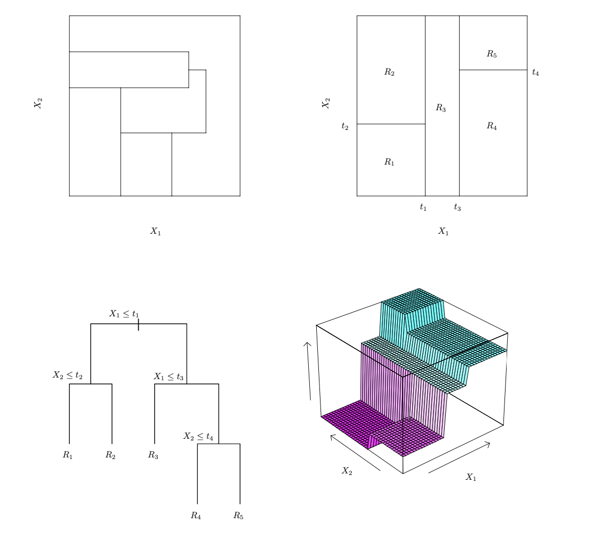

```{r load-libraries}
library(purrr)
library(tibble)
library(dplyr)
library(magrittr)
library(stringr)
library(ggplot2)
library(htmltools)
library(kableExtra)
library(scales)

percent = label_percent(accuracy=1)
approx  = function(x,accuracy=.01) { label_number(accuracy=accuracy, scale_cut=cut_short_scale())(x) }
```


```{r ggplot-themes}
fontsize = 16
textcolor = "#888888"

class.theme = theme(plot.background = element_rect(fill = "transparent", colour = NA),
        panel.background = element_rect(fill = "transparent", colour = NA),
                    legend.background = element_rect(fill="transparent", colour = NA),
                    legend.box.background = element_rect(fill="transparent", colour = NA),
                    legend.key = element_rect(fill="transparent", colour = NA),
        axis.ticks.x = element_blank(),
        axis.ticks.y = element_blank(),
        axis.text.x  = element_text(colour = textcolor, size=fontsize),
        axis.text.y  = element_text(colour = textcolor, size=fontsize),
        axis.title.x  = element_text(colour = textcolor),
        axis.title.y  = element_text(colour = textcolor, angle=90),
         legend.position=c(.9,.9),
         plot.title=element_text(margin=margin(t=40,b=-30))
)

theme_set(class.theme)
theme_update(axis.title.x  = element_blank(),
             axis.title.y  = element_blank())
simplified.theme = theme_get()

theme_update(axis.text.x   = element_blank(), 
              axis.text.y   = element_blank())
blank.theme = theme_get()

theme_update(panel.grid.major=element_line(color=rgb(1,0,0,.1,  maxColorValue=1)),
           panel.grid.minor=element_line(color=rgb(0,1,0,.1, maxColorValue=1)))
grid.theme = theme_get()

theme_set(simplified.theme)
```

```{r define-population}
set.seed(1) 
m = 100000
pi = function(x) { 1/(1+exp(-sinpi((x-65)/30))) }
mu = function(w, x) { 2 - 1.5*((x-50)/20)^3/3 + w*((x-50)/30)^2 }  

X = 50+round(30*runif(m))
W = rbinom(m, 1, pi(X))
eps0 = .5*rnorm(m)
eps1 = .5*rnorm(m)

pop = data.frame(X=X, W=W, Y0=mu(0,X)+eps1, Y1=mu(1,X)+eps1)
```


```{r summarize-population}
pop$Y = pop$Y0*(1-pop$W) + pop$Y1*pop$W

pop.summaries.x = pop %>% group_by(X) %>% summarize(pi=mean(W))
pi = function(x) { inner_join(data.frame(X=x), pop.summaries.x, by=c('X')) %>% pull(pi) }

pop.summaries = pop %>% group_by(W,X) %>% summarize(mu=mean(Y), n = n()) %>%
                        group_by(W) %>% mutate(f=n/sum(n))
mu = function(w,x)  { inner_join(data.frame(W=w, X=x), pop.summaries, by=c('W','X')) %>% pull(mu) } 
f  = function(w,x)  { inner_join(data.frame(W=w, X=x), pop.summaries, by=c('W','X')) %>% pull(f) }
x = unique(pop$X)

ATT = mean(mu(1,pop$X[pop$W==1]) - mu(0,pop$X[pop$W==1]))
```


```{r plot-population-ATT}

plotX = function(X,W) { X + .15*(2*W-1) }
scaleY = coord_cartesian(ylim=c(0,3.5))
#scale_y_continuous(limits=c(0,4), breaks=seq(0,4,by=1))

pop.scatter = ggplot(pop) + 
  geom_point(aes(x=plotX(X,W), y=Y, color=factor(W)), alpha=.05, position=position_jitter(w=.15, h=0), size=.05) + 
  guides(color="none") + scaleY

summarized.pop.scatter = pop.scatter + 
  geom_point(aes(x=plotX(X,W), y=mu, color=factor(W)), data=pop.summaries, alpha=.5) + 
  geom_line(aes(x=plotX(X,W), y=mu, color=factor(W)),  data=pop.summaries, alpha=.5) + 
  geom_col(aes(x=X, y=30*f, fill=factor(W)), position='identity', alpha=.15, data=pop.summaries) + 
  guides(fill="none", color="none") + ggtitle(sprintf("ATT = %s", approx(ATT))) 

```


```{r sample}

set.seed(3)
n = 500
data = pop[sample(1:nrow(pop), n, replace=TRUE),]
summaries = data %>% group_by(X, W) %>% summarize(mu=mean(Y), sd=sd(Y), n=n()) %>%
                     group_by(W) %>% mutate(f=n/sum(n))
```

```{r plot-sample-ATT}

plotX = function(X,W) { X + .15*(2*W-1) }
scatter.plot = function(data) { 
    ggplot(data) + 
        geom_point(aes(x=plotX(X,W), y=Y, color=factor(W)), alpha=.1, size=1, position=position_jitter(w=.15, h=0)) + 
        guides(color="none") + scaleY
}

summarized.scatter.plot = function(data) { 
  summaries = data %>% group_by(X, W) %>% summarize(mu=mean(Y), sd=sd(Y), n=n()) %>%
                     group_by(W) %>% mutate(f=n/sum(n))
  scatter.plot(data) + 
    geom_pointrange(aes(x=plotX(X,W), y=mu, ymin=mu-2*sd/sqrt(n), ymax=mu+2*sd/sqrt(n), 
                        color=factor(W)), data=summaries, alpha=.5) + 
    geom_col(aes(x=X, y=30*f, fill=factor(W)), position='identity', alpha=.15, data=summaries) + 
    guides(fill="none", color="none") + ggtitle(sprintf("ATT = %s", approx(ATT))) 
}

```

```{r estimate-ATT-formula}

ATT.weights = function(pi,W,X) { W  + (1-W)*pi(X)/(1-pi(X)) }
mu.model.ATT = function(data, mu.formula, pi.spec) {
    mu.model = if(is.null(pi.spec)) { 
        lm(mu.formula, data=data)
    } else if(is.function(pi.spec)) {
        data$weights = ATT.weights(pi, data$W, data$X)
        lm(mu.formula, data=data, weights=weights)
    } else { # assume pi.spec is a formula 
        pi.model = glm(pi.spec, family=binomial(), data=data)
        pi.hat = function(x) { predict(pi.model, newdata=data.frame(X=x), type='response') }
        data$weights = ATT.weights(pi.hat, data$W, data$X)
        lm(mu.formula, data=data, weights=weights)
    }
}

estimate.ATT = function(data, mu.formula, pi.spec=NULL) {
    mu.model = mu.model.ATT(data, mu.formula, pi.spec)
    mean(predict(mu.model, newdata=data.frame(W=1, X=data$X[data$W==1])) -
         predict(mu.model, newdata=data.frame(W=0, X=data$X[data$W==1])))
}
```

```{r plot-ATT-formula}

plot.ATT.estimate = function(data, mu.formula, pi.spec=NULL) { 
    grid = expand.grid(W=c(0,1), X=unique(data$X))
    mu.model = mu.model.ATT(data, mu.formula, pi.spec)
    grid$muhat = predict(mu.model, newdata=grid)
    grid$weights = 
        if(is.null(pi.spec)) { 
            1 
        } else if(is.function(pi.spec)) { 
            ATT.weights(pi, grid$W, grid$X)
        } else { # assume pi.spec is a formula 
            pi.model = glm(pi.spec, family=binomial(), data=data)
            pi.hat = function(x) { predict(pi.model, newdata=data.frame(X=x), type='response') }
            ATT.weights(pi.hat, grid$W, grid$X)
        } 
    estimate = estimate.ATT(data, mu.formula, pi.spec)
    summarized.scatter.plot(data) + 
        geom_line(aes(x=plotX(X,W), y=mu(W,X), color=factor(W)), data=grid, linetype='solid', alpha=.9) +
        geom_line(aes(x=plotX(X,W), y=muhat, color=factor(W)), data=grid, linetype='dashed') +
        geom_point(aes(x=plotX(X,W), y=muhat, size=weights),   data=grid, color='black', fill='black', shape=23, alpha=.3) +
        scale_size_area(max_size=3)  + 
        ggtitle(sprintf(" ATT Estimate = %s\t ATT= %s\t error=%s", approx(estimate), approx(ATT), approx(estimate-ATT)))
}
```

```{r plot-ATT-dist}
plot.ATT.dist = function(pop, n, mu.formula, pi.spec=NULL, replications=200, K=100) {
    set.seed(3)
    estimates = replicate(replications, {
        data.sample = pop[sample(1:nrow(pop), n, replace=TRUE),]
        estimate.ATT(data.sample, mu.formula, pi.spec)
    })
    dist.plot = ggplot() + 
        geom_histogram(aes(x=estimates, y=after_stat(density)), alpha=.2) + 
        geom_pointrange(aes(y=seq(0,15, length.out=K), 
                                 x=estimates[1:K], 
                                 xmin=estimates[1:K]-2*sd(estimates), 
                                 xmax=estimates[1:K]+2*sd(estimates)), color='purple', alpha=.2) +
        geom_vline(aes(xintercept=ATT), size=2, alpha=.5) + 
        geom_vline(aes(xintercept=mean(estimates)), alpha=.5, color='blue') +
        geom_vline(aes(xintercept=mean(estimates) + sd(estimates)),   alpha=.5, color='blue', linetype='dashed') +
        geom_vline(aes(xintercept=mean(estimates) - sd(estimates)),   alpha=.5, color='blue', linetype='dashed') +
        geom_vline(aes(xintercept=mean(estimates) + 2*sd(estimates)), alpha=.5, color='blue', linetype='dotted') +
        geom_vline(aes(xintercept=mean(estimates) - 2*sd(estimates)), alpha=.5, color='blue', linetype='dotted') + ggtitle(sprintf("coverage=%s", percent(mean(abs(estimates-ATT) < 2*sd(estimates)))))
    dist.plot
}
```

# Why Piecewise-Constant Models?

## Goal: Estimate the ATT in this Population


::: {.hidden}
$$
\newcommand{\alert}[1]{\textcolor{red}{#1}}
\newcommand{\model}{\mathcal{M}}
\newcommand{\R}{\mathbb{R}}
\DeclareMathOperator{\E}{E}
\DeclareMathOperator*{\argmin}{argmin}
\DeclareMathOperator{\V}{V}
\DeclareMathOperator{\Var}{\V}
\newcommand{\inblue}[1]{\textcolor{blue}{#1}}
\newcommand{\inred}[1]{\textcolor[RGB]{248,118,109}{#1}}
\newcommand{\ingreen}[1]{\textcolor[RGB]{0,191,196}{#1}}
\newcommand{\ingray}[1]{\textcolor[RGB]{150,150,150}{#1}}
\newcommand{X}{\mathbf{X}}
\newcommand{Y}{\mathbf{Y}}
$$ 
:::

```{r}
#| output-height: 800px
#| fig-asp: .75 
summarized.pop.scatter
```

$$
\text{ATT} = \sum_x \ingreen{f_1(x)} \cdot \qty{\ingreen{\mu(1,x)} - \inred{\mu(0,x)}}
$$


## We'll Use This Sample

```{r}
#| output-height: 800px
#| fig-asp: .75 
  
summarized.scatter = summarized.scatter.plot(data)
summarized.scatter
```

$$
\widehat{\text{ATT}} = \sum_x \ingreen{\hat f_1(x)} \cdot \qty{\ingreen{\hat\mu(1,x)} - \inred{\hat\mu(0,x)}}
$$


## Options

```{r}
#| output-height: 400px 
#| layout-nrow: 2
#| layout-ncol: 3 
#| fig-asp: .7 
 
plot.ATT.estimate(data, Y ~ W*factor(X))
plot.ATT.estimate(data, Y ~ W*X)
plot.ATT.estimate(data, Y ~ W+X)

plot.ATT.estimate(data, Y ~ W*factor(X), pi.spec=pi)
plot.ATT.estimate(data, Y ~ W*X, pi.spec=pi)
plot.ATT.estimate(data, Y ~ W+X, pi.spec=pi)
```

$$
\widehat{\text{ATT}} = \sum_x \ingreen{\hat f_1(x)} \cdot \qty{\ingreen{\hat\mu(1,x)} - \inred{\hat\mu(0,x)}}
\qfor
\hat\mu = \argmin_{m \in\model } \frac{1}{n}\sum_{i=1}^n \text{weight}(D_i,X_i) \ \qty{m(D_i,X_i) - Y_i}^2
$$


##  The Saturated Model

```{r}
#| output-height: 400px 
#| layout-ncol: 2
#| fig-asp: .65
 
mu.formula = Y~W*factor(X)
plot.ATT.estimate(data, mu.formula)
plot.ATT.estimate(data, mu.formula, pi.spec=pi)
```

$$
\widehat{\text{ATT}} = \sum_x \ingreen{\hat f_1(x)} \cdot \qty{\ingreen{\hat\mu(1,x)} - \inred{\hat\mu(0,x)}}
\qfor
\hat\mu = \argmin_{m \in\model } \frac{1}{n}\sum_{i=1}^n \text{weight}(D_i,X_i) \ \qty{m(D_i,X_i) - Y_i}^2
$$

- It doesn't matter whether we use weights for this one. Why not?
- The model lets us make any prediction at any level $(d,x)$ of the treatment and covariate.
- So we'll make the best prediction at each level in terms of our error criterion.
- The least squares thing to do is to use the sample means. 
$$
\begin{aligned}
\hat \mu(d,x) &= \argmin_{m \in \R} \sum_{i:D_i=d, X_i=x}^n \qty{m - Y_i}^2 = \frac{\sum_{i:D_i=d, X_i=x}^n Y_i}{\sum_{i:D_i=d, X_i=x}^n 1}   
\end{aligned}
$$


##  The Saturated Model

```{r}
#| output-height: 400px 
#| layout-ncol: 2
#| fig-asp: .65

plot.ATT.estimate(data, mu.formula)
plot.ATT.estimate(data, mu.formula, pi.spec=pi)
```

- Why is the weighted least squares thing to do the same?
$$
\begin{aligned}
\hat \mu(d,x) &= \argmin_{m \in \R} \sum_{i:D_i=d, X_i=x}^n w(D_i,X_i) \qty{m - Y_i}^2 \overset{?}{=} \frac{\sum_{i:D_i=d, X_i=x}^n Y_i}{\sum_{i:D_i=d, X_i=x}^n 1}   
\end{aligned}
$$

::: fragment

- The weights are constant within each subsample---$w(D_i,X_i) = w(d,x)$.
- So what we're minimizing to get $\hat\mu(d,x)$ is unweighted squared error *times a constant*.
- That constant factor doesn't change the solution.

:::

## The Saturated Model's Sampling Distribution 

```{r}
#| output-height: 300px
#| layout-nrow: 2
#| layout-ncol: 2
#| fig-asp: .5
#| fig-subcap:
#|   - "Unweighted" 
#|   - "Weighted" 
#|   - "Unweighted, 4 x sample size" 
#|   - "Weighted, 4 x sample size" 
#| 
#| cache: true 
scale_X = scale_x_continuous(limits=c(.15, .65))
plot.ATT.dist(pop, nrow(data),   mu.formula) + scale_X
plot.ATT.dist(pop, nrow(data),   mu.formula, pi.spec=pi) + scale_X

plot.ATT.dist(pop, 4*nrow(data), mu.formula) + scale_X
plot.ATT.dist(pop, 4*nrow(data), mu.formula, pi.spec=pi) + scale_X
```


##  The Interacted Bivariate Linear Model


```{r}
#| output-height: 400px 
#| layout-ncol: 2
#| fig-asp: .65

mu.formula = Y~W*X
plot.ATT.estimate(data, mu.formula)
plot.ATT.estimate(data, mu.formula, pi.spec=pi)
```

$$
\widehat{\text{ATT}} = \sum_x \ingreen{\hat f_1(x)} \cdot \qty{\ingreen{\hat\mu(1,x)} - \inred{\hat\mu(0,x)}}
\qfor
\hat\mu = \argmin_{m \in\model } \frac{1}{n}\sum_{i=1}^n \text{weight}(D_i,X_i) \ \qty{m(D_i,X_i) - Y_i}^2
$$

- What's bad about fitting lines without weights?

::: fragment

- If we don't use weights, we'll fit the data in the wrong place.
    - i.e., where there are a lot of [red folks]{.twocolor-fed} and few [green folks]{.twocolor-fed}.
    - which is not what's relevant for estimating the ATT.
- Inverse probability weighting fixes this by telling the line what matters and what doesn't.
:::


## The Interacted Model's Sampling Distribution

```{r}
#| output-height: 300px
#| layout-nrow: 2
#| layout-ncol: 2
#| fig-asp: .5
#| fig-subcap:
#|   - "Unweighted" 
#|   - "Weighted" 
#|   - "Unweighted, 4 x sample size" 
#|   - "Weighted, 4 x sample size" 
#| cache: true 
plot.ATT.dist(pop, nrow(data),   mu.formula) + scale_X
plot.ATT.dist(pop, nrow(data),   mu.formula, pi.spec=pi) + scale_X

plot.ATT.dist(pop, 4*nrow(data), mu.formula) + scale_X
plot.ATT.dist(pop, 4*nrow(data), mu.formula, pi.spec=pi) + scale_X
```


##  The Additive Bivariate Linear Model

```{r}
#| output-height: 400px 
#| layout-ncol: 2
#| fig-asp: .65

mu.formula = Y~W+X
plot.ATT.estimate(data, mu.formula)
plot.ATT.estimate(data, mu.formula, pi.spec=pi)
```


$$
\widehat{\text{ATT}} = \sum_x \ingreen{\hat f_1(x)} \cdot \qty{\ingreen{\hat\mu(1,x)} - \inred{\hat\mu(0,x)}}
\qfor
\hat\mu = \argmin_{m \in\model } \frac{1}{n}\sum_{i=1}^n \text{weight}(D_i,X_i) \ \qty{m(D_i,X_i) - Y_i}^2
$$

- What's *worse* about fitting parallel lines without weights?

::: fragment

- We may not be able to fit the data at all. And our slope will be some mix of ...
    - the slope of the [red folks]{.twocolor-fed} on the left, where they are.
    - the slope of the [green folks]{.twocolor-fed} on the right, where they are.
- The distance between these lines is our estimate of the ATT.
- And it isn't a comparison of people on the right to people on the right.
- Inverse probability weighting fixes this by, in effect, ignoring the irrelevant stuff on the left.

:::


## The Additive Model's Sampling Distribution

```{r}
#| output-height: 300px
#| layout-nrow: 2
#| layout-ncol: 2
#| fig-asp: .5
#| fig-subcap:
#|   - "Unweighted" 
#|   - "Weighted" 
#|   - "Unweighted, 4 x sample size" 
#|   - "Weighted, 4 x sample size" 
#| cache: true 
plot.ATT.dist(pop, nrow(data),   mu.formula) + scale_X
plot.ATT.dist(pop, nrow(data),   mu.formula, pi.spec=pi) + scale_X

plot.ATT.dist(pop, 4*nrow(data), mu.formula) + scale_X
plot.ATT.dist(pop, 4*nrow(data), mu.formula, pi.spec=pi) + scale_X
```

## Piecewise-Constant Models 

```{r}
#| output-height: 400px 
#| layout-ncol: 2
#| fig-asp: .65
#| 
weights.curve = geom_line(aes(x=X, y=pi(X)/(1-pi(X))), 
                    data=data.frame(X=unique(pop$X)),
                    color='purple', alpha=.3)

mu.formula = Y ~ W*(I(X>60) + I(X>70))
plot.ATT.estimate(data, mu.formula)
plot.ATT.estimate(data, mu.formula, pi.spec=pi) + weights.curve
```

$$
\widehat{\text{ATT}} = \sum_x \ingreen{\hat f_1(x)} \cdot \qty{\ingreen{\hat\mu(1,x)} - \inred{\hat\mu(0,x)}}
\qfor
\hat\mu = \argmin_{m \in\model } \frac{1}{n}\sum_{i=1}^n \textcolor{purple}{\text{weight}(D_i,X_i)} \ \qty{m(D_i,X_i) - Y_i}^2
$$

- Here I've fit an interacted piecewise-constant model. This is less susceptible to this problem. 
$$
\hat\mu(d,x) = \hat\beta_{0,d} + \hat\beta_{1,d} \cdot \mathbf{1}\qty{x > 60} + \hat\beta_{2,d} \cdot \mathbf{1}\qty{x > 70}
$$

- That's sort of like what happens with the saturated model. Why?
- Hint. Look at the [purple line]{.fg style="color:purple"}, which shows the weights for [untreated folks]{.twocolor-red}.


## Piecewise-Constant Models
```{r}
#| output-height: 400px 
#| layout-ncol: 2
#| fig-asp: .65
#| 

mu.formula = Y ~ W*(I(X>60) + I(X>70))
plot.ATT.estimate(data, mu.formula) + weights.curve
plot.ATT.estimate(data, mu.formula, pi.spec=pi) + weights.curve
```

$$
\widehat{\text{ATT}} = \sum_x \ingreen{\hat f_1(x)} \cdot \qty{\ingreen{\hat\mu(1,x)} - \inred{\hat\mu(0,x)}}
\qfor
\hat\mu = \argmin_{m \in\model } \frac{1}{n}\sum_{i=1}^n \text{weight}(D_i,X_i) \ \qty{m(D_i,X_i) - Y_i}^2
$$

- Because it fits *locally*---what happens on the left doesn't affect fit on the right.
- The least squares estimator at each point is the average of the samples *within the same bin*.
- The weighted least squares takes a weighted average within each bin.
    - But [the weights]{.fg style="color:purple"} don't vary much within bins.
    - So the weighted average is similar to the unweighted one.
- This is the same as coarsening the data --- forgetting age differences within bins ...
- ... then fitting a saturated model. But people do keep their (uncoarsened) weights.

## Piecewise-Constant's Model Sampling Distribution 
```{r}
#| output-height: 300px
#| layout-nrow: 2
#| layout-ncol: 2
#| fig-asp: .5
#| fig-subcap:
#|   - "Unweighted" 
#|   - "Weighted" 
#|   - "Unweighted, 4 x sample size" 
#|   - "Weighted, 4 x sample size" 
#| cache: true 

plot.ATT.dist(pop, nrow(data),  mu.formula) + scale_X
plot.ATT.dist(pop, nrow(data),  mu.formula, pi.spec=pi) + scale_X

plot.ATT.dist(pop, 4*nrow(data),  mu.formula) + scale_X
plot.ATT.dist(pop, 4*nrow(data),  mu.formula, pi.spec=pi) + scale_X
```
 
## How Do I Choose The Number of Bins?
```{r}
#| output-height: 400px 
#| layout-nrow: 2
#| layout-ncol: 4 
#| fig-asp: .8 

pc.formula = function(lefts) {
    paste('Y~1', do.call(paste, as.list(sprintf(' + W*I(X>%f)', lefts[2:(length(lefts)-1)]))))
}

plot.ATT.estimate(data, pc.formula(seq(50,80, length.out=2+1))) + weights.curve
plot.ATT.estimate(data, pc.formula(seq(50,80, length.out=4+1))) + weights.curve
plot.ATT.estimate(data, pc.formula(seq(50,80, length.out=8+1))) + weights.curve
plot.ATT.estimate(data, pc.formula(seq(50,80, length.out=16+1))) + weights.curve

plot.ATT.estimate(data, pc.formula(seq(50,80, length.out=2+1)), pi.spec=pi) + weights.curve 
plot.ATT.estimate(data, pc.formula(seq(50,80, length.out=4+1)), pi.spec=pi) + weights.curve
plot.ATT.estimate(data, pc.formula(seq(50,80, length.out=8+1)), pi.spec=pi) + weights.curve
plot.ATT.estimate(data, pc.formula(seq(50,80, length.out=16+1)), pi.spec=pi) + weights.curve
```

## Two Bins
```{r}
#| output-height: 300px
#| layout-nrow: 2
#| layout-ncol: 2
#| fig-asp: .5
#| cache: true

mu.formula = pc.formula(seq(50,80, length.out=2+1))
plot.ATT.estimate(data, mu.formula) + weights.curve
plot.ATT.estimate(data, mu.formula, pi.spec=pi) + weights.curve 
plot.ATT.dist(pop, nrow(data),   mu.formula) + scale_X
plot.ATT.dist(pop, nrow(data),   mu.formula, pi.spec=pi) + scale_X
```

## Four Bins
```{r}
#| output-height: 300px
#| layout-nrow: 2
#| layout-ncol: 2
#| fig-asp: .5
#| cache: true 

mu.formula = pc.formula(seq(50,80, length.out=4+1))
plot.ATT.estimate(data, mu.formula) + weights.curve
plot.ATT.estimate(data, mu.formula, pi.spec=pi) + weights.curve 
plot.ATT.dist(pop, nrow(data),   mu.formula) + scale_X
plot.ATT.dist(pop, nrow(data),   mu.formula, pi.spec=pi) + scale_X
```

## Eight Bins
```{r}
#| output-height: 300px
#| layout-nrow: 2
#| layout-ncol: 2
#| fig-asp: .5
#| cache: true 

mu.formula = pc.formula(seq(50,80, length.out=8+1))
plot.ATT.estimate(data, mu.formula) + weights.curve
plot.ATT.estimate(data, mu.formula, pi.spec=pi) + weights.curve 
plot.ATT.dist(pop, nrow(data),   mu.formula) + scale_X
plot.ATT.dist(pop, nrow(data),   mu.formula, pi.spec=pi) + scale_X
```

## Sixteen Bins
```{r}
#| output-height: 300px
#| layout-nrow: 2
#| layout-ncol: 2
#| fig-asp: .5
#| cache: true 

mu.formula = pc.formula(seq(50,80, length.out=16+1))
plot.ATT.estimate(data, mu.formula) + weights.curve
plot.ATT.estimate(data, mu.formula, pi.spec=pi) + weights.curve 
plot.ATT.dist(pop, nrow(data),   mu.formula) + scale_X
plot.ATT.dist(pop, nrow(data),   mu.formula, pi.spec=pi) + scale_X
```

## Weight or Go Big. Or Both.
```{r}
#| output-height: 300px
#| layout-ncol: 2
#| layout-nrow: 2
#| fig-asp: .5
#| fig-subcap:
#|   - "Unweighted: 2 bins" 
#|   - "Weighted: 2 bins" 
#|   - "Unweighted: 16 bins" 
#|   - "Weighted: 16 bins"
#| cache: true 

mu.formula = pc.formula(seq(50,80, length.out=2+1))
plot.ATT.dist(pop, nrow(data),  mu.formula) + scale_X
plot.ATT.dist(pop, nrow(data),  mu.formula, pi.spec=pi) + scale_X

mu.formula = pc.formula(seq(50,80, length.out=16+1))
plot.ATT.dist(pop, nrow(data),  mu.formula) + scale_X
plot.ATT.dist(pop, nrow(data),  mu.formula, pi.spec=pi) + scale_X
```

## Weighting Works With Estimated Treatment Probabilities, Too
```{r}
#| output-height: 300px
#| layout-ncol: 2
#| layout-row:  2
#| fig-asp: .5
#| fig-subcap:
#|   - "Unweighted: 2 bins" 
#|   - "Unweighted: 16 bins" 
#|   - "Weighted, Logistic Regression-Estimated Weights: 2 bins" 
#|   - "Weighted: Logistic Regression-Estimated Weights 16 bins"
#| cache: true 

mu.formula = pc.formula(seq(50,80, length.out=2+1))
plot.ATT.dist(pop, nrow(data),  mu.formula) + scale_X
plot.ATT.dist(pop, nrow(data),  mu.formula, pi.spec=W~X) + scale_X

mu.formula = pc.formula(seq(50,80, length.out=16+1))
plot.ATT.dist(pop, nrow(data),  mu.formula) + scale_X
plot.ATT.dist(pop, nrow(data),  mu.formula, pi.spec=W~X) + scale_X
```

## Enough About IPW

- Inverse probability weighting is a good idea.
    - It's easy to do once you work out what the weights should be.
    - And you can get valid intervals even with widly misspecified models.
- But it has some limitations.
    - For one thing, it means your fitted curve is estimand-specific.
    - If you've fit a model to estimate the ATT, you've got to refit to estimate the ATE.^[Unless you use a model with a very clever feature. Can you think of one?]
    - That's not great if you're sharing your fitted models with other people.
- So it's nice to have a model that works ok with or without inverse probability weighting.
- Big piecewise-constant models look promising in our example.
    - Bias goes down as we increase bin count.
    - And variance doesn't really go up.
- Conceptually, these let us avoid bias in two ways---even if we're doing unweighted least squares.
    - If the inverse probability weights are effectively constant within bins, we're effectively inverse probability weighting.
    - If the subpopulation mean $\mu$ is effectively constant within bins, we're effectively using a saturated model.

# Going Big

Piecewise-constant models fit via unweighted least squares.

## Why Doesn't Going Big Increase Variance (Much)?

```{r}
#| output-height: 400px 
#| layout-ncol: 2
#| fig-asp: .66 

plot.ATT.estimate(data, pc.formula(seq(50,80, length.out=2+1))) 
plot.ATT.estimate(data, pc.formula(seq(50,80, length.out=16+1)))
```

$$
\widehat{\text{ATT}} 
= \sum_x \ingreen{\hat f_1(x)} \qty{\ingreen{\hat\mu(1,x)} - \inred{\hat\mu(0,x)}} 
$$

- It seems like it should. Our within-bin subsample mean estimates are all over the place.
- What's happening is that this noise is averaging out. Let's start somewhere simple.
    - Suppose we pair up all our observations, average the pairs, and average the averages.
    - We get the same thing as if we just averaged all the observations without pairing.

## Why Doesn't Going Big Increase Variance (Much)?

```{r}
#| output-height: 400px 
#| layout-ncol: 2
#| fig-asp: .66 

plot.ATT.estimate(data, pc.formula(seq(50,80, length.out=2+1))) 
plot.ATT.estimate(data, pc.formula(seq(50,80, length.out=16+1)))
```

$$
\widehat{\text{ATT}} 
= \sum_x \ingreen{\hat f_1(x)} \qty{\ingreen{\hat\mu(1,x)} - \inred{\hat\mu(0,x)}} 
$$

- That's essentially what's going on with the [easy part]{.twocolor-green} of the ATT formula.
- If we have $1$ bin for each level of $X$, we get the same thing as if we have 1 bin outright.
$$
\sum_x \ingreen{\hat f_1(x)} \times \ingreen{\hat\mu(1,x)} 
= \sum_{x} \frac{\sum_{i:X_i=x, D_i=1} 1}{\sum_{i:D_i=1} 1} \times \frac{\sum_{i:D_i=1, X_i=x} Y_i}{\sum_{i:D_i=1, X_i=x} 1}
= \frac{\sum_{i:D_i=1} Y_i}{\sum_{i:D_i=1} 1}
$$

## Why Doesn't Going Big Increase Variance (Much)?

```{r}
#| output-height: 400px 
#| layout-ncol: 2
#| fig-asp: .65 

plot.ATT.estimate(data, pc.formula(seq(50,80, length.out=2+1))) 
plot.ATT.estimate(data, pc.formula(seq(50,80, length.out=16+1)))
```

- Now let's think about the [hard]{.twocolor-green} [part]{.twocolor-red}---the mixed-color one. 
- After coarsening to bins, we're just using within-bin subsample means as our estimates $\inred{\hat\mu(0,x)}$.
- So what we really have is a linear combinations of subsample means.

$$
\begin{aligned}
\sum_x \ingreen{\hat f_1(x)} \times \inred{\hat\mu(0,x)} 
&= \sum_{j} \sum_{x \in \text{bin}_j} \ingreen{\hat f_1(x)} \times \inred{\hat\mu(0,\text{bin}_j)} \\
&= \sum_{j} \hat\alpha_j \ \inred{\hat\mu(0,\text{bin}_j)} \qfor \hat\alpha_j = \sum_{x \in \text{bin}_j} \ingreen{\hat f_1(x)} 
\end{aligned}
$$

## Why Doesn't Going Big Increase Variance (Much)?

```{r}
#| output-height: 400px 
#| layout-ncol: 2
#| fig-asp: .66 

plot.ATT.estimate(data, pc.formula(seq(50,80, length.out=2+1))) 
plot.ATT.estimate(data, pc.formula(seq(50,80, length.out=16+1)))
```

$$
\sum_x \ingreen{\hat f_1(x)}  \inred{\hat\mu(0,x)} = \sum_{j} \hat\alpha_j \ \inred{\hat\mu(0,\text{bin}_j)} \qfor \hat\alpha_j = \sum_{x \in \text{bin}_j} \ingreen{\hat f_1(x)}  
$$

- We can use the variance formula we worked out earlier in the semester.
    - With [a few approximations and some clever arithmetic]{.fg style="color:blue"}, we can get something meaningful.
    - Variance is proportional to the average--over green folks--of the ratio of our *within-bin averaged* histograms.

$$
\begin{aligned}
\Var\qty{\sum_{j} \hat\alpha_j \ \hat\mu(0,{\text{bin}_j})} 
\approx \sum_{j} \hat\alpha_j^2 \ \Var\qty{\hat\mu(0, \text{bin}_j)} 
\textcolor{blue}{\approx} \frac{\sigma^2}{n \ P(D=0)}\sum_x \ingreen{f_1(x)} \frac{ \ingreen{\sum_{x' \in \text{bin}(x)} f_1(x')} }{ \inred{\sum_{x' \in \text{bin}(x)} f_0(x')}} 
\end{aligned}
$$

## A Picture

```{r}
#| fig-asp: .3

smoothed = function(f, smooth.formula, w, x) {
    grid=expand.grid(X=unique(pop$X), W=c(0,1))
    M.grid = model.matrix(smooth.formula, grid)
    to.uid = 2 %*% (0:(ncol(M.grid)-1))
    grid$uid = M.grid %*% t(to.uid)
    grid$meanf = NA
    for(u in unique(grid$uid)) {
        grid$meanf[grid$uid==u] = mean(f(grid$W[grid$uid==u], grid$X[grid$uid==u]))
    }
    inner_join(data.frame(X=x, W=w), grid, by=c('W','X')) %>% pull(meanf)
}

smooth.formula.1 =  ~ W *(I(X>60)+I(X>70)+I(X>80))
smooth.formula.2 =  ~ W *(I(X>55) + I(X>60) + I(X>65) + I(X>70) + I(X>75))
ggplot() + geom_col(aes(x=X, y=30*f, fill=factor(W)), position='identity', alpha=.15, data=pop.summaries) +
           geom_line(aes(x=X,  y=f(1,X)/f(0,X)), data=pop.summaries,  alpha=.5, color='purple', linetype='dotted') +
           geom_point(aes(x=X, y=f(1,X)/f(0,X)), data=pop.summaries,  alpha=.5, color='purple', shape=1) +
           geom_line(aes(x=X,  y=smoothed(f,smooth.formula.1,1,X)/smoothed(f,smooth.formula.1, 0,X)), data=pop.summaries,  alpha=.5, color='purple') +
           geom_point(aes(x=X, y=smoothed(f,smooth.formula.1,1,X)/smoothed(f,smooth.formula.1, 0,X)), data=pop.summaries,  alpha=.5, color='purple') + 
           geom_line(aes(x=X,  y=smoothed(f,smooth.formula.2,1,X)/smoothed(f,smooth.formula.2, 0,X)), data=pop.summaries,  alpha=.5, color='purple', linetype='dashed') +
           geom_point(aes(x=X, y=smoothed(f,smooth.formula.2,1,X)/smoothed(f,smooth.formula.2, 0,X)), data=pop.summaries,  alpha=.5, color='purple', shape=4) + 
           guides(fill='none')

x=50:80
unsmoothed.ratio.avg = sum(f(1,x)^2/f(0,x))
first.smoothed.ratio.avg = sum(f(1,x)*smoothed(f,smooth.formula.1,1,x)/smoothed(f,smooth.formula.1,0,x))
second.smoothed.ratio.avg = sum(f(1,x)*smoothed(f,smooth.formula.2,1,x)/smoothed(f,smooth.formula.2,0,x))
```

$$
\small{
\Var\qty{\sum_x \ingreen{\hat f_1(x)} \times \inred{\hat\mu(0,x)}} 
\approx \frac{\sigma^2}{n \ P(D=0)}\sum_x \ingreen{f_1(x)} \textcolor{purple}{\qty{\frac{ \ingreen{\sum_{x' \in \text{bin}(x)} f_1(x')} }{ \inred{\sum_{x' \in \text{bin}(x)} f_0(x')}}}}
}
$$

- Above, the [purple lines]{.fg style="color:purple"} show the ratio of smoothed densities.
    - For a 3-piece model, we get the solid one. The sum in the variance is `r approx(first.smoothed.ratio.avg, .01)`.
    - For a 6-piece model, we get the dashed one. The sum in the variance is `r approx(second.smoothed.ratio.avg, .01)`.
    - For a 30-piece (saturated) model, we get the dotted one. The sum in the variance is `r approx(unsmoothed.ratio.avg, .01)`.
- The variance improvement we get by using a smaller model is pretty small.

## An Extreme-Case Picture
```{r}
#| fig-asp: .3
#| 
smoothed = function(f, smooth.formula, w, x) {
    grid=expand.grid(X=unique(pop$X), W=c(0,1))
    M.grid = model.matrix(smooth.formula, grid)
    to.uid = 2 %*% (0:(ncol(M.grid)-1))
    grid$uid = M.grid %*% t(to.uid)
    grid$meanf = NA
    for(u in unique(grid$uid)) {
        grid$meanf[grid$uid==u] = mean(f(grid$W[grid$uid==u], grid$X[grid$uid==u]))
    }
    inner_join(data.frame(X=x, W=w), grid, by=c('W','X')) %>% pull(meanf)
}


g = function(w,x) { (1-w)*abs(sin(x))/sum(abs(sin((50:80)))) + w*abs(sin(x^2))/sum(abs(sin((50:80)^2))) }
smooth.formula.1 =  ~ W *(I(X>60)+I(X>70)+I(X>80))
smooth.formula.2 =  ~ W *(I(X>55) + I(X>60) + I(X>65) + I(X>70) + I(X>75))
ratio.smoothing.plot.rough = ggplot() + geom_col(aes(x=X, y=30*g(W,X), fill=factor(W)), position='identity', alpha=.15, data=pop.summaries) +
           geom_line(aes(x=X,  y=g(1,X)/f(0,X)), data=pop.summaries,  alpha=.5, color='purple', linetype='dotted') +
           geom_point(aes(x=X, y=g(1,X)/f(0,X)), data=pop.summaries,  alpha=.5, color='purple', shape=1) +
           geom_line(aes(x=X,  y=smoothed(g,smooth.formula.1,1,X)/smoothed(f,smooth.formula.1, 0,X)), data=pop.summaries,  alpha=.5, color='purple') +
           geom_point(aes(x=X, y=smoothed(g,smooth.formula.1,1,X)/smoothed(f,smooth.formula.1, 0,X)), data=pop.summaries,  alpha=.5, color='purple') + 
           geom_line(aes(x=X,  y=smoothed(g,smooth.formula.2,1,X)/smoothed(f,smooth.formula.2, 0,X)), data=pop.summaries,  alpha=.5, color='purple', linetype='dashed') +
           geom_point(aes(x=X, y=smoothed(g,smooth.formula.2,1,X)/smoothed(f,smooth.formula.2, 0,X)), data=pop.summaries,  alpha=.5, color='purple', shape=4) + 
           guides(fill='none')
ratio.smoothing.plot.rough 

x=50:80
unsmoothed.ratio.avg = sum(g(1,x)^2/g(0,x))
first.smoothed.ratio.avg = sum(g(1,x)*smoothed(g,smooth.formula.1,1,x)/smoothed(g,smooth.formula.1,0,x))
second.smoothed.ratio.avg = sum(g(1,x)*smoothed(g,smooth.formula.2,1,x)/smoothed(g,smooth.formula.2,0,x))
```

$$ \small{
\Var\qty{\sum_x \ingreen{\hat f_1(x)} \times \inred{\hat\mu(0,x)}} 
\approx \frac{\sigma^2}{n \ P(D=0)}\sum_x \ingreen{f_1(x)} \textcolor{purple}{\qty{\frac{ \ingreen{\sum_{x' \in \text{bin}(x)} f_1(x')} }{ \inred{\sum_{x' \in \text{bin}(x)} f_0(x')}}}}
}
$$

- Here's what we see when our densities are a lot rougher---there's more to smooth out.
    - For a 3-piece model, we get the solid one. The sum in the variance is `r approx(first.smoothed.ratio.avg, .01)`.
    - For a 6-piece model, we get the dashed one. The sum in the variance is `r approx(second.smoothed.ratio.avg, .01)`.
    - For a 30-piece (saturated) model, we get the dotted one. The sum in the variance is `r approx(unsmoothed.ratio.avg, .01)`.
- The variance improvement we get by using a smaller model is a lot bigger.
- This isn't a free lunch. With rough densities like this, 'automatic inverse probability weighting' doesn't really happen.
- This means we are at greater risk of bias. It's likely to be a problem if we aren't fitting the subpopulation means well.


## Variance Formula Derivation

```{r}
#| output-height: 300px 
#| layout-ncol: 2
#| fig-asp: .65

plot.ATT.estimate(data, pc.formula(seq(50,80, length.out=2+1))) 
plot.ATT.estimate(data, pc.formula(seq(50,80, length.out=16+1)))
```

$$ 
\small{
\begin{aligned}
\Var\qty{\sum_{j} \hat\alpha_j \ \hat\mu(0,{\text{bin}_j})} 
&\approx \sum_{j} \hat\alpha_j^2 \ \Var\qty{\hat\mu(0, \text{bin}_j)} && \qqtext{with} \\
\hat\alpha_j^2 &\approx \qty{\sum_{x \in \text{bin}_j}\ingreen{ f_1(x) }}^2 && \qqtext{and} \\
\Var\qty{\hat\mu(0, \text{bin}_j)} 
&\approx \frac{\sigma^2}{N_{D=0, X\in\text{bin}_j}} 
\approx \frac{\sigma^2}{n \  P(D=0) \ P(X \in \text{bin}_{j} \mid D=0)} 
= \frac{\sigma^2}{n \ P(D=0)} \frac{1}{\sum_{x \in \text{bin}_j} \inred{f_0(x')}} && \qqtext{so} \ldots
\end{aligned}
}
$$

$$
\small{
\begin{aligned}
\Var\qty{\sum_{j} \hat\alpha_j \ \hat\mu(0,{\text{bin}_j})} 
&\approx \frac{\sigma^2}{n \ P(D=0)} \sum_{j} \frac{\qty{\sum_{x \in \text{bin}_j}\ingreen{ f_1(x) }}^2}{\sum_{x \in \text{bin}_j} \inred{f_0(x)}} 
&& \qqtext{substituting approximations} \\ 
&= \frac{\sigma^2}{n \ P(D=0)} \sum_{j} \sum_{x' \in \text{bin}_j} \ingreen{f_1(x')} \frac{\sum_{x \in \text{bin}_j}\ingreen{ f_1(x') }}{\sum_{x \in \text{bin}_j} \inred{f_0(x)}}  
&&\qqtext{since} \qty{\sum_x a_x}^2 = \sum_{x'} a_{x'} \times \sum_{x} a_{x} \\
&= \frac{\sigma^2}{n \ P(D=0)} \sum_{j} \sum_{x'} \ingreen{f_1(x')} 1(x' \in \text{bin}_j) \frac{\sum_{x \in \text{bin}_j}\ingreen{ f_1(x') }}{\sum_{x \in \text{bin}_j} \inred{f_0(x')}} 
&& \qqtext{since } \sum_{x' \in S} a_{x'} = \sum_{x'} a_{x'} 1(x' \in S) \\
\\ 
&= \frac{\sigma^2}{n \ P(D=0)} \sum_{x'} \ingreen{f_1(x')} \sum_j 1(x' \in \text{bin}_j) \frac{\sum_{x \in \text{bin}_j}\ingreen{ f_1(x) }}{\sum_{x \in \text{bin}_j} \inred{f_0(x)}} 
&& \qqtext{pulling constants out of the inner sum} \\
\\
&= \frac{\sigma^2}{n \ P(D=0)} \sum_{x'} \ingreen{f_1(x')} \sum_j \frac{\sum_{x \in \text{bin}(x')}\ingreen{ f_1(x) }}{\sum_{x \in \text{bin}(x')} \inred{f_0(x)}}  
&& \qqtext{there's one inner-sum term where the indicator is nonzero}
\end{aligned}
}
$$

## Implications
```{r}
#| out-height: 400px
summarized.pop.scatter
```

- To keep variance small, we want our bins to extend far enough from the peaks and valleys in $\ingreen{f_1}$ and $\inred{f_0}$.
- Far enough that we've got a mix of moderate and extreme values in each bin to smooth out the averages.
- But if we're going to avoid bias, we need to fit the subpopulation means well. How do we do that?
- A naive approach is to try to find a 'just right' bin size.
    - If there were one, it'd be easy enough to find.
    - We could use cross-validation to choose from a range of bin sizes.
- But there's no reason to think there is one size that works everywhere. 
- In this example, we can get away with bigger bins on the left than we can on the right. Why?
- And the options get even more complex in 2D.

## A 2D Example

```{r image-stuff}
image.from.function = function(f, w=20, h=20) {
    im = expand.grid(x=seq(0,w-1)/w, y=seq(0,h-1)/h)
    im$z = f(im$x, im$y)
    im 
}
image.from.array = function(a) {
    w=dim(a)[1]; h=dim(a)[2]
    im = expand.grid(x=seq(0,w-1)/w, y=rev(seq(0,h-1)/h))
    im$z = as.vector(a)
    im
}
plot.image = function(im) { 
  #im[1,1]=0
  #im[nrow(im), ncol(im)]=1  
  ggplot(im) + geom_raster(aes(x=x, y=y, fill=z)) + xlim(0,1) + ylim(0,1) + scale_fill_gradient(limits=c(0,1))
}
sample.px = function(im, n, density=rep(1,nrow(im)), noise.level=.1) {
  im.sampled = im[sample(1:nrow(im), n, prob=density, replace=TRUE),]
  im.sampled$z = im.sampled$z + runif(n, min=-noise.level, max=noise.level)
  im.sampled
}
clip01 = function(z) { pmin(1, pmax(0, z)) }
pc.formula.2d = function(leftx, lefty) {
    grid = expand.grid(x=leftx[1:(length(leftx)-1)], y=lefty[1:(length(lefty)-1)])
    mu.formula = paste('z~1', do.call(paste, as.list(sprintf(' + I(x>%f)*I(y>%f)', grid$x, grid$y))))
    mu.formula
}

plot.predictions = function(im, mu.formula) {
    model = lm(mu.formula, data=im)
    im.hat = im
    im.hat$z = predict(model,  newdata = im)
    #blank = im; im$z=1 # try to work around some ggplot artifacts
    #plot.image(blank)  # no luck?
    plot.image(im.hat)
}
```

```{r}
# Create an image of an axis-aligned gaussian 'bump' at x=1/2,y=1/2 
mu = c(1/2, 1/2)
Sigma=diag(c(1/8^2, 1/16^2)) 
leak = image.from.function(function(x,y) { 
  exp(-diag(cbind(x-mu[1],y-mu[2])%*% solve(Sigma) %*% t(cbind(x-mu[1],y-mu[2])))/ 2) 
}, w=30, h=30)
Sigma.sampling = diag(c(1/8^2, 1/4^2))
density.im = image.from.function(function(x,y) { 
  exp(-diag(cbind(x-mu[1],y-mu[2])%*% solve(Sigma.sampling) %*% t(cbind(x-mu[1],y-mu[2])))/ 2)
}, w=30, h=30) 

set.seed(1)
sampled.leak = sample.px(leak, 2000, density.im$z, noise.level=.2)
```

```{r}
#| out-height: 250px
#| fig-asp: 1
#| layout-ncol: 2
 
plot.image(leak)
plot.image(density.im)
```

- Suppose we're interested in the health impacts of a chemical leak.
    - What we're looking at on the left is a map of the chemical concentration in the air. 
    - **Lighter colors on the left mean higher concentrations.**
- Those are our supopulation means. But we can't measure concentration everywhere all the time.
- We'll measure it a set of randomly chosen locations---**location density on the right**

## A 2D Example
```{r}
#| out-height: 250px
#| fig-asp: 1
#| layout-ncol: 2
 
plot.image(leak)
plot.image(density.im)
```

- Our sample is this set of measurements $(Z_i,X_i,Y_i)$.
    - $Z_i$ = concentration at measurement location i.
    - $X_i$ = longitude at location i
    - $Y_i$ = latitude  at location i 

## A 2D Example
```{r}
#| out-height: 250px
#| fig-asp: 1
#| layout-ncol: 2
 
plot.image(leak)
plot.image(density.im)
```


- We'll take them at random times, too. In the population we're sampling from ...
    - There are many observations $(z_j,x_j,y_j)$ at the same location $(x_j,y_j)$
    - We'll sample with replacement. The probability a sample is at a given location is shown on the right.

## A 2D Example
```{r}
#| out-height: 250px
#| fig-asp: 1
#| layout-ncol: 2
 
plot.image(leak)
plot.image(density.im)
```


- There are `r nrow(sampled.leak)` observations in our sample.
- We want to estimate $\mu(x,y)=\E[Z_i \mid X_i=x, Y_i=y]$.
- What we see on the right are the predictions $\hat\mu(x,y)$ of the saturated model.
- i.e., the mean of the observations at each location. 

## Fitting A Saturated Model
```{r}
#| out-height: 250px
#| fig-asp: 1
#| layout-ncol: 2
 
plot.image(leak)
plot.predictions(sampled.leak, z~factor(x)*factor(y))
```

- Here are the predictions of the saturated model.
    -  i.e., the means of the observed concentrations at at each location.
    - white = zero observations at that location.
- It's ok near the center but bad elsewhere, where we sample less.  

## Piecewise-Constant Models

```{r}
#| out-height: 250px
#| fig-asp: 1
#| layout-ncol: 2
plot.predictions(sampled.leak, pc.formula.2d(seq(0,1, length.out=4+1), seq(0,1, length.out=4+1)))
plot.predictions(sampled.leak, pc.formula.2d(seq(0,1, length.out=8+1), seq(0,1, length.out=8+1)))
```

- Small piecewise-constant models work better.
- But they're still not resolving detail.

## A Piecewise-Constant Models

```{r}
#| out-height: 250px
#| fig-asp: 1
#| layout-ncol: 2
#| cache: true 
plot.predictions(sampled.leak, pc.formula.2d(seq(0,1, length.out=16+1), seq(0,1, length.out=16+1)))
plot.predictions(sampled.leak, pc.formula.2d(seq(0,1, length.out=32+1), seq(0,1, length.out=32+1)))
```

- Larger ones resolve detail better, but they're huge.
- On the left, we have $16 \times 16 = 256$ bins; on the right, $32 \times 32 = 1024$.
- We only have `r nrow(sampled.leak)` observations. 

## Anisotropic Models

```{r}
#| out-height: 250px
#| fig-asp: 1
#| layout-ncol: 2
#| cache: true 
plot.predictions(sampled.leak, pc.formula.2d(seq(0,1, length.out=8+1), seq(0,1, length.out=32+1)))
plot.predictions(sampled.leak, pc.formula.2d(seq(0,1, length.out=32+1), seq(0,1, length.out=8+1)))
```

- We can try using rectangles, rather than squares, as bins.
- Both of these have $32 \times 8 = 256$.
- But, fundamentally, there's no right rectangle-shape either.
- We want smaller bins near the center of the data, where we have more observations and more variation in the outcomes. 

## Anisotropic Models

```{r}
#| out-height: 250px
#| fig-asp: 1
#| layout-ncol: 2
#| cache: true 
plot.predictions(sampled.leak, pc.formula.2d(seq(0,1, length.out=8+1), seq(0,1, length.out=32+1)))
plot.predictions(sampled.leak, pc.formula.2d(seq(0,1, length.out=32+1), seq(0,1, length.out=8+1)))
```

- There's no reason, statistically speaking, that our bins should be ...
    - all the same shape
    - all the same number of locations 
    - spatially contiguous locations

## Any set of pixels can be a bin

{height=500px}

- But we need some way to search for good partitions of the pixels into bins.
- Trying all possible partitions is computationally infeasible. 
- And it runs into a major statistical issue we haven't had time to address satisfactorily---overfitting.
- To make things manageable computationally and statistically...
- we need to make some restrictions on the set of possible partitions.
- People have, for the most part, settled on this: bins are *axis-aligned rectangles*.

## Partioning as Tree-Search

{height=500px}

- We can describe any partition like this as the result of a tree of *splits* based on one covariate.
- This aligns the problem naturally with *tree-search algorithms* from the AI/Optimization tradition in CS.
- All we need is a way to evaluate the quality of a partition. For that, we have...
    - Heuristics, e.g. no small bins.^[Given our variance formula, this makes sense if we don't want to make assumptions about the density ratio $f_1/f_0$.]
    - Cross-validation, e.g. minimize the mean squared error of predictions. This is standard.
    - Fancier cross-validation, e.g. to minimize error in estimating the CATE. 

## Fancy Trees

{height=500px}

- The fancy stuff is newer, but it's easy to use and getting popular.
- It's implemented in the [Generalized Random Forest](https://grf-labs.github.io/grf/) package in **R**.
- GRF includes a search procedure meant for estimating the CATE. 
- And many generalizations, e.g. for Survival Analysis.

## Back to the Chemical Leak

```{r}
#| layout-ncol: 2
#| echo: true
#| out-height: 250px
#| fig-asp: 1  

library(grf)
model = regression_forest(X=cbind(sampled.leak$x, sampled.leak$y), Y=sampled.leak$z, 
                          num.trees=1, honesty=FALSE)
im.hat = leak; im.hat$z=predict(model, newdata=cbind(im.hat$x, im.hat$y))$predictions
plot.image(leak)
plot.image(im.hat)
```

- Here's what we get with GRF's default settings. 
    - Left is the population means, right is the predictions from GRF. Not bad!
    - We're not using any special features---just cross-validation on squared error.

## And, For What It's Worth, A Bird

```{r}
#| cache: true
library(imager)
puffin.hires = load.image('https://upload.wikimedia.org/wikipedia/commons/thumb/c/c4/Puffin_%28Fratercula_arctica%29.jpg/2560px-Puffin_%28Fratercula_arctica%29.jpg')
rescale = function(hires) { 
  as.array(imresize(grayscale(hires), scale=100/max(dim(hires))))[,,1,1]
}
puffin = image.from.array(rescale(puffin.hires))
puffin.sampled = sample.px(puffin,5000, noise.level=.05)

puffin.model = regression_forest(X=cbind(puffin.sampled$x, puffin.sampled$y), Y=puffin.sampled$z, 
                                 num.trees=1, honesty=FALSE)
im.hat = puffin
im.hat$z=predict(puffin.model, newdata=cbind(im.hat$x, im.hat$y))$predictions
```

```{r}
#| layout-ncol: 2
#| out-height: 500px
#| fig-asp: 1
#| fig-cap:
#| - left, the original image. Roughly 5000 pixels.
#| - right, an estimate based on 5000 samples.
plot.image(puffin)
plot.image(im.hat)
```

## Possible Additional Topic: Forests vs. Trees
- Forests, i.e., averages of the predictions of multiple trees that we get by working with random subsets of the observations. 
    - just use GRF with default parameters. 
    - don't pass num.trees=1 or honesty=FALSE to regression_forest