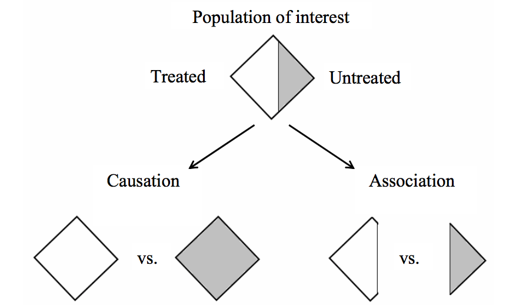
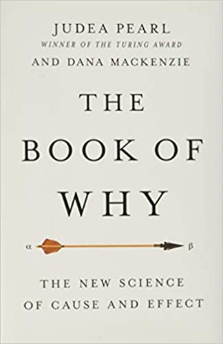

```{r load-libraries}
library(purrr)
library(tibble)
library(dplyr)
library(magrittr)
library(stringr)
library(ggplot2)
library(htmltools)
library(kableExtra)
library(scales)
library(cpsR)
library(mapdata)
library(usmap)

options(knitr.kable.NA = '')

percent = label_percent(accuracy=1)
approx  = function(x,accuracy=.01) { label_number(accuracy=accuracy, scale_cut=cut_short_scale())(x) }

library(cpsR)
census.api.key = '8084f81e4f71e4d32638dac15f188b424f72d063'
# for cps variable interpretation see https://www2.census.gov/programs-surveys/cps/datasets/2022/march/asec2022_ddl_pub_full.pdf
```

```{r ggplot-themes}
class.theme = theme(plot.background = element_rect(fill = "transparent", colour = NA),
        panel.background = element_rect(fill = "transparent", colour = NA),
                    legend.background = element_rect(fill="transparent", colour = NA),
                    legend.box.background = element_rect(fill="transparent", colour = NA),
                    legend.key = element_rect(fill="transparent", colour = NA),
        axis.ticks.x = element_blank(),
        axis.ticks.y = element_blank(),
        axis.text.x  = element_text(colour = "#aaaaaa"),
        axis.text.y  = element_text(colour = "#aaaaaa"),
        axis.title.x  = element_text(colour = "#aaaaaa"),
        axis.title.y  = element_text(colour = "#aaaaaa", angle=90)
)

theme_set(class.theme)
theme_update(axis.title.x  = element_blank(),
             axis.title.y  = element_blank())
simplified.theme = theme_get()

theme_update(axis.text.x   = element_blank(), 
              axis.text.y   = element_blank())
blank.theme = theme_get()

theme_update(panel.grid.major=element_line(color=rgb(1,0,0,.1,  maxColorValue=1)),
           panel.grid.minor=element_line(color=rgb(0,1,0,.1, maxColorValue=1)))
grid.theme = theme_get()

theme_set(simplified.theme)
```

```{r table-styling}
ellipsis <- function(df, nhead=5L, ntail=2) {
    rownames(df) = as.character(1:nrow(df))
    stopifnot("data.frame" %in% class(df))
    els <- rep(NA, ncol(df)) %>% 
        matrix(nrow=1, dimnames=list(NULL, names(df))) %>% 
        data.frame(stringsAsFactors=FALSE) %>% 
        tibble::as_tibble()
    rownames(els) = "⋮"
    dplyr::bind_rows(head(df, nhead), els, tail(df, ntail))
}
```


```{r get-california-data}
#| cache: true
cps.sampling.ratio = 1/2500
plotting.cps.sampling.ratio=1/25
california.state.code = 6
cps.data = cpsR::get_asec(year=2022, vars=c('pearnval', 'gestfips', 'h_numper', 'htotval', 'a_age', 'a_hga','gereg', 'a_maritl', 'a_sex','peafever','a_wkstat','gtco'), key=census.api.key)
```

```{r process-california-data}
all.earnings = data.frame(age=cps.data$a_age,
                          state.code = cps.data$gestfips,
              county.code = cps.data$gtco,
                          hincome=cps.data$htotval, 
                          pincome=cps.data$pearnval,
                          education=case_match(cps.data$a_hga,
                                          0  ~ 0,   # child
                                          31 ~ 0,   # < grade 1
                                          32 ~ 4,   #  grade 1-4
                                          33 ~ 6,   #  grade 5-6
                                          34 ~ 8,   #  grade 7-8 
                                          35 ~ 9,   #  grade 9
                                          36 ~ 10,  #  grade 10
                                          37 ~ 11,  #  grade 11
                                          38 ~ 11,  #  grade 12 no diploma
                                          39 ~ 12,  #  high school grad
                                          40 ~ 13,  #  some college
                                          41 ~ 14,  #  associate degree(vocational)
                                          42 ~ 14,  #  associate degree (academic)
                                          43 ~ 16,  #  bachelors degree
                                          44 ~ 18,  #  masters degree
                                          45 ~ 20,  #  professional school degree
                                          46 ~ 20)) #  doctorate

in.interval = function(X, interval) { interval[1] <= X & X <= interval[2] }
all.earnings$employed<- ifelse(cps.data$a_wkstat >5, 0,ifelse(cps.data$a_wkstat<2,NA,1))
all.earnings$degree = factor(all.earnings$education >= 16,
                    levels=c(FALSE, TRUE), 
                    labels=c('no 4-year degree','4-year degree')) 

earnings = all.earnings[all.earnings$age %>% in.interval(c(25,35)) & 
                        all.earnings$state.code == california.state.code &
                        all.earnings$education > 8, ]

rownames(earnings)=NULL
earnings$person = 1:nrow(earnings)
n = nrow(earnings)
```


```{r visualization-defaults}
scale_y = function(limits=c(-.5e5, 4e5)) { 
  scale_y_continuous(labels=label_dollar(), limits=limits)
}

dot.size = 2
```

# Causality on an Intuitive Level

## Review

::: {.hidden}
$$
\newcommand{\alert}[1]{\textcolor{red}{#1}}
\DeclareMathOperator{\E}{E}
\DeclareMathOperator{\V}{V}
\DeclareMathOperator{\Var}{\V}
\newcommand{\inred}[1]{\textcolor{red}{#1}}
\newcommand{\inblue}[1]{\textcolor{blue}{#1}}
$$ 
:::

```{r}
earnings$income = earnings$hincome

X = earnings$degree=='4-year degree'
Y = earnings$income
muhat.dif = mean(Y[X==1]) - mean(Y[X==0])
sehat.dif = sqrt( var(Y[X==1])/sum(X==1) + var(Y[X==0])/sum(X==0) )

x = seq(muhat.dif-4*sehat.dif, muhat.dif+4*sehat.dif, by=.01*sehat.dif)
sampling.dist.approx = data.frame(x=x, density.x=dnorm(x,muhat.dif,sehat.dif))
interval = muhat.dif + 1.96*c(-1,1)*sehat.dif
```

```{r}
#| out-height: 250px
#| fig-asp: .25

earnings.jitter = ggplot(earnings) + geom_point(aes(x=degree, y=income, color=degree), 
                              size=dot.size, position=position_jitter(seed=0,w=.3), alpha=.1) +
                   scale_y() + guides(color=FALSE)
earnings.summaries = earnings %>% group_by(degree) %>% summarize(mean=mean(income), sd=sd(income))

earnings.jitter + geom_pointrange(aes(x=degree, y=mean, ymin=mean-sd, ymax=mean+sd), data=earnings.summaries) + scale_y()
```

- Last time, we talked about estimating differences between subpopulation means based on a random sample.
- When we were looking at household income for California residents [with]{.twocolor-green} and [without]{.twocolor-red} four-year degrees ...
  - The difference in *subsample means* was huge: \$`r approx(muhat.dif,1)`.
  - We were confident that wasn't a fluke.
  - Our 95% confidence interval for the difference in *subpopulation means* was [\$`r approx(min(interval),1)` ... \$`r approx(max(interval),1)`].

```{r}
#| out-height: 250px
#| fig-asp: .25

ggplot() + geom_area(aes(x=x,y=density.x), data=sampling.dist.approx, alpha=.1, color='black', fill='green') + 
       geom_vline(aes(xintercept=qnorm(c(.16,.84),   muhat.dif, sehat.dif)), linetype='dashed', color='purple') +
       geom_vline(aes(xintercept=qnorm(c(.025,.975), muhat.dif, sehat.dif)), linetype='dotted', color='purple') +
       geom_pointrange(aes(y=mean(sampling.dist.approx$density.x), x=muhat.dif, xmin = min(interval), xmax=max(interval))) + 
       scale_x_continuous(labels=label_dollar(), limits=c(0,120000))
```


## Part of the Story

```{r}
# this next line is the only code change relative to the previous slide
earnings$income = earnings$pincome

X = earnings$degree=='4-year degree'
Y = earnings$income
muhat.dif = mean(Y[X==1]) - mean(Y[X==0])
sehat.dif = sqrt( var(Y[X==1])/sum(X==1) + var(Y[X==0])/sum(X==0) )

x = seq(muhat.dif-4*sehat.dif, muhat.dif+4*sehat.dif, by=.01*sehat.dif)
sampling.dist.approx = data.frame(x=x, density.x=dnorm(x,muhat.dif,sehat.dif))
interval = muhat.dif + 1.96*c(-1,1)*sehat.dif
```

```{r}
#| out-height: 250px
#| fig-asp: .25

earnings.jitter = ggplot(earnings) + geom_point(aes(x=degree, y=income, color=degree), 
                              size=dot.size, position=position_jitter(seed=0,w=.3), alpha=.1) +
                   scale_y() + guides(color=FALSE)
earnings.summaries = earnings %>% group_by(degree) %>% summarize(mean=mean(income), sd=sd(income))

earnings.jitter + geom_pointrange(aes(x=degree, y=mean, ymin=mean-sd, ymax=mean+sd), data=earnings.summaries) + scale_y()
```

- We can account for part of that by acknowledging that many households have two incomes.
- When we look at individual incomes, everything is, roughly speaking, halved.
  - The difference in *subsample means* is still huge: \$`r approx(muhat.dif,1)`.
  - We're still confident it's not a fluke.
  - A 95% confidence interval for the difference in *subpopulation means* is [\$`r approx(min(interval),1)` ... \$`r approx(max(interval),1)`].

```{r}
#| out-height: 250px
#| fig-asp: .25

ggplot() + geom_area(aes(x=x,y=density.x), data=sampling.dist.approx, alpha=.1, color='black', fill='green') + 
       geom_vline(aes(xintercept=qnorm(c(.16,.84),   muhat.dif, sehat.dif)), linetype='dashed', color='purple') +
       geom_vline(aes(xintercept=qnorm(c(.025,.975), muhat.dif, sehat.dif)), linetype='dotted', color='purple') +
       geom_pointrange(aes(y=mean(sampling.dist.approx$density.x), x=muhat.dif, xmin = min(interval), xmax=max(interval))) + 
       scale_x_continuous(labels=label_dollar(), limits=c(0,120000))
```


## Is This An **Effect** of A 4-Year Education?

- I don't buy it. There's more going on.
- Even if we ignore all the family/culture/etc. stuff.
- Rational choice can account for a lot of that on it's own.
- 4-year degrees cost a lot more. For California residents...
  - A 4-year degree in the UC System costs about \$60K in tuition
  - A 4-year degree in the Cal State system costs about \$25K in tuition
  - A 2-year degree at a community college should cost &lt; \$2K in tuition 
  - a high school education costs nothing.
- If we factor in rent and lost income during the additional years, it's an even bigger difference.
- It just makes more sense to pay the extra money if you expect to make it back quickly.
- Especially if you're paying interest.

## Taking Choice Out Of It

- If we want to really estimate the *effect* on a degree on income ...
  - We have to account for choice.
  - And all the family, culture, etc. stuff
- From a statistical perspective, the easiest way to account for it is to make sure it's not there.
  - e.g., by **randomly assigning** people to get (or not get) 4-year degrees.
- From a practical perspective, this is essentially impossible. People wouldn't put up with it.
- We'll talk about how to work with what we've got later in the semester.
- For now, we'll shift our focus to an intervention that **was randomized**.

## Why We Need Randomization

{height=500px}

::: aside
An illustration of Hernan and Robins.
:::


## The NSW Demonstration

- The National Supported Work Demonstration was implemented in the mid-1970s
- It provided paid work experience --- in a supportive environment --- to people who'd had trouble keeping jobs.
- In particular ...
  - Employers got subsidies, so performance expectations were lower than usual.
  - There were both peer-support and program-officer support components.
- A subset of applicants was chosen as an *evaluatation sample*
- People in this sample were **randomly assigned** into two groups
  - A **treated** group, who particulated in the work-experience program
  - A **control** group, who did not
- Irrespective of group, these people were interviewed every 9 months for 3 years.
- So we know their income 18 months after the conclusion of the program.
- That's what we're looking at when we evaluate the effectiveness of the program.
- As a result of randomization, differences between the two groups should speak to the impact of the program.

## Results

```{r}
nsw = read.csv('https://davidahirshberg.bitbucket.io/teaching/regression/fall2021/data/nsw-data.csv')
evaluation = nsw[nsw$dataset=='nsw',]
Y = evaluation$re78
X = evaluation$treat+0
muhat.dif = mean(Y[X==1]) - mean(Y[X==0])
sehat.dif = sqrt( var(Y[X==1])/sum(X==1) + var(Y[X==0])/sum(X==0) )

x = seq(muhat.dif-4*sehat.dif, muhat.dif+4*sehat.dif, by=.01*sehat.dif)
sampling.dist.approx = data.frame(x=x, density.x=dnorm(x,muhat.dif,sehat.dif))
interval = muhat.dif + 1.96*c(-1,1)*sehat.dif
```

```{r}
#| out-height: 250px
#| fig-asp: .25

eval = data.frame(income=Y, degree=factor(c('control', 'treated'))[X+1])
earnings.jitter = ggplot(eval) + geom_point(aes(x=degree, y=income, color=degree), 
                              size=dot.size, position=position_jitter(seed=0,w=.3), alpha=.1) +
                   scale_y(limits=c(-.5e4,4e4)) + guides(color=FALSE)
earnings.summaries = eval %>% group_by(degree) %>% summarize(mean=mean(income), sd=sd(income))

earnings.jitter + geom_pointrange(aes(x=degree, y=mean, ymin=mean-sd, ymax=mean+sd), data=earnings.summaries) 
```

:::: r-stack
::: {.fragment .fade-out data-fragment-index="0"}

- As you'd expect, incomes are smaller than in the 2022 CPS data we've looked at. About 10x smaller.
  - Inflation accounts for half of that: \$1 in 1978 ≈ \$5 today
  - The program's focus on a low-income population does the rest.
- And differences between [treated]{.twocolor-green} and [control]{.twocolor-red} subsamples are *smaller still*.
  - The difference in *subsample means* was 20x smaller: \$`r approx(muhat.dif,1)`.
  - That said, when you're talking about people making &lt; \$30k/year, that's pretty meaningful. 
- Anyway, it's a different intervention. There's no reason to expect the same impact from...
    - a year and a half of free job training
    - 2-4 years of expensive college
:::
::: {.fragment .current-visible data-fragment-index="0"}

- But from an inferential perspective, something *very different* is happening here.
- If we think of our evaluation sample as being drawn (with replacement) from some subpopulation ...
  - [\$`r approx(min(interval),10)` ... \$`r approx(max(interval),.1)`] is a 95% confidence interval for the difference in *subpopulation means*.
  - On the high end of that interval estimate, that's big. Enough to justify a broader implementation of the program.
  - On the low end, it's not much at all. Pretty clearly not worth it.
- In short, this wasn't a well-designed experiment. 
- Our evaluation sample was too small for us to learn what we wanted to.

:::
::::

```{r}
#| out-height: 250px
#| fig-asp: .25

ggplot() + geom_area(aes(x=x,y=density.x), data=sampling.dist.approx, alpha=.1, color='black', fill='green') + 
       geom_vline(aes(xintercept=qnorm(c(.16,.84),   muhat.dif, sehat.dif)), linetype='dashed', color='purple') +
       geom_vline(aes(xintercept=qnorm(c(.025,.975), muhat.dif, sehat.dif)), linetype='dotted', color='purple') +
       geom_pointrange(aes(y=mean(sampling.dist.approx$density.x), x=muhat.dif, xmin = min(interval), xmax=max(interval))) + 
       scale_x_continuous(labels=label_dollar(), limits=c(-1000,4000))
```

## Statistical Practice

- Historically, the solution to this was to have designed the experiment better in the first place.
- Somebody should have worked out an appropriate sample size ahead of time.
  - That --- determining sample size based on what you know and what you want to know --- is called *statistical power analysis*.
  - It's expected that you do one before running an experiment. With good reason.
  - At this point, you basically have the ingredients to do one. We'll have you assemble them later on.
- But people have tried to argue that we can *do without* experimental data with the right statistical techniques.
- They claim differences between groups we're comparing can be **adjusted away** instead of **randomized away**.
- This is controversial. There are a million PhD-student appropriate papers on the topic.
  - Dehejia & Wahba in JASA (1999) looks at this particular experiment
  - Robins & Ritov in Statistics & Medicine (1998) takes a purely mathematical approach 
- But what we have managed to agree on is that we need to think carefully about causality.
- And for that, we've begun to settle on a language and notation. 
- That---in the simplest of contexts---is what we'll talk about for the rest of class.

# Formalizing Causality

## Agenda

- Introduce formal causal inference with potential outcomes.
- Demonstrate the identification of average treatment effects with randomized treatment assignment. 
- Discuss the relationship between the potential outcomes approach and the approach we have been using so far.
- Discuss constant vs. nonconstant treatment effects.

## What is formal causal inference?

- The formal approach reframes the problem of causal inference in terms of counterfactuals which are treated as missing data.  
- This is a natural extension to sampling from populations where the unsampled portion of the population is treated as missing data. 
- This reframing has lead to a revolution in the empirical sciences. 


### Optional readings for those interested

- The Credibility Revolution in Empirical Economics: How Better Research Design is Taking the Con out of Econometrics 
    - Angrist, Joshua D. and JornSteen Pischke (2010) 
    - Journal of Economic Perspectives 

- The Book of Why
    - Judea Pearl and Dana Mackenzie 

{height=300px}

## Potential Outcomes and Treatment Effects {.smaller}

### Observable Stuff

- $Y$ is an outcome variable (e.g. alive/dead, wages, etc.)
- $D$ is a treatment variable (e.g. Treatment/Control, college degree/no degree)

### Conceptual Stuff

- Potential Outcomes
    - $Y_i(1)$ is the outcome individual $i$ would have received if they'd received treatment $D_i=1$
    - $Y_i(0)$ is the outcome individual $i$ would have received if they'd received treatment $D_i=0$.
    - We can't observe both at once because an individual can't receive both treatments at once.
- Individual-Level Treatment Effect
   - It's the *diffence* in what would happen with the two treatments.
   - We call this $\tau_i$. Naturally, we can *never* observe this.
- Example
   - If a patient will live with the treatment ($Y_i(1)=1$)
   - But they'll die without it ($Y_i(0)=0$)
   - Then the individual-level effect $\tau_i=Y_i(1)-Y_i(0)=1$. Treatment saved their life.


## Magic Tricks

- Let's talk about the magic of statistics.
- The first magic trick we've seen. It's inference about a population.
    - A small sample can tell us about averages in a large population.
- The second magic trick is inference about counterfactuals.
    - A sample *without* counterfactual information can tell us about averages of quantities involving counterfactual information.
- Before getting into this, let's make sure we have our concepts traight.

## Illustrative Example

$$
\begin{array}{ccc|ccc}
i & D_i & Y_i & Y_i(1) & Y_i(0) & \tau_i \\
\hline
1 & 1 & 70 & 70 & \alert{?} & \alert{?} \\
2 & 1 & 80 & 80 & \alert{?} & \alert{?} \\
3 & 0 & 60 & \alert{?} & 60 & \alert{?} \\
4 & 0 & 70 & \alert{?} & 70 & \alert{?} \\
5 & 0 & 70 & \alert{?}& 70 & \alert{?} \\
6 & 0 & 80 & \alert{?} & 80 & \alert{?} \\
\end{array}
$$


- Suppose we're administering ADHD patients at a clinic. 
    - Two are being treated with stimulants ($D=1$) 
    - Four are not ($D=0$). 
- We're interested in the treatment's effect on resting heart rate ($Y$).
- And we can't, of course, observe the counterfactual outcomes.
  - $Y_i(1)$ when $D_i=0$
  - $Y_i(0)$ when $D_i=1$
- This is what we see.

## Going Forward: From Potential Outcomes to Observed Outcomes

$$
\begin{array}{ccc|ccc}
i & D_i & Y_i & Y_i(1) & Y_i(0) & \tau_i \\
\hline
1 & ? & ?\  & \alert{70} & \alert{70} & \alert{0} \\
2 & ? & ?\  & \alert{80} & \alert{70} & \alert{10} \\
3 & ? & ?\  & \alert{70} & \alert{60} & \alert{10} \\
4 & ? & ?\  & \alert{80} & \alert{70} & \alert{10} \\
5 & ? & ?\  & \alert{70} & \alert{70} & \alert{0} \\
6 & ? & ?\  & \alert{80} & \alert{80} & \alert{0} \\
\end{array}
$$

- Let's think of our study as it unfolds over time.
- At the beginning, nobody's been assigned a treatment.
- But---as an idea---the potential outcomes already exist.
- And, as a result, so do the individual-level treatment effects.
- And all this stuff---the stuff to the right of the vertical bar---has nothing to do with treatment.

## Going Forward: From Potential Outcomes to Observed Outcomes

$$
\begin{array}{ccc|ccc}
i & D_i & Y_i & Y_i(1) & Y_i(0) & \tau_i \\
\hline
1 1 ? & ?\  & \alert{70} & \alert{70} & \alert{0} \\
2 1 ? & ?\  & \alert{80} & \alert{70} & \alert{10} \\
3 0 ? & ?\  & \alert{70} & \alert{60} & \alert{10} \\
4 0 ? & ?\  & \alert{80} & \alert{70} & \alert{10} \\
5 0 ? & ?\  & \alert{70} & \alert{70} & \alert{0} \\
6 0 ? & ?\  & \alert{80} & \alert{80} & \alert{0} \\
\end{array}
$$

- Next, we assign treatment.
- Outcomes "haven't happened yet", so they're not in our table, but we know what they will be.
- Let's fill them in. The assigned treatment $D_i$ tells us *which* potential outcome we observe.

## Going Forward: From Potential Outcomes to Observed Outcomes

$$
\begin{array}{ccc|ccc}
i & D_i & Y_i & Y_i(1) & Y_i(0) & \tau_i \\
\hline
1 & 1 & 70 & 70         & \alert{70} & \alert{0} \\
2 & 1 & 80 & 80         & \alert{70} & \alert{10} \\
3 & 0 & 60 & \alert{70} & 60 & \alert{10} \\
4 & 0 & 70 & \alert{80} & 70 & \alert{10} \\
5 & 0 & 70 & \alert{70} & 70 & \alert{0} \\
6 & 0 & 80 & \alert{80} & 80 & \alert{0} \\
\end{array}
$$

- Finally, we observe the outcomes.
- This reveals what *some* of the potential outcomes are. But not all of them.
- And it revals *none* of the individual-level treatment effects.

## Going Backward: From Observed Outcomes to Potential Outcomes

$$
\begin{array}{ccc|ccc}
i & D_i & Y_i & Y_i(1) & Y_i(0) & \tau_i \\
\hline
1 & 1 & 70 & 70 & \alert{70} & \alert{0} \\
2 & 1 & 80 & 80 & \alert{70} & \alert{10} \\
3 & 0 & 60 & \alert{70} & 60 & \alert{10} \\
4 & 0 & 70 & \alert{80} & 70 & \alert{10} \\
5 & 0 & 70 & \alert{70} & 70 & \alert{0} \\
6 & 0 & 80 & \alert{80} & 80 & \alert{0} \\
\end{array}
$$

- Now let's try to go backwards. In general, this is impossible.
- But let's suppose that the treatment was **randomized**. Then we can get part-way there.
- It means we can think of the treated and subsamples as being drawn from our population by a two-stage process.
  - First, we draw a random sample of people.
  - Then, for each, we flip a coin to decide whether it's in the subsample.
- This is **the same process** for both the treated and control groups.
- As a result, people in those two subsamples have the same distribution ...
  - if we ignore the stuff downstream of treatment assignment.
  - i.e. if we only look at what's to the right of the vertical bar.

## Going Backward: From Observed Outcomes to Potential Outcomes

$$
\begin{array}{ccc|ccc}
i & D_i & Y_i & Y_i(1) & Y_i(0) & \tau_i \\
\hline
1 & 1 & 70 & 70 & \alert{70} & \alert{0} \\
2 & 1 & 80 & 80 & \alert{70} & \alert{10} \\
3 & 0 & 60 & \alert{70} & 60 & \alert{10} \\
4 & 0 & 70 & \alert{80} & 70 & \alert{10} \\
5 & 0 & 70 & \alert{70} & 70 & \alert{0} \\
6 & 0 & 80 & \alert{80} & 80 & \alert{0} \\
\end{array}
$$

- In particular, it tells us that conditioning on treatment **does not affect** the potential outcome means.

$$ 
\begin{aligned}
\E[Y_i(1)|D_i=1] &= \E[\alert{Y_i(1)|D_i=0}] = \E[Y_i(1)] \\
\E[\alert{Y_i(0)|D_i=1}] &= \E[Y_i(0)|D_i=0] = \E[Y_i(0)] \\
\end{aligned}
$$

- And, because one of these potential outcomes is observed within each group, this has a very useful implication.
- The expectations of our potential outcomes coincide with *conditional* expectations **of observed outcomes**.
$$ 
\begin{aligned}
\E[Y_i\cancel{(1)}|D_i=1] &= \E[\alert{Y_i(1)|D_i=0}] = \E[Y_i(1)] \\
\E[\alert{Y_i(0)|D_i=1}] &= \E[Y_i\cancel{(0)}|D_i=0] = \E[Y_i(0)] \\
\end{aligned}
$$


## Implications for Causal Inference

:::: columns
::: column

- Randomization tells us that an real-world thing and a conceptual thing match
  - Real-world: within-group expectations 
  - Conceptual: counterfactual expectations
- Let's see what this tells us about our table.
:::
::: column

$$
\begin{aligned}
\E[Y_i(1)] &=\E[Y_i|D_i=1] \\
\E[Y_i(0)] &=\E[Y_i|D_i=0]
\end{aligned}
$$
:::
::::

\ \

### Let's see what this tells us about our table.

:::: columns
::: column
$$
\begin{array}{ccc|ccc}
i & D_i & Y_i & Y_i(1) & Y_i(0) & \tau_i \\
\hline
1 & 1 & 70 & 70 & \alert{70} & \alert{0} \\
2 & 1 & 80 & 80 & \alert{70} & \alert{10} \\
3 & 0 & 60 & \alert{70} & 60 & \alert{10} \\
4 & 0 & 70 & \alert{80} & 70 & \alert{10} \\
5 & 0 & 70 & \alert{70} & 70 & \alert{0} \\
6 & 0 & 80 & \alert{80} & 80 & \alert{0} \\
\end{array}
$$
:::
::: {.column .incremental} 

What is the average of ...

- $Y_i(1)$?
  - $\frac{70 + 80 +\alert{70} + \alert{80} +\alert{70} + \alert{80}}{6}  = 75$
- $Y_i(1)$ among people with $D=1$?
  - $\frac{70 + 80 }{2}  = 75$
- $Y_i$ among people with $D=1$?
  - $\frac{70 + 80 }{2}  = 75$
:::
::::


## Implications for Causal Inference

:::: columns
::: column

- Randomization tells us that an real-world thing and a conceptual thing match
  - Real-world: within-group expectations 
  - Conceptual: counterfactual expectations
:::
::: column

$$
\begin{aligned}
\E[Y_i(1)] &=\E[Y_i|D_i=1] \\
\E[Y_i(0)] &=\E[Y_i|D_i=0]
\end{aligned}
$$
:::
::::

\ \

### Let's see what this tells us about our table.

:::: columns
::: column
$$
\begin{array}{ccc|ccc}
i & D_i & Y_i & Y_i(1) & Y_i(0) & \tau_i \\
\hline
1 & 1 & 70 & 70 & \alert{70} & \alert{0} \\
2 & 1 & 80 & 80 & \alert{70} & \alert{10} \\
3 & 0 & 60 & \alert{70} & 60 & \alert{10} \\
4 & 0 & 70 & \alert{80} & 70 & \alert{10} \\
5 & 0 & 70 & \alert{70} & 70 & \alert{0} \\
6 & 0 & 80 & \alert{80} & 80 & \alert{0} \\
\end{array}
$$
:::
::: {.column .incremental} 

What is the average of ...

-  $Y_i(0)$?
  - $\frac{\alert{70} +\alert{70} +60+ 70 +70 + 80}{6}  = 70$
- $Y_i(0)$ among people with $D=0$?
   - $\frac{60+ 70 +70 + 80}{4}  = 70$
- $Y_i$ among people with $D=0$?
  - $\frac{60+ 70 +70 + 80}{4}  = 70$
:::
::::

## This is All Too Perfect

- This fake data is a little contrived.
- We're seeing stuff balance out perfectly in sample. It won't. 
- But we know that the difference between sample and population means is small in large samples.
  - In particular, it's proportional to $1/\sqrt{n}$
- So what we're seeing with our contrived data is close to what we'd really see.

## The ATE 

- It's the Difference in Average Potential Outcomes

$$
\begin{array}{ccc|ccc}
i & D_i & Y_i & Y_i(1) & Y_i(0) & \tau_i \\
\hline
1 & 1 & 70 & 70 & \alert{70} & \alert{0} \\
2 & 1 & 80 & 80 & \alert{70} & \alert{10} \\
3 & 0 & 60 & \alert{70} & 60 & \alert{10} \\
4 & 0 & 70 & \alert{80} & 70 & \alert{10} \\
5 & 0 & 70 & \alert{70} & 70 & \alert{0} \\
6 & 0 & 80 & \alert{80} & 80 & \alert{0} \\
\end{array}
$$

- What is the average $Y_i(1)$?
- 
$$
\frac{70 + 80 +\alert{70} + \alert{80} +\alert{70} + \alert{80}}{6}  = 75
$$

- What is the average $Y_i(0)$?
$$
\frac{\alert{70} +\alert{70} +60+ 70 +70 + 80}{6}  = 70
$$

- What is the average $\tau_i = Y_i(1) - Y_i(0)$?
$$
75-70 = \frac{\alert{0} + \alert{10} + \alert{10}+  \alert{10} +\alert{0} +\alert{0}}{6}  = 5
$$


## Implications for Linear Regression

```{r}
#| out-height: 250px
#| fig-asp: .25

eval$X = 0 + (eval$degree=='treated')
earnings.jitter = ggplot(eval) + geom_point(aes(x=X, y=income, color=degree), 
                              size=dot.size, position=position_jitter(seed=0,w=.3), alpha=.1) +
                   scale_y(limits=c(-.5e4,4e4)) + guides(color=FALSE)
earnings.summaries = eval %>% group_by(X) %>% summarize(mean=mean(income), sd=sd(income), meanX = mean(X))

earnings.jitter + geom_pointrange(aes(x=X, y=mean, ymin=mean-sd, ymax=mean+sd), data=earnings.summaries) + 
                  geom_line(aes(x=meanX, y=mean), linetype='dashed', data=earnings.summaries) 
```
$$
\hat a, \hat b = \operatorname*{argmin}_{a,b} \sum_{i=1}^n \qty{ aX_i + b - Y_i }^2
$$

- The slope $\hat b$ is just the difference in subsample means. As discussed in Lecture 1.
- So it's our difference-in-means estimate of the ATE. Nothing going on here.
- I just wanted to make the connection because people sometimes phrase it this way.


## Descriptive vs Causal and Sample vs Pop {.smaller}

:::: columns
::: column
$$
\tiny{
\begin{array}{ccc|ccc}
i & D_i & Y_i & Y_i(1) & Y_i(0) & \tau_i \\
\hline
\text{Sample} & \text{Descriptive} & \text{Statistics} & \text{Sample} & \text{Causal} & \text{Inference} \\
\hline
1 & 1 & 70 & 70 & ? & ? \\
2 & 1 & 80 & 80 & ? & ? \\
3 & 0 & 60 & ? & 60 & ? \\
4 & 0 & 70 & ? & 70 & ? \\
5 & 0 & 70 & ? & 70 & ? \\
6 & 0 & 80 & ? & 80 & ? \\
\hline
\text{Population} & \text{Descriptive} & \text{Inference} & \text{Population} & \text{Causal} & \text{Inference} \\
\hline
7 & ? & ? & ? & ? & ? \\
8 & ? & ? & ? & ? & ? \\
\vdots & \vdots & \vdots & \vdots & \vdots & \vdots \\
\vdots & \vdots & \vdots & \vdots & \vdots & \vdots \\
\end{array}
}
$$
:::
::: column

- This table lays out 4 things we can work at.
 - Top Left: Describing the Sample
 - Bottom Left: Describing the Population
 - Top Right: Causal Inference about the Sample
 - Top Left: Causal Inference about the Population
- All we ever have is the sample.
- So we need to work out what it tells us about the rest.
- Obviously that involves assumptions.
  - Downward: Random Sampling
  - Rightward: Randomization of Treatment
- In class, we'll talk about everything but the top-right.
:::
::::

## What does the ATE tell us about Individual Effects?

Let's play CausalDoku! 

- Randomization implies that the *probability distribution* of both potential outcomes is the same in both groups
- Let's take this to an extreme.
  - We'll pretend it implies the *observed distribution* (i.e. the set of values) is the same
  - All we get to to fiddle with is *who* we give each value to
- Let's make this a puzzle.
  - The empty $Y_i(1)$ cells for $i=4,5,6$ must be filled with a 4 a 3 and a 2 (in some order)...
  - And the empty $Y_i(0)$ cells for $i = 1,2,3$ must be filled with a 3 and a 2 and a 1 (in some order).

$$
\begin{array}{ccc||c|c|c}
% Treatment & Outcome  & Outcome if Treated  & Outcome if Control  & Causal Effect  \\
i & D_i & Y_i & Y_i(1) & Y_i(0) & \tau_i=Y_i(1)-Y_i(0) \\
\hline
\hline
1&1 & 4 & 4 & &  \\
\hline
2&1 & 3 & 3 & & \\
\hline
3&1 & 2 & 2 & & \\
\hline
\hline
4&0 & 3 &   & 3 & \\
\hline
5&0 & 2 &   & 2 & \\
\hline
6& 0 & 1 &   & 1 & \\
\hline
\hline
\end{array}
$$


## CausalDoku 

Find two solutions:

- with constant treatment effects
- with both negative and positive effects


$$
\begin{array}{ccc||c|c|c}
% Treatment & Outcome  & Outcome if Treated  & Outcome if Control  & Causal Effect  \\
i & D_i & Y_i & Y_i(1) & Y_i(0) & \tau_i=Y_i(1)-Y_i(0) \\
\hline
\hline
1&1 & 4 & 4 & &  \\
\hline
2&1 & 3 & 3 & & \\
\hline
3&1 & 2 & 2 & & \\
\hline
\hline
4&0 & 3 &   & 3 & \\
\hline
5&0 & 2 &   & 2 & \\
\hline
6& 0 & 1 &   & 1 & \\
\hline
\hline
\end{array}
$$


- Note that both solutions imply the same ATE! 
 - We focus on ATEs because linearity of ATEs implies *we can* estimate them.
 - But on an individual level, these two scenarios are very different.
- With modern stuff, we can get part of the way but not all the way there...


