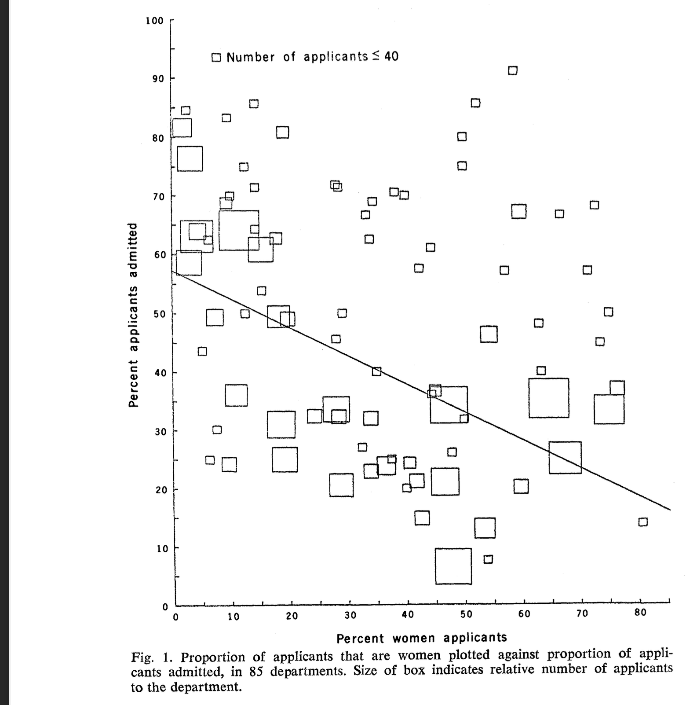

# Multivariate Analysis





```{r}
pop = pop.earnings 
sam = earnings 
pop$group = pop$sex == 'female'
sam$group = sam$sex == 'female'

xco = function(w,x, shift=.15) {
  w=as.numeric(w)
  x + shift*(2*w-1)
}

sam.dot = list(size=1,    alpha=.15)
pop.dot = list(size=.25,    alpha=.05)
scatter.by.group = function(data, dot=sam.dot, width=sd, 
                            highlight=NULL, 
                            highlight.color='yellow', highlight.alpha=.25,
                            line.alpha = NULL,
                            group.means.alpha=NULL, 
                            mean.shift=.05)
                            { 
  p = ggplot(data)
  if(!is.null(highlight)) {
    p = p + annotate('rect', 
                      xmin=min(highlight)-.5,
                      xmax=min(highlight)+.5,
                      ymin=-Inf, ymax=Inf, 
                      fill=highlight.color, alpha=highlight.alpha)
  } 
  if(!is.null(group.means.alpha)) {
    summaries = data |> group_by(group) |> summarize(income=mean(income))
    p = p + geom_hline(aes(yintercept=income, color=group), alpha=group.means.alpha, data=summaries, linetype='dashed') 
  }
  if(!is.null(line.alpha)) { 
    p = p + stat_summary(aes(x=xco(group, education,shift=mean.shift), y=income, color=group), 
    geom='line', alpha=line.alpha, fun=mean, linetype='solid') 
  }

  p + geom_point(aes(x=xco(group, education),  y=income, color=group), 
               size=dot$size, position=position_jitter(seed=0,w=.15), alpha=dot$alpha) +
      stat_summary(aes(x=xco(group, education,shift=mean.shift), y=income, color=group), geom="pointrange", alpha=.7, fun.data=mean_sd)  +
    scale_x() + scale_y() + scale_alpha(range=c(0,1)) + guides(color='none')
}

scatter.by.sex.only = function(data, dot=sam.dot, width=sd) {
    ggplot(data) + 
      geom_point(aes(x=sex,  y=income, color=group), 
                 size=dot$size, position=position_jitter(seed=0,w=.15), alpha=dot$alpha) +
    stat_summary(aes(x=sex, y=income, color=group), geom="pointrange", alpha=.7, fun.data=mean_sd) +
    scale_y() + guides(color='none')
}

money = function(x) { sprintf('%1.0fk', round(x/1000, digits=0)) }  
```

## Multivariate Analysis

```{r}
scatter.by.group(sam)
```

```{r}
muhat.male = mean(sam$income[sam$sex=='male']) 
muhat.female = mean(sam$income[sam$sex=='female'])
```

- Today, we're going to talk about how to analyze data when we have multiple covariates.
- An important application is analyzing disparities to think about discrimination.
- Above, we see the kind of data we'll be working with.
- Each dot represents a California resident, age 25-35, who responded to the CPS.
  - $Y_i$, their income, is on the $y$-axis.
  - $X_i$, their education level, is on the $x$-axis.
  - $W_i$, their sex, is indicated by color. And a slight shift along the $x$-axis.
    - $\ingroupa{W_i=0}$ indicates male, $\ingroupb{W_i=1}$ indicates female.
- As usual, we've drawn in each group's income mean and standard deviation too.
- We'll write $\ingroupa{\hat\mu(0,x)}$ and $\ingroupb{\hat\mu(1,x)}$ for the mean income of male and female respondents with $x$ years of education. 

## Plan for Today

```{r}
#| layout-ncol: 2
#| fig-width: 7
#| fig-cap: 
#| - Imaginary Population of California Residents
#| - Real Sample of California Residents from CPS
scatter.by.group(pop, dot=pop.dot)
scatter.by.group(sam)
```

- From a calculational and inferential perspective, this is nothing new.
  - We're still talking about ways of summarizing a sample that's broken down into columns.
  - That our columns are determined by two variables rather than one makes no difference.
- The part that is new will be interpretation and communication.
  - We'll see that there are a variety of ways to look at differences in a multivariate setting.
  - If we're not careful, we can find ourselves talking about different summaries as if they were the same.
- That'll be our focus today.
  - Thinking and communicating precisely about what we're talking about.
  - Understanding how we get different answers to 'the same question' if we're imprecise.
  - Thinking about the implications of what we choose to report.

## Our Data and Approach

```{r}
#| layout-ncol: 2
#| fig-width: 7
#| fig-cap: 
#| - Imaginary Population of California Residents
#| - Real Sample of California Residents from CPS
scatter.by.group(pop, dot=pop.dot)
scatter.by.group(sam)
```

- Our main example will be income disparities that we can see in the CPS. 
- But we'll start by looking at something else: disparities in grad-school admissions.
- We're not going to talk about statistical inference today. 
  - But we're not going to be working with a made-up population either. 
  - Instead, we'll just work with our sample a little recklessly.
- We'll talk as if our summaries of the sample are reasonable descriptions of the population.
  - Even though we know that they're just point estimates.
  - And that point estimates can be pretty far off-target. 

# Berkeley Admissions and Simpson's Paradox

## A Famously Paradoxical Example
```{r}
#| fig-asp: .4
Y = c(rep(c(0,1), c(4704, 3738)), 
      rep(c(0,1), c(2827, 1494)))
W = c(rep(0, 4704+3738), rep(1, 2827+1494))

berkeley = data.frame(
  admit=Y, 
  gender=factor(c('men', 'women'), 
  levels=c('men','women'))[W+1])

dot = pop.dot
ggplot(berkeley) + 
      geom_point(aes(x=gender,  y=admit, color=gender), 
                 size=dot$size, position=position_jitter(seed=0,w=.15,h=.075), alpha=dot$alpha) +
    stat_summary(aes(x=gender, y=admit, color=gender), geom="pointrange", alpha=.7,
                 fun.data=mean_sd) + guides(color='none') + 
                 coord_cartesian(ylim=c(-.1,1.1)) + 
                 scale_y_continuous(breaks=seq(0,1,by=.2)) + 
                 scale_x_discrete(labels=c('Men', 'Women'))
```

- In the 1970s, Berkeley graduate programs were admitting a much higher proportion of [men]{.groupa} than [women]{.groupb}.
  - $\ingroupa{`r sum(Y[W==0])`/`r sum(W==0)`\approx `r round(100*mean(Y[W==0]))`}$% of men who applied were admitted.
  - $\ingroupb{`r sum(Y[W==1])`/`r sum(W==1)`\approx `r round(100*mean(Y[W==1]))`}$% of women who applied were admitted. 
  - People were concerned that this difference was evidence of discrimination against women.^[We've shifted our focus from  discrimination on the basis of sex to discrimination on the basis of gender. That would've been my preference for the discussion of income disparities too, but the CPS doesn't currently ask about gender identity. You analyze the data you have, not the data you wish you had.]
$$
\color{gray}
\text{admission rate gap} = \ingroupb{\frac{1}{N_1}\sum_{i: W_i=1} Y_i} - \ingroupa{\frac{1}{N_0}\sum_{i: W_i=0} Y_i} \approx `r round(mean(Y[W==1]) - mean(Y[W==0]), 2)`
$$

- But, on closer examination, most departments were admitting women at a higher rate than men.
- What's going on?  Let's see if we can figure it out by working with some stylized data.

## 


```{r}
x = c(1,1,1,0,0,0,  1,0,0)
y = c(0,0,0,1,1,1,  1,0,1)
w = c(1,1,0,1,0,0,  1,0,0)
jitter.y = .075*c(0,0,0,0,0,0,    0,0,-1)
jitter.x = -.05*c(-1,0,1,-1,0,1,  0,0,0)  
data = data.frame(x=x, jitter.x=jitter.x, y=y, jitter.y=jitter.y, w=w)
berkeley.data = data

berkeley.scales.nox = list(
  scale_y_continuous(breaks=c(0, 1/3, 2/3, 1), labels=c('0', '1/3', '2/3', '1')), 
  coord_cartesian(ylim=c(-.1,1.1)),
  guides(color='none'))
berkeley.scales = c(list(scale_x_continuous(breaks=c(0,1))), berkeley.scales.nox)

exercise.grid = function(data) { 
  ggplot(data) + geom_point(aes(x=x+jitter.x, y=y+jitter.y), shape=1, size=8) + berkeley.scales
}

solution.grid = function(data, numbered=FALSE, mean.size=1) {
  p = exercise.grid(data) 
  if(numbered) { 
    p = p + geom_text(aes(x=x+jitter.x, y=y+jitter.y, label=1:nrow(data)), alpha=.6) 
  }
  p +
    geom_point(aes(x=x+jitter.x, y=y+jitter.y, color=factor(w)), size=8, alpha=.5, 
      data=data) + 
    geom_pointrange(aes(x=x+.02*(2*w-1), y=y, ymin=y-.08, ymax=y+.08, color=factor(w)),  
      data=data |> group_by(w,x) |> summarize(y=mean(y)), size=mean.size, alpha=.8) +
    geom_hline(aes(yintercept=mean.y, color=factor(w)), 
      data=data |> group_by(w) |> summarize(mean.y=mean(y)), linetype='dashed', alpha=.4) 
}
```

::: {.panel-tabset}
### No Solution
```{r}
#| layout-ncol: 2
#| fig-width: 7 
exercise.grid(data[1:6,])
ggplot() + geom_blank()
```
### Warm-Up Solution
```{r}
#| layout-ncol: 2
#| fig-width: 7 
exercise.grid(data[1:6,])
solution.grid(data[1:6,])
```
### Paradox Solution
```{r}
#| layout-ncol: 2
#| fig-width: 7 
exercise.grid(data[1:6,])
solution.grid(data)
```
:::


::: {.panel-tabset}

### What We're Doing

- Above is a stylized version of the Berkeley data in which we have two departments.
  - At the department on the left ($x=0$),  getting in is easy.
  - At the department on the right ($x=1$), getting in is hard.
- We'll draw dots representing applicants. 
  - The $y$-coordinate indicates whether they were admitted ($y=1$) or not ($y=0$).
  - The color of the dot indicates their gender. [Men are red]{.groupa}. [Women are green]{.groupb}.

### Warm-up Exercise
- Color three dots red and three green so that ...
  1. Within each column, the mean of the green dots is *equal to* the mean of the red dots.
  2. The mean of all the green dots is *lower* than the mean of the red ones. 
- Annotate your plot by ...
  1. Drawing in the means of the red and green dot within each column. 
    - Use dots with arms [`r pointrange`]{.groupa} [`r pointrange`]{.groupb} because that's what we usually do in **R**.
    - Don't worry about the length of the arms. We're not thinking about spread here. 
  2. Drawing in the means of *all* the red dots and all the green dots. 
    - Use horizontal lines.  
  
### Paradox Exercise
- Add three more dots --- two red and one green --- so that ...
  1. Within each column, the mean of the green dots is *now higher* the mean of the red ones. 
  2. The mean of all the red dots is *still lower* than the mean of green ones. 
- Fix your annotations to account for these new dots. 

:::


## The Story our Exercises Tell 
```{r}
#| layout-ncol: 2
#| fig-width: 7
#| fig-cap:
#|  - Warm-up Data
#|  - Paradox Data
solution.grid(data[1:6,])
solution.grid(data)
```

::: {.panel-tabset}

### Warm-up Story
- The story, in this simple example, is that ... 
  - more men apply to the department everybody gets in to. 
  - more women apply to the department nobody gets in to. 
- So men are admitted at a higher rate to the university as a whole.
- Even though men and women are admitted at the same rate within each department.
- **Lesson.** Even when there is no disparity within groups, there can be a disparity in aggregate.

### Paradox Story

- The story in this follow-up, is that ...
  - some woman miraculously get admitted to the department nobody gets in to.
  - some man, equally miraculously, is rejected by the department everybody gets in to.
  - and one more man, less miraculously, gets is admitted to that department too.
- The university as a whole still admits men at a higher rate than women.
- But on a departmental level, that's reversed. Every department admits women at a higher rate than men.
- **Lesson.** Within-group and aggregate disparities can be in *opposite directions*.
  
:::

## The Real Berkeley Data
:::: columns 
::: column
{height=4.5in}
:::
::: column 
 \
```{r}
#| fig-width: 7
#| fig-cap: "Our Paradox Data"
solution.grid(data)
```
:::
::::

- The real data is a bit more complicated than our simple caricature. 
  - Berkeley has more than two departments.
  - And they tend to have more than 4 or 5 applicants.
- To relate our caricature to the real Berkeley data, lets do a quick drawing exercise.
- **Exercise**. Draw our two little departments into the plot of the real data.
  - How do you calculate the x-coordinates? 
  - What about the y-coordinates?
- **Discuss**. Is the observed difference evidence of discrimination?

# Breaking Down Disparities in Admission Rates
Analyzing our caricature of the Berkeley data 

## Summaries of Admission Rates

:::: free-zoom
```{r}
#| layout-ncol: 2
#| fig-width: 7
#| fig-cap: 
#|  - An aggregated-over-departments version of the 'paradox data'. 
#|  - The disaggregated 'paradox data'.
jw = c(-1,1,-1,-1,-1,1, 1,1,0)
berkeley.data$jitter.w = .05*jw
ggplot(berkeley.data) + 
    geom_point(aes(x=w+jitter.w, y=y, color=factor(w)), size=8, alpha=.5) +
    geom_pointrange(aes(x=w, y=y, ymin=y-.08, ymax=y+.08, color=factor(w)), 
      alpha=.7, 
      data=berkeley.data |> group_by(w) |> summarize(y=mean(y))) +
      guides(color='none') + berkeley.scales.nox + 
      scale_x_continuous(breaks=c(0,1), labels=c('Men', 'Women')) +
    geom_hline(aes(yintercept=mean.y, color=factor(w)), alpha=.2, 
      data=berkeley.data |> group_by(w) |> summarize(mean.y=mean(y)))
solution.grid(berkeley.data)
```
::::

```{r}
Y = berkeley.data$y 
X = berkeley.data$x
W = berkeley.data$w 
muhat = Vectorize(function(w,x) { mean(Y[W==w & X==x]) })

muhat.male = mean(Y[W==0])
muhat.female = mean(Y[W==1])
```


:::: columns
::: {.column}
### At the Graduate School
The rate for women is `r percent(muhat.male-muhat.female)` lower than for men.
$$
\color{gray}
\begin{aligned}
\ingroupb{\hat\mu(1)} \ - \  \ingroupa{\hat\mu(0)}  
&\approx \ingroupb{`r round2(muhat.female)`} \ - \ \ingroupa{`r round2(muhat.male)`} \\
&\approx `r round2(muhat.female - muhat.male)` 
\end{aligned}
$$

:::
::: {.column}
### In Department 0
The rate for women is `r percent(muhat(1,0)-muhat(0,0))` higher than for men.
$$
\color{gray}
\begin{aligned}
\ingroupb{\hat\mu(1,0)} \ - \  \ingroupa{\hat\mu(0, 0)}  
&\approx \ingroupb{`r round2(muhat(1, 0))`} \ - \ \ingroupa{`r round2(muhat(0, 0))`} \\
&\approx `r round2(muhat(1, 0)-muhat(0, 0))`
\end{aligned}
$$

:::
::::

- This is just a review of the paradox we talked about before.
  - When we compare within departments, it looks like women are better-off than men. 
  - But when we look at the university as a whole, this discrepency is reversed.
- These comparisons are relatively simple in that we're just reading two numbers off a plot.
- On the left:
  - We compared means in our plot of the aggregated data.
  - This is nice because the result is simple. It's one number.
- On the right:
  - We compared columns in the disaggregated data.
  - This is nice because it's a 'like-with-like' comparison.

##  What If We Want Simplicity *and* Comparability?

```{r}
#| layout-ncol: 2
#| fig-width: 7
#| fig-cap: 
#|  - The warm-up version 
#|  - The paradox version
solution.grid(berkeley.data[1:6,])
solution.grid(berkeley.data)
```

- **Exercise.** Using only one number, summarize the typical difference in acceptance rates ...
- ... for [women]{.groupb} and [men]{.groupa} applying **to the same department**.
- *Step 1*. Calculate a number for both samples above: the 'warm up version' and the 'paradox version'.  
- *Step 2*. Write out a formula in abstract terms using mathematical notation. 
  - Write ${\faded W_i,X_i,Y_i}$ for the values of *gender*, *department*, and *admission status* in our sample.
  - Write $\ingroupa{\hat\mu(0, x)}$ and $\ingroupb{\hat\mu(1, x)}$ for within-group means.
  - Check that when you plug in the numbers for your two samples, you get your answers from Step 1.
- *Step 3*. Generalize your formula so it works when you have more than two departments (i.e. non-binary $X$).
  - If your answer to Step 2 already worked for non-binary $X$, you have nothing to do here. You're done.
  


## Solution 1. An Average over Departments 
```{r}
muhat.frac = Vectorize(function(w,x) { 
  sprintf('\\frac{%d}{%d}', sum(Y[W==w & X==x]), sum(W==w & X==x))
})
```

::: {.panel-tabset} 
### Warm-up Version
```{r}
solution.grid(berkeley.data[1:6,])
```

$$
\color{gray}
\begin{aligned}
\text{summary} 
&=\frac{1}{\# \text{departments}}
\sum_{x \in \text{departments}}\qty{ \ingroupb{\hat\mu(\wone,x)} - \ingroupa{\hat \mu(\wzero, x)} } \\
&=\frac{1}{2}\qty[ {\{\ingroupb{\hat\mu(\wone, \xzero)} - \ingroupa{\hat\mu(\wzero, \xzero)}\} + \{\ingroupb{\hat\mu(\wone, \xone)} - \ingroupa{\hat\mu(\wzero, \xone)}\}} ] \\
&= \frac{1}{2}\qty[ \{ \ingroupb{1} - \ingroupa{1} \} + \{ \ingroupb{0} - \ingroupa{0} \} ] \\
&= \frac{1}{2}\qty[ \{ 0 \} + \{ 0 \} ] \\
&= 0 
\end{aligned}
$$


### Paradox Version
```{r}
solution.grid(berkeley.data)
```

$$
\color{gray}
\begin{aligned}
\text{summary} 
&=\frac{1}{\# \text{departments}}
\sum_{x \in \text{departments}}\qty{ \ingroupb{\hat\mu(\wone,x)} - \ingroupa{\hat \mu(\wzero, x)} } \\
&=\frac{1}{2}\qty[ {\{\ingroupb{\hat\mu(\wone, \xzero)} - \ingroupa{\hat\mu(\wzero, \xzero)}\} + \{\ingroupb{\hat\mu(\wone, \xone)} - \ingroupa{\hat\mu(\wzero, \xone)}\}} ] \\
&= \frac{1}{2}\qty[ \qty{\ingroupb{`r muhat.frac(1, 0)`} - \ingroupa{`r muhat.frac(0, 0)`}} \ + \ \qty{\ingroupb{`r muhat.frac(1, 1)`}-\ingroupa{`r muhat.frac(0, 1)`} } ] \\
&\approx \frac{1}{2}\qty[ \qty{`r round(muhat(1,0) - muhat(0,0), 2)`} + \qty{`r round(muhat(1, 1) - muhat(0, 1), 2)`} ] \\
&\approx `r round(mean(muhat(1,0:1) - muhat(0,0:1)), 2)`
\end{aligned}
$$

- This is telling us the direction of the disparity within departments.
  - In the warm-up version, it's zero because there is no disparity in acceptance rates within departments.
  - In the paradox version, it's positive because bot departments accept [women]{.groupb} at a higher rate than [men]{.groupa}.
- But is it a good summary of the experience of the women applying to them? Probably not. 
  - Only 1 applies to Department 0. Several times more---3 in the paradox version---apply to Department 1.
  - And we're giving the same weight to the rate difference in each departments.
- We've counted the one woman who applied to Department 0 three times as much as the ones who applied to Dept. 1.

:::

## Solution 2. An Average over Applicants
```{r}
N1 = sum(W==1)
X1 = X[W==1]
stopifnot(N1==4)
```

::: {.panel-tabset}
### Warm-up Version
```{r}
solution.grid(berkeley.data[1:6,], numbered=TRUE)
```

$$
\color{gray}
\begin{aligned}
\text{summary} 
&= \ingroupb{\frac{1}{N_1}\sum_{i: W_i=1}} \qty{ \ingroupb{\hat \mu(1, X_i) - \ingroupa{\hat \mu(0,X_i)} } }  \qfor N_w = \sum_{i: W_i=w} 1 \\
&= \frac{1}{3} \qty[
\underset{\veryfaint{i=1}}{ \{ \ingroupb{\hat \mu(\wone,\xone)} - \ingroupa{\hat \mu(\wzero, \xone)} \} } + 
\underset{\veryfaint{i=2}}{ \{ \ingroupb{\hat \mu(\wone, \xone)} - \ingroupa{\hat \mu(\wzero, \xone)} \} } + 
\underset{\veryfaint{i=4}}{ \{ \ingroupb{\hat \mu(\wone, \xzero)} - \ingroupa{\hat \mu(\wzero, \xzero)} \} } 
] \\
&= \frac{1}{3} \qty[\underset{\veryfaint{i=1}}{ \{ \ingroupb{0} - \ingroupa{0} \} } + 
\underset{\veryfaint{i=2}}{ \{ \ingroupb{0} - \ingroupa{0} \} } + 
\underset{\veryfaint{i=4}}{ \{ \ingroupb{1} - \ingroupa{1} \} } ]  \\
&= \frac{2}{3}\qty{\ingroupb{0} - \ingroupa{0}} + \frac{1}{3}\qty{\ingroupb{1} - \ingroupa{1}} \\
&= 0
\end{aligned}
$$

### Paradox Version

```{r}
solution.grid(berkeley.data, numbered=TRUE)
```

$$
\color{gray}
\begin{aligned}
\text{summary} 
&= \ingroupb{\frac{1}{N_1}\sum_{i: W_i=1}} \qty{ \ingroupb{\hat \mu(1, X_i) - \ingroupa{\hat \mu(0,X_i)} } }  \qfor N_w = \sum_{i: W_i=w} 1 \\
&= \frac{1}{4} \qty[
\underset{\veryfaint{i=1}}{ \{ \ingroupb{\hat \mu(\wone,\xone)} - \ingroupa{\hat \mu(\wzero, \xone)} \} } + 
\underset{\veryfaint{i=2}}{ \{ \ingroupb{\hat \mu(\wone, \xone)} - \ingroupa{\hat \mu(\wzero, \xone)} \} } + 
\underset{\veryfaint{i=4}}{ \{ \ingroupb{\hat \mu(\wone, \xzero)} - \ingroupa{\hat \mu(\wzero, \xzero)} \} } + 
\underset{\veryfaint{i=7}}{ \{ \ingroupb{\hat \mu(\wone, \xone)} - \ingroupa{\hat \mu(\wzero, \xone)} \} } ]
&= \frac{3}{4}\qty{ \ingroupb{`r muhat.frac(1, 1)`} - \ingroupa{`r muhat.frac(0,1)`}} +
\frac{1}{4}\qty{ \ingroupb{`r muhat.frac(1, 0)`} - \ingroupa{`r muhat.frac(0,0)`}} \\
&= \frac{3}{4}\qty{ \ingroupb{`r muhat.frac(1, 1)`} - \ingroupa{`r muhat.frac(0,1)`}} +
\frac{1}{4}\qty{ \ingroupb{`r muhat.frac(1, 0)`} - \ingroupa{`r muhat.frac(0,0)`}} \\
& \approx 
\frac{3}{4}\qty{`r round(muhat(1, 1) - muhat(0, 1), 2)`} +
\frac{1}{4}\qty{`r round(muhat(1, 0) - muhat(0, 0), 2)`} 
\approx `r round(mean(muhat(1,X1) - muhat(0,X1)), 2)`
\end{aligned}
$$

- This is a comparison that focuses on what's typical for women who apply to the Graduate School. 
  - Each female applicant gets equal weight in 'deciding' what is typical. 
  - That's why ${\faded X_i=1}$ occurs in 3 of `r N1` terms. 
- The number we get is not radically different from the Solution 1 version.
 - It's `r round(mean(muhat(1,X1) - muhat(0,X1)), 2)` vs. `r round(mean(muhat(1,0:1) - muhat(0,0:1)), 2)`
 - But it can be. We'll see a case in which that happens soon.

:::


## Reinterpreting Solution 2


- We can think of this as the average in even more woman-centric terms. It's the average difference between ...
  - each woman applicant's acceptance status, $\ingroupb{Y_i}$ 
  - the mean acceptance status (i.e. rate) among men who applied to the same department, $\ingroupa{\hat \mu(0, X_i)}$.

$$
\color{gray}
\begin{aligned}
\text{summary} 
&= \ingroupb{\frac{1}{N_1}\sum_{i: W_i=1}} \qty{ \ingroupb{\hat \mu(1,X_i)} - \ingroupa{\hat \mu(0, X_i)} }  
= \ingroupb{\frac{1}{N_1}\sum_{i: W_i=1}} \qty{ \ingroupb{Y_i} - \ingroupa{\hat \mu(0, X_i)} }
\end{aligned}
$$

- These two expressions will always be equal, no matter what the actual values of $\faint{W_i,X_i,Y_i}$ are.
- We can think of the first one as a version of the second where we sum in a certain order. 

:::: columns

::: {.column width="50%"}
```{r}
#| fig-width: 7
solution.grid(berkeley.data, numbered=TRUE)
```

:::
::: {.column width="50%"}
$$
\color{gray}
\begin{aligned}
\sum_{i: W_i=w} Y_i 
&\explain{=}{We sum first over dots in a column, then over columns.}
\class{fragment}{\sum_{x} \sum_{\substack{i: W_i=w, \ X_i=x}} Y_i}    \\
&\explain{=}{The column sum is the column's mean times its number of dots.}
\class{fragment}{\sum_{x} \hat \mu(w, x) \times N_{w,x} \text{ for } N_{w,x} = \sum_{\substack{i: W_i=w, \ X_i=x}} 1}    \\
&\explain{=}{Or equivalently, its mean summed over the dots.}
\class{fragment}{\sum_{x} \sum_{\substack{i: W_i=w, \  X_i=x}} \hat \mu(w,x)} \\ 
&\mathexplain{=}{\hat\mu(w,x)=\hat\mu(w,X_i) \text{ within a column}.} 
\class{fragment}{\sum_{x} \sum_{\substack{i: W_i=w, \ X_i=x}} \hat \mu(w, X_i)} \\
&\explain{=}{We 'unorder' that sum to get back to the form we started with.} 
\class{fragment}{\sum_{i: W_i=w} \hat \mu(w, X_i)}       
\end{aligned}
$$
:::
::::

## Visualizing Averages using Histograms

```{r}
#| fig-asp: .4
#| fig-width: 12
berkeley.with.histograms = 
  solution.grid(berkeley.data, numbered=TRUE) + 
    geom_bar(aes(x=xco(w,x, shift=.1), y=after_stat(prop), fill=factor(w), color=factor(w)), position='identity', alpha=.3, linewidth=.2) + 
    stat_summary(aes(x=x, y=y, color=factor(w)), geom='line', fun=mean, alpha=.3) +
    guides(fill='none') 
berkeley.with.histograms
```

- To make sense of our summary, it's helpful to revisit a counting trick we use now and then.
  - When we want to average over the people in a sample, we can use a histogram to help us count.
  - This is a small sample, so it's not necessary here. Think of it as a warm-up for the next example.
- The average of function of $x$ over the department-choices of women who applied to the graduate school  ...
  - is a weighted average of the function's values at each department 
  - where a department's weight is its *frequency*  among these applicants. 
$$
\color{gray}
\begin{aligned}
\ingroupb{\frac{1}{N_1}\sum_{i: W_i=1}} f(\ingroupb{X_i}) = \sum_{x} f(x) \ingroupb{P_{x\mid 1}} \qfor 
\underset{\faded\text{height of the green bar at $x$}}{\ingroupb{P_{x\mid 1} = \frac{N_{1,x}}{N_1}}}
\end{aligned}
$$

- Here the function of $x$ we're looking at is $\faint{f(x) = \ingroupb{\hat\mu(1,x)} - \ingroupa{\hat \mu(0,x)}}$.
  - That's the difference in accepance rate for women and men in department $x$.
  - In visual terms, it's the difference in the height of the [green]{.groupb} and [red]{.groupa} lines. 
- And we're averaging that difference with the weights shown by the [green bars]{.groupb}.

### Proof 

To prove it, we can trace the argument from our last slide backward, stopping in the middle. 

$$
\faded
\begin{aligned}
\sum_{i: W_i=w} f(X_i)  
&\explain{=}{We sum first over dots in a column, then over columns.}
\sum_{x} \sum_{\substack{i: W_i=w, \  X_i=x}} f(X_i) \\ 
&\mathexplain{=}{f(x)=f(X_i) \text{ within a column}.} 
\sum_{x} \sum_{\substack{i: W_i=w, \ X_i=x}} f(x) \\
&\explain{=}{The column sum is the column's mean times its number of dots.}
\sum_{x}f(x) \times N_{w,x} \qfor N_{w,x} = \sum_{\substack{i: W_i=w, \ X_i=x}} 1 
\end{aligned}
$$
Looking at this sum for $w=1$ and then dividing by $N_1$, we get the weighted-average identity above.

## Variations
```{r}
#| fig-asp: .4
#| fig-width: 12
berkeley.with.histograms +
  geom_bar(aes(x=x, y=after_stat(prop)), alpha=.1, linewidth=.1, fill='purple', color='purple', width=.2)
```

- If we prefer, we could summarize the within-department disparities $\ingroupb{\hat\mu(1,x)} - \ingroupa{\hat\mu(0,x)}$ in other ways.
- We could focus on the disparities within departments *men* apply to. 
  - To do this, we could weight our average using the [red bars]{.groupa}.  
- We could focus on the disparities within departments *people* apply to. 
  - To do this, we could weight using the height of the [purple bars]{.purple}.  
  - This would emphasize disparities in popular departments over those in unpopular ones.
    

## 

:::: columns
::: {.column width="60%"}
```{r}
#| fig-width: 9
berkeley.with.histograms +
  geom_bar(aes(x=x, y=after_stat(prop)), alpha=.1, linewidth=.1, fill='purple', color='purple', width=.2)
``` 

:::
::: {.column width="40%"}
$$
\color{gray}
\begin{aligned}
\hat\Delta_a 
&\explain{=}{All men who applied to the Graduate School. All red dots. Red bars.} 
\ingroupa{\frac{1}{N_0}\sum_{i: W_i=0}} \qty{ \ingroupb{\hat\mu(1,X_i)} - \ingroupa{\hat \mu(0, X_i)} } \\
\hat\Delta_b 
&\explain{=}{All women who applied to the Graduate School. All green dots. Green bars.} 
\ingroupb{\frac{1}{N_1}\sum_{i: W_i=1}} \qty{ \ingroupb{\hat\mu(1,X_i)} - \ingroupa{\hat \mu(0, X_i)} } \\
\hat\Delta_c 
&\explain{=}{All applicants to the Graduate School outright. All dots. Purple bars.} 
\frac{1}{n} \sum_{i=1}^n \qty{ \ingroupb{\hat\mu(1,X_i)} - \ingroupa{\hat \mu(0, X_i)} } 
\end{aligned}
$$
:::
::::

::: {.panel-tabset}

### Exercise
  - Above are a few summaries of the difference in within-department acceptance rates between men and women.
    - They are all averages of the same [within-column]{.groupb} [differences]{.groupa}.
    - But they're averages over different groups of dots (i.e. applicants).
  - **Part 1.** For each of these summaries, describe the group we're averaging over. Do it three ways.
    1. As you'd describe the people in them, e.g. 'all women who applied to Department 1'.
    2. As you'd describe the dots in the plot, e.g. 'all green dots in the x=1 column'.
    3. In 'histogram form' mathematical notation, i.e. as a weighted average over departments.
      - Write $\ingroupb{P_{x\mid 1}}$, $\ingroupa{P_{x\mid 0}}$, and $\inpurple{P_x}$ for the heights of the [green]{.groupb}, [red]{.groupa}, and [purple]{.purple} bars.

  - **Part 2.** Using the information in the plot, calculate each of them.

### Terminology
- It's common to use the same words to describe these three different summaries.
  - 'The average difference in acceptance rate for men and women, **adjusted for department**.
  - Or sometimes '..., *controlling for department*'.^[Don't do this. Saying 'controlling for ...' can be confusing because it has a different, but related, meaning when when we're talking about designing an experiment.]
- This results in a lot of confusion.  There is more precise terminology out there and you should use it.
  - We'll discuss the precise terminology, and why we're not using it today, when we talk about *causality*. 
  - Today, when we talk about the adjusted difference, that'll mean the average over [green dots]{.groupb}.


:::

## Acceptance Rates at the Graduate School Level
```{r}
#| fig-asp: .4
#| fig-width: 12
berkeley.with.histograms
```

When we look at the acceptance rates at the graduate school as a whole in 'histogram form', \
we can see how it differs from our summary of within-department rates very clearly.

$$
\color{gray}
\begin{aligned}
\hat\Delta_{\text{raw}}
&=\text{difference in womens' and mens' acceptance rates at the Graduate School} \\ 
&\explain{=}{summing over people} 
\ingreen{\frac{1}{N_1}\sum_{i:W_i=1} \hat\mu(1,X_i)} - \inred{\frac{1}{N_0}\sum_{i:W_i=0} \hat\mu(0,X_i)} \\
&\explain{=}{rewriting inhistogram form} 
\sum_{x} \ingreen{P_{x\mid 1} \ \hat\mu(1,x)} - \sum_{x} \inred{P_{x\mid 0} \  \hat\mu(0,x)}  \\
&\explain{=}{adding a fancy version of zero} 
\sum_{x} \ingreen{P_{x\mid 1} \ \hat\mu(1,x)} + \sum_{x} (\ingreen{P_{x\mid 1}} - \ingreen{P_{x|1}} - \inred{P_{x\mid 0}}) \ \inred{\hat\mu(0,x)}  \\
&\explain{=}{moving terms around} 
\underset{\text{within-department summary}}{\sum_{x} \ingreen{P_{x\mid 1}} \ \qty{\ingreen{\hat\mu(1,x)} - \inred{\hat\mu(0,x)}}} 
+ \underset{\text{covariate shift term}}{\qty{\sum_x \ingreen{P_{x\mid 1}} \ \inred{\hat\mu(0,x)} - \sum_x \inred{P_{x\mid 0}} \ \inred{\hat\mu(0,x)}}}
\end{aligned}
$$

It differs from our average of within-department differences by a 'covariate shift term'. 

## Covariate Shift 
```{r}
#| fig-asp: .4
#| fig-width: 12
berkeley.with.histograms
```

$$
\color{gray}
\begin{aligned}
\hat\Delta_{\text{raw}}
&= \underset{\text{within-department summary}}{\sum_{x} \ingreen{P_{x\mid 1}} \ \qty{\ingreen{\hat\mu(1,x)} - \inred{\hat\mu(0,x)}}} 
   + \underset{\text{covariate shift term}}{\qty{\sum_x \ingreen{P_{x\mid 1}} \ \inred{\hat\mu(0,x)} - \sum_x \inred{P_{x\mid 0}} \ \inred{\hat\mu(0,x)}}}
\end{aligned}
$$

::: {.panel-tabset}

### What is Covariate Shift? 

- This *covariate shift term* that has nothing to do with the disparity within departments.
  - It's about the shift in the distribution of our covariate $x$, the applicant's department choice ...
  - ... from [the group of men who applied to the Graduate School]{.groupa} to [the group of women who did]{.groupb}.
- In our paradox example, this term is negative.
  - Our summary of within-department differences is positive.
  - The graduate school-level difference is negative.^[Remember we're looking at [rates for women]{.groupb} - [rates for men]{.groupa}.] 
  - So the covariate shift term---what we add the first to get the second---must be negative. 
- In our warm-up example, the covariate shift term was *the whole difference* we saw on the university level. 
  - There were no within-department disparities, so the within-department term was zero.

### Visualizing Covariate Shift 

- The covariate shift term is the difference of two averages of the same function of $\faint{x}$.
    - The function---the red line---is the [acceptance rate for men]{.groupa} within departments.
    - The term is the difference of two averages. 
      - The average over the distribution of departments [men]{.groupa} applied to. Red dots/bars. 
      - The average over the distribution of departments [women]{.groupb} applied to. Green dots/bars. 
- Why is it negative? 
  - The function we're averaging *decreases from left to right*. 
  - The distribution we're averaging over *shifts from [left]{.groupa} to [right]{.groupb}*.
  - *Consequence*. The first average is bigger than the second.

### The Multiplication Heuristic 

- There's a simple heuristic that'll tell you if this term is positive or negative.
  - It's like multiplying two numbers: $\faint{+ \times + = +, + \times - = -, - \times + = -, - \times - = +}$.
  - The two factors here are the function and the distribution shift. 
- To use this heuristic, we need to give these two factors signs. 
  - A function is 'positive' if it increases from left to right and 'negative' if it decreases from left to right.
  - A distribution shift is 'positive' if probability mass shifts left to right and 'negative' if it shifts right to left.
$$
\faint{
\overset{-}{\text{decreasing function}} \times \overset{+}{\text{rightward shift}} = \overset{-}{\text{negative difference}}
}
$$

- This'll be more useful but subtler when we have more than two levels of $\faint{X}$.

### Terminology 

- The word *adjustment* refers to the process of getting rid of the covariate shift term. 
  - Or trying to. Often people do it in a way that only half-works. 
- We call the difference without adjustment the **raw difference**. 
  - Adjustment is, after all, a bit like cooking. There are recipes. 

:::

# Income Disparities {#continued} 

**We'll continue from here.**

## A Few Comparisons You Might Hear 
```{r}
Y = sam$income
X = sam$education
W = sam$sex == 'female'
N1 = sum(W==1)
N0 = sum(W==0)
muhat = Vectorize(function(w,x) { mean(Y[W==w & X==x]) })

muhat.male = mean(Y[W==0])
muhat.female = mean(Y[W==1])
muhat.male.adjusted = mean(muhat(0,X[W==1]))

raw.gap = muhat.female - muhat.male
raw.ratio = muhat.female/muhat.male
adjusted.gap = muhat.female - muhat.male.adjusted
adjusted.ratio = muhat.female / muhat.male.adjusted
```

```{r}
#| fig-width: 7
#| layout-ncol: 2
#| fig-cap:
#|  - income vs. sex (aggregated)
#|  - income vs. education and sex (disaggregated)

scatter.by.sex.only(sam)
scatter.by.group(sam, group.means.alpha=.2)
```

::: {.panel-tabset}
### Differences 

:::: columns
::: {.column width="48%"}
**The Raw Difference**.
Female respondents earn \$`r money(muhat.male-muhat.female)` less, 
on average, than male respondents.
$$
\color{gray}
\ingroupb{\frac{1}{N_1}\sum_{i:W_i=1} Y_i} \ - \ \ingroupa{\frac{1}{N_0}\sum_{i:W_i=0} Y_i}  
\approx `r money(muhat.female - muhat.male)` 
$$

:::
::: {.column width="52%"}
**The Adjusted Difference**.
And they earn `r money(abs(mean(Y[W==1] - muhat(0,X[W==1]))))` less than similarly-educated ones.
$$
\color{gray}
\ingroupb{\frac{1}{N_1}\sum_{i: W_i=1}}  \qty{ \ingroupb{Y_i} \ - \ \ingroupa{\hat \mu(0, X_i)} }
\approx `r money(mean(Y[W==1] - muhat(0,X[W==1])))` 
$$

:::
::::

### Ratios
:::: columns
::: {.column width="48%"}
**The Raw Ratio**.
Female respondents earn `r 100*round(raw.ratio, 2)` cents for every dollar a male one does.
$$
\color{gray}
\begin{aligned}
\ingroupb{\hat\mu(1)} \ / \ \ingroupa{\hat\mu(0)} 
&\approx \ingroupb{`r money(muhat.female)`} \ / \  \ingroupa{`r money(muhat.male)`} \\
&\approx {`r round(muhat.female/muhat.male, 2)`} \\
\end{aligned}
$$
:::
::: {.column width="52%"}
**The Adjusted Ratio**.
And `r 100*round(adjusted.ratio, 2)` cents for every dollar a similarly-educated male one does.
$$
\color{gray}
\begin{aligned}
\ingroupb{\frac{1}{N_1}\sum_{i:W_i=1}Y_i } \ / \ \ingroupb{\frac{1}{N_1}\sum_{i:W_i=1}}\ingroupa{\hat\mu(0, X_i)}  
&\approx \ingroupb{`r money(muhat.female)`} \ / \  \ingroupa{`r money(muhat.male.adjusted)`} \\
&\approx {`r round(adjusted.ratio, 2)`} \\
\end{aligned}
$$
:::
::::
:::


## Review: What's the Difference?

```{r}
scatter.by.group(sam, group.means.alpha=.2)
```

:::: columns

::: {.column width="52%"}
### The Raw Difference

$$
\color{gray}
\ingroupb{\frac{1}{N_1}\sum_{i:W_i=1} Y_i} \ - \ \ingroupa{\frac{1}{N_0}\sum_{i:W_i=0} Y_i}  
\approx `r money(muhat.female - muhat.male)` 
$$

is what we get when we ...
  
::: {.incremental}
  1. Look at the height of each [red dot]{.groupa}.
  2. Subtract the average height of *all of the [green dots]{.groupb}*.
  3. Average these differences.
:::
:::

::: {.column width="48%"}
### The Adjusted Difference
$$
\color{gray}
\ingroupb{\frac{1}{N_1}\sum_{i: W_i=1}}  \qty{ \ingroupb{Y_i} \ - \ \ingroupa{\hat \mu(0, X_i)} }
\approx `r money(mean(Y[W==1] - muhat(0,X[W==1])))` 
$$

is what we get when we ...

  1. Look at the height of each [red dot]{.groupa}.
  2. Subtract the average height of the \
  [green dots]{.groupb} in the same column.
  3. Average these differences.
:::
::::

## Income Disparities and Covariate Shift 
```{r}
proportion.scale = 400000
scaled.interleaved.bars = list(geom_bar(aes(x=xco(group, education), y=proportion.scale*after_stat(prop), fill=group, color=group), 
                               position='identity', alpha=.1, linewidth=.1), 
                               scale_y(c(0,150000), sec.axis=sec_axis(~./proportion.scale, name='Proportion')),
                               guides(color='none', fill='none'))
purple.bars = geom_bar(aes(x=education, y=proportion.scale*after_stat(prop)), 
                       alpha=.05, linewidth=.025, fill='purple', color='purple', width=.2)
bars= list(geom_bar(aes(x=education, y=after_stat(prop), fill=group, color=group), 
                     position='identity', alpha=.05, linewidth=.4), 
            guides(color='none', fill='none'))

scatter.by.group(sam, group.means.alpha=.2, line.alpha=.5) + scaled.interleaved.bars
```

$$
\color{gray}
\begin{aligned}
\underset{\text{raw difference} \approx `r thousand(raw.gap)`}{\Delta_{\text{raw}}}
 &= \underset{\text{adjusted difference} \approx `r thousand(adjusted.gap)`}{\sum_{x} \ingreen{P_{x\mid 1}} \ \qty{\ingreen{\hat\mu(1,x)} - \inred{\hat\mu(0,x)}}} 
   + \underset{\text{covariate shift term} \approx `r thousand(raw.gap-adjusted.gap)`}{\qty{\sum_x \ingreen{P_{x\mid 1}} \ \inred{\hat\mu(0,x)} - \sum_x \inred{P_{x\mid 0}} \ \inred{\hat\mu(0,x)}}}
\end{aligned}
$$

::: {.panel-tabset}
### The Covariate Shift Term
- Here the covariate shift term is positive. 
  - Adding it to the adjusted difference gives you something bigger. 
  - The sum we get is still negative, but it's closer to zero. 
- You can think of covariate shift as 'hiding' part of the disparity that's there within education levels.

### Breaking Down the Covariate Shift Term

- We do the same thing we did in our last example, but now we've got many more levels of the covariate.
- The covariate shift term is the difference of two averages of the same function of x.
  - This function $\ingroupa{f(x)=\hat\mu(0,x)}$ increases from left to right. Income increases with education.
  - The distribution shift is from [left]{.groupa} to [right]{.groupb}. Women tend to have more years of education. 
- The *multiplication heuristic* tells us the shift term is positive: $\faint{+1 \times +1 = +1}$.

### Other Visualizations of Covariate Shift 
```{r}
#| fig-width: 7
#| layout-ncol: 2
 
facet.by.group = list(facet_grid(row=vars(group)), theme(strip.background=element_blank(), strip.text=element_blank()))
ggplot(sam) + bars + facet.by.group
ggplot(sam) + bars   
``` 
 
- These are exactly the same histograms we had overlaid on the previous plot. They're exactly the same bars.
- What's changed is *layout*. 
  - Our groups are shown one above the other or one on top of the other rather than interleaved as before.
  - This can make it easier to see the direction of the shift---that it's from [left]{.groupa} to [right]{.groupb}.
- The [red histogram]{.groupa} has more mass on the left side than the [green one]{.groupb} does

::: 

## An Animated Visualization of Covariate Shift {#sec-animated-shifts} 


```{r}
plot.group = function(sam, color=groupa) { 
  ggplot(sam) + 
    geom_point(aes(x=education,  y=income), color=color, 
               size=dot$size, position=position_jitter(seed=0,w=.15), alpha=dot$alpha) +
      stat_summary(aes(x=education, y=income), color=color, 
                   geom="pointrange", alpha=.7, fun.data=mean_sd)  +
    scale_x() + scale_y() + scale_alpha(range=c(0,1)) + guides(color='none') 
}

hist.group = function(sam, color=groupa) { 
  ggplot(sam) + 
  geom_bar(aes(x=education, y=after_stat(prop)), fill=color, color=color, 
           position='identity', alpha=.1, linewidth=.1) +
           scale_x() + scale_y_continuous(breaks=seq(0,.4,.1)) + 
           coord_cartesian(xlim=c(7.5,20.5), ylim=c(0,.4)) + 
           guides(color='none', fill='none') 
}
```

:::: r-stack
::: {.fragment .fade-out data-fragment-index="0"}

```{r}
#| fig-width: 7 
#| layout-ncol: 2
plot.group(sam |> filter(sex=='male'), color=groupa) 
hist.group(sam |> filter(sex=='male'), color=groupa)  
```
:::
::: {.fragment .fade-in data-fragment-index="0"}
```{r}
#| fig-width: 7
#| layout-ncol: 2

plot.group(sam |> filter(sex=='female'), color=groupb) 
hist.group(sam |> filter(sex=='female'), color=groupb)  
```
:::
::::

- Animated visualizations are great at showing shifts. Flip back and forward a slide here. 
  - You'll see the shifts in the column means on the left. 
  - And the shift in the covariate distribution on the right. 
- The downside is that you can't use them everywhere. e.g., on a board or in a book.  
- But you can try to see the animation in your head when you look at static ones. 
  - The one-above-the-other histogram plot on the last slide is pretty good for this. 
  - Scan up and down from one histogram to the other. You can sort of see the animation.

## Covariate Shift *attenuates* the Disparity^[*Attenuates* is a word that means *reduces* but tends to refer to *magnitude* rather than a *signed number*.]
::: free-zoom
```{r}
#| layout-ncol: 2
#| fig-width: 7
scatter.by.group(sam) + scaled.interleaved.bars
ggplot(sam) + bars + facet.by.group
```
:::

::: {.panel-tabset}
### Reviewing What We Just Talked About
- Our plot shows that, at virtually all levels of education, male respondents out-earn female ones.
- And the typical magnitude of this disparity is something like 15k.
  - Sometimes it's about 20k (e.g. at 11, 14, and 18 years of education)
  - Sometimes it's about 10k (e.g. at 16 years)
- That's summarized reasonably by the adjusted difference, `r money(mean(Y[W==1] - muhat(0,X[W==1])))`.
- The raw difference, `r money(mean(Y[W==1]) - mean(Y[W==0]))`, is bigger---it's closer to zero.
- The increase is due to two factors working together.
  1. *An Upward Shift*.   Female respondents tend to have more education than male ones.
  2. *An Upward Trend*.   Income tends be higher at higher levels of education.
- The relationship between the raw and adjusted difference depends on both. 
  - Heuristically, the dependence is *multiplicative*. 

### A Confusing Quirk of Language 

- People tend to report the [magnitude]{.pink} and [sign]{.teal} of a disparity separately. 
  - e.g., they'll say female Californians earn [`r money(abs(raw.gap))`]{.pink} [less]{.teal} than male ones. 
  - e.g., or [`r money(abs(adjusted.gap))`]{.pink} [less]{.teal} than similarly-educated ones. 
- This means that a positive *covariate shift term* can make the disparity sound larger or smaller. 
  - if the adjusted difference is positive, a positive shift will make the magnitude bigger.
  - if the adjusted difference is negative, a positive shift will make the magnitude smaller.
- If you like, you can use a *triple product heuristic* to keep track of it all. 

$$
\color{gray}
\begin{aligned}
&\text{impact of covariate shift on the magnitude of the disparity} \\
&= \qqtext{sign of the adjusted difference } \\
&\times \qqtext{direction of the trend $\ingroupa{\hat\mu(0,x)}$} \\
&\times \qqtext{direction of the shift}
\end{aligned}
$$

:::

# Another Income Example 

## Covariate Shift *increases* this other Disparity
```{r}
adj.mf.ca = mean(Y[W==1] - muhat(0,X[W==1]))
raw.mf.ca = mean(Y[W==1]) - mean(Y[W==0])
```

```{r}
#| cache: true
georgia.state.code = 13
ga.sam = income(georgia.state.code)$sample
```

```{r}
#| out-width: 100%
this.sam = ga.sam |> 
  mutate(group = race == 'Black only') |> 
  filter(race %in% c('Black only', 'White only'))

W = this.sam$group
X = this.sam$education
Y = this.sam$income
N1 = sum(W==1)
N0 = sum(W==0)
muhat = Vectorize(function(w,x) { mean(Y[W==w & X==x]) })
```

::: free-zoom
:::: r-stack
::: {.fragment .fade-out data-fragment-index="0"}
```{r}
#| fig-width: 7 
#| layout-ncol: 2
#| 
plot.group(this.sam |> filter(race=='White only'), color=groupa) 
hist.group(this.sam |> filter(race=='White only'), color=groupa)  
```
:::
::: {.fragment .fade-in-then-out data-fragment-index="0"}
```{r}
#| fig-width: 7
#| layout-ncol: 2

plot.group(this.sam |> filter(race=='Black only'), color=groupb) 
hist.group(this.sam |> filter(race=='Black only'), color=groupb)  
```
:::
::: {.fragment .fade-in data-fragment-index="1"}
```{r}
#| layout-ncol: 2
#| fig-width: 7
scatter.by.group(this.sam)  + scaled.interleaved.bars
ggplot(this.sam) + bars + facet.by.group
```
:::
::::
:::

- Here we're making the same comparison, but for [Black]{.groupb} and [white]{.groupa} respondents in Georgia.
- The within-group means are qualitatively similar (using the same dot colors) to the ones we've just looked at.
- The trend is still increasing $\faded{(+)}$. More education means more income.
  - And [Black]{.groupb} respondents make less at most levels of education, esp. the common ones.
- But the covariate shift is in the opposite direction. It's now right to left $\faded{(-)}$.
  - [Black]{.groupb} respondents tend to have fewer years of education than [white ones]{.groupa}. 
- As a result, the raw difference is *smaller* than the adjusted one. $\faint{\text{+ trend} \times \text{- shift} \implies \text{- shift term}}$
  - It decreases `r money(mean(Y[W==1] - muhat(0,X[W==1])))` adjusted &rarr; `r money(mean(Y[W==1]) - mean(Y[W==0]))` raw. Signed disparity &darr;, disparity magnitude &uarr;.
- This is a bigger shift --- and in the opposite direction --- compared to what we saw in the previous example.
  - That was `r money(-abs(adj.mf.ca))` adjusted &rarr; `r money(-abs(raw.mf.ca))` raw.  

## Be Careful: How You Average Matters^[The notation here is a bit of a lie. Our sample includes no Black respondents with 20 years of education, so we're actually excluding everyone with 20 years of education from our calculations. This happens. I'm burying it in a footnote to keep the exposition manageable, but it's important to be clear when you report your estimates. Note that the average over Black respondents is correct as written. Why?]

```{r}
this.sam = ga.sam |> 
  mutate(group = race == 'Black only') |> 
  filter(race %in% c('Black only', 'White only'))

W = this.sam$group
X = this.sam$education
Y = this.sam$income
N1 = sum(W==1)
N0 = sum(W==0)
muhat = Vectorize(function(w,x) { mean(Y[W==w & X==x]) })
```

```{r}
scatter.by.group(this.sam) + scaled.interleaved.bars + purple.bars
```

```{r}
years = sort(intersect(unique(this.sam$education[this.sam$group==1]), 
                       unique(this.sam$education[this.sam$group==0])))
years.str = paste(years, sep=', ')
```

$$
\color{gray}
\begin{aligned}
\hat\Delta_{\text{years}}
&\explain{=}{The average over the 9 levels of education observed in both groups. No dots/bars needed.} 
\frac{1}{`r length(years)`}\sum_{x \in \text{years}}  
\qty{ \ingroupb{\hat\mu(1,x)} - \ingroupa{\hat \mu(0, x)} } 
\approx `r thousand(mean(muhat(1, years) - muhat(0, years)))` \quad \text{for } \text{years} =\{ `r years.str ` \} \\
\\
\hat\Delta_0 
&\explain{=}{The average over the distribution of education among male respondents. Red dots and red bars.} 
\ingroupa{\frac{1}{N_0}\sum_{i: W_i=0}} \qty{ \ingroupb{\hat\mu(1,X_i)} - \ingroupa{\hat \mu(0, X_i)} } 
\approx `r thousand(mean(muhat(1, X[W==0 & X %in% years]) - muhat(0, X[W==0 & X %in% years])))` \\
\hat\Delta_1 
&\explain{=}{The average over the distribution of education among female respondents. Green dots and green bars.} 
\ingroupb{\frac{1}{N_1}\sum_{i: W_i=1}} \qty{ \ingroupb{\hat\mu(1,X_i)} - \ingroupa{\hat \mu(0, X_i)} } 
\approx `r thousand(mean(muhat(1, X[W==1 & X %in% years]) - muhat(0, X[W==1 & X %in% years])))` \\
\hat\Delta_{\text{all}} 
&\explain{=}{The average over the distribution of education among all respondents. All dots and purple bars.} 
\frac{1}{n} \sum_{i=1}^n \qty{ \ingroupb{\hat\mu(1,X_i)} - \ingroupa{\hat \mu(0, X_i)} } 
\approx `r thousand(mean(muhat(1, X[X %in% years]) - muhat(0, X[X %in% years])))` 
\end{aligned}
$$
 

## Reading Comparisons
```{r}
scatter.by.group(this.sam)  + scaled.interleaved.bars + purple.bars
```

- Here are a few things you might want to think about when hear about a comparison between two groups.
  1. What's being reported.
    - A raw difference or an adjusted one?
    - What variable(s) are being adjusted for? 
    - What group is being averaged over?
  2. How the things *they could report* might differ.
  3. Why they're reporting what they're reporting.

## What Would You Report?

```{r}
this.sam = ga.sam |> 
  mutate(group = race == 'Black only') |>
  filter(race %in% c('Black only', 'White only'))

differences = function(sam) {
  W = sam$group
  X = sam$education
  Y = sam$income
  N1 = sum(W==1)
  N0 = sum(W==0)
  muhat = Vectorize(function(w,x) { mean(Y[W==w & X==x]) })
  data.frame(raw = mean(Y[W==1]) - mean(Y[W==0]),
             adjusted = mean(Y[W==1] - muhat(0,X[W==1])))
}
```

::: {.panel-tabset}
### California
:::: free-zoom
```{r}
#| layout-ncol: 2
#| fig-width: 7
scatter.by.group(sam) + scaled.interleaved.bars 
ggplot(sam) + bars + facet.by.group
```
:::: 

$$
\color{gray}
\begin{aligned}
\hat\Delta_{\text{raw}} &= 
\ingroupb{\frac{1}{N_1}\sum_{i:W_i=1} Y_i} - \ingroupa{\frac{1}{N_0}\sum_{i:W_i=0} Y_i} 
\approx  `r money(differences(sam)$raw)` \\ 
\hat\Delta_{\text{adjusted}} &= 
\ingroupb{\frac{1}{N_1}\sum_{i:W_i=1}} \qty{ \ingroupb{Y_i} - \ingroupa{\hat \mu(0, X_i)} }
\approx `r money(differences(sam)$adjusted)` 
\end{aligned}
$$

### Georgia
:::: free-zoom
```{r}
#| layout-ncol: 2
#| fig-width: 7
scatter.by.group(this.sam) + scaled.interleaved.bars 
ggplot(this.sam) + bars + facet.by.group
```
:::: 

$$
\color{gray}
\begin{aligned}
\hat\Delta_{\text{raw}} &= 
\ingroupb{\frac{1}{N_1}\sum_{i:W_i=1} Y_i} - \ingroupa{\frac{1}{N_0}\sum_{i:W_i=0} Y_i} 
\approx `r money(differences(this.sam)$raw)` \\ 
\hat\Delta_{\text{adjusted}} &= 
\ingroupb{\frac{1}{N_1}\sum_{i:W_i=1}} \qty{ \ingroupb{Y_i} - \ingroupa{\hat \mu(0, X_i)} }
\approx `r money(differences(this.sam)$adjusted)` 
\end{aligned}
$$

:::

### Exercise

*Context*. You're writing an article about income disparities in the US. 

1. Flip a coin. 
  - **Tails**. It's on the disparity between [female]{.groupb} and [male]{.groupa} residents of California.  
  - **Heads**. It's on the disparity between [Black]{.groupb} and [white]{.groupa} residents of Georgia.
2. You're going to include one summary in your headline---either the raw or the adjusted difference. Decide which.
3. Write down, in a sentence or two, why you chose what you did.

