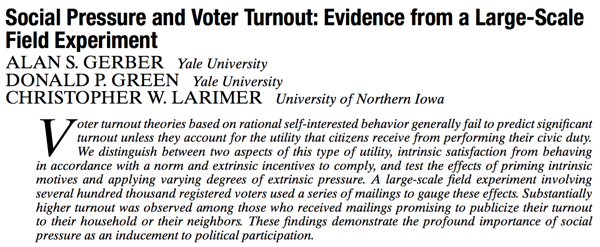
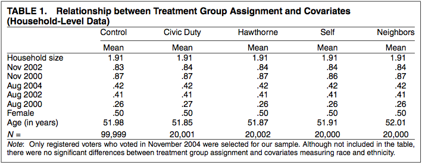
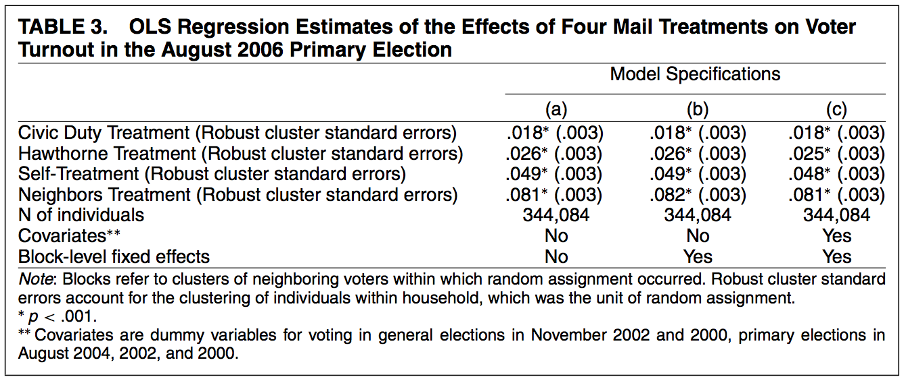

```{r load-libraries}
library(purrr)
library(tibble)
library(dplyr)
library(magrittr)
library(stringr)
library(ggplot2)
library(htmltools)
library(kableExtra)
library(scales)

percent = label_percent(accuracy=1)
approx  = function(x,accuracy=.01) { label_number(accuracy=accuracy, scale_cut=cut_short_scale())(x) }
```

```{r ggplot-themes}
fontsize = 16
textcolor = "#888888"

class.theme = theme(plot.background = element_rect(fill = "transparent", colour = NA),
        panel.background = element_rect(fill = "transparent", colour = NA),
                    legend.background = element_rect(fill="transparent", colour = NA),
                    legend.box.background = element_rect(fill="transparent", colour = NA),
                    legend.key = element_rect(fill="transparent", colour = NA),
        axis.ticks.x = element_blank(),
        axis.ticks.y = element_blank(),
        axis.text.x  = element_text(colour = textcolor, size=fontsize),
        axis.text.y  = element_text(colour = textcolor, size=fontsize),
        axis.title.x  = element_text(colour = textcolor),
        axis.title.y  = element_text(colour = textcolor, angle=90)
)

theme_set(class.theme)
theme_update(axis.title.x  = element_blank(),
             axis.title.y  = element_blank())
simplified.theme = theme_get()

theme_update(axis.text.x   = element_blank(), 
              axis.text.y   = element_blank())
blank.theme = theme_get()

theme_update(panel.grid.major=element_line(color=rgb(1,0,0,.1,  maxColorValue=1)),
           panel.grid.minor=element_line(color=rgb(0,1,0,.1, maxColorValue=1)))
grid.theme = theme_get()

theme_set(simplified.theme)
```


```{r table-styling}
ellipsis <- function(df, nhead=5L, ntail=2) {
    rownames(df) = as.character(1:nrow(df))
    stopifnot("data.frame" %in% class(df))
    els <- rep(NA, ncol(df)) %>% 
        matrix(nrow=1, dimnames=list(NULL, names(df))) %>% 
        data.frame(stringsAsFactors=FALSE) %>% 
        tibble::as_tibble()
    rownames(els) = "⋮"
    dplyr::bind_rows(head(df, nhead), els, tail(df, ntail))
}
```

## Today

::: {.hidden}
$$
\newcommand{\alert}[1]{\textcolor{red}{#1}}
\newcommand{\model}{\mathcal{M}}
\newcommand{\R}{\mathbb{R}}
\DeclareMathOperator{\E}{E}
\DeclareMathOperator*{\argmin}{argmin}
\DeclareMathOperator{\V}{V}
\DeclareMathOperator{\Var}{\V}
\newcommand{\inred}[1]{\textcolor{red}{#1}}
\newcommand{\inblue}[1]{\textcolor{blue}{#1}}
$$ 
:::

- We'll talk about the mechanics of least squares regression with multiple covariates.
- We'll use two common linear models, focusing on *descriptive analysis*. No populations today.
- Here's an Outline
  - Introductory Exercises
  - The Additive Model
  - The Fully-Interactive Model
  - Omitted Variable Bias

# Introductory Exercises

## Exercise 1: One Regression Line


- Here's a plot of some data with binary $X$ and $Y$. We've jittered the points a little.
- **Exercise**. Draw the least squares regression line. What's the slope?
- Hint. What are the means of the  X=1 and X=0 subsamples? What does this tell us?

## Exercise 1: Solution


- The slope is $1/3$ ($2/6$). 
- The line goes through the subsample means:
$2/6$ on the left and $4/6$ on the right.
- So it rises by $4/6-2/6=2/6$ as it runs a distance of $1-0=1$.

## Exercise 2: Two Regression Lines


- Let's add a second binary covariate $Z \in \{a,b\}$. We'll choose Z. We'll label each point either $a$ or $b$.
- Then we'll draw two regression lines: one each for the $Z=a$ and $Z=b$ subsamples.
- **Exercise** Try labeling the points so that the slopes of both lines are zero. Then draw the lines.

## Exercise 2: Solution


## Exercise 3: Three Regression Lines

- Now let's make our covariate $Z$ three-valued: $Z \in \{a,b,c\}$.
- We'll relabel our points and draw a line for each of our 3 $Z=x$ subsamples.
- **Exercise** Try labeling the points so that we get ...
  - two lines with zero slope
  - one line with downward slope

## Exercise 3: Solution


- Let's think about the *average slope* here. 
- There are two averages we might think of...
  - The simple unweighted average, $\frac{1}{3}\sum_z \text{slope}_z$
  - The subsample-size weighted average, $\sum_z P_z \text{slope}_z$ for $P_z=N_z/N$.
- Both are negative. And that's interesting---when we drew one line ignoring $z$, the slope was positive.

## Lesson


- The *ignore-z slope* is not necessarily similar to the *average-z slope*.
- This has huge implications. People often get confused because they mean one and use the other.
- We'll explore this in some examples soon. Any questions now?

## Working With More Than One Covariate

- Often we want to work with subsamples defined in terms of multiple covariates.
- As with continuous conditioning variables, there are many ways to do this.
- And as with continuous conditioning variables, the choice matters: misspecification leads to big problems inferentially.
- Today we will look at two common approaches to modeling data with two covariates.

$$
\begin{aligned}
m(x,z) &= \beta_0 + \beta_1 x + \beta_2 z  && \text{ additive } \\
m(x,z) &= \beta_0 + \beta_1 x + \beta_2 z + \textcolor{blue}{\beta_{3} xz} && \text{ fully-interacted }
\end{aligned}
$$

- In the *additive model*, the influences of each covariate add together. 
  - This is essentially never how our covariates influence our outcome in reality.
  - So this model is essentially always misspecified. 
- In *fully-interacted model*, the influence of one covariate depends on the value of the other. 
  - The [interaction term]{.fg style="color:blue"} captures this dependence.
  - This isn't misspecified when our covariates are binary. It'll go through the 4 subsample means.
- When we have more than two covariates, these are the extremes---there are models somewhere in between.

## Function vs. Coefficient-Oriented Interpretations

- There are two ways to think about what you're doing when you do regression.
- I have a strong preference for one of them. But I'll try to give you both perspectives.
- You'll need both to be able to understand what other people are saying.
- I tend to translate into my preferred interpretation before doing anything else.

:::: columns
::: column
### The Selecting-A-Curve Interpretation

$$
\begin{aligned}
\hat\mu &= \argmin_{m \in \model} \sum_{i=1}^n \qty{m(X_i,Z_i) - Y_i}^2 \qqtext{where} \\
\model &= \qty{m(x,z) = \beta_0 + \beta_1 x + \beta_2 z : \beta \in \R^3}
\end{aligned}
$$

- We think about choosing the curve that fits best from a set of curves.
- We call this set of curves our **regression model**.
- We can then use that curve to ...
  - make predictions $\hat\mu(x,z)$, just like we've used subsample means.
  - summarize predictions at multiple values of $x$ and $z$. 
    - e.g. average treatment effects.

:::

::: column
### The Finding-Coefficients Interpretation

$$
\begin{aligned}
\hat\mu(x,z) &= \hat\beta_0 + \hat\beta_1 x + \hat\beta_2 z  \qqtext{where} \\
\hat\beta &= \argmin_{b \in \R^3}\sum_{i=1}^n \qty{b_0 + b_1 X_i + b_2 Z_i - Y_i}^2 
\end{aligned}
$$

- We think about the coefficients that give you the best-fit.
- If you use the same model, it is, of course, the same curve. 
- You can do the same things with it, but when you think this way ...
- You tend to focus on **interpreting the coefficients**. 
- These are the summaries you wind up talking about.
  - This can be very confusing.
  - The coefficient of $x$ (or $z$) means different things in different models.


:::
::::


# The Additive Model

- There are really two ways 


## One Binary and One Continuous Conditioning Variable


- When we have 
## One Binary and One Continuous Conditioning Variable


## One Binary and One Continuous Conditioning Variable


## Regression Plane


## Misspecification Activity

Draw the two regression lines (i.e., edges of the regression plane) implied by 
$$
\hat{y} = B_0 + B_1 x + B_2 z
$$

:::: r-stack
::: {.fragment .fade-out data-fragment-index="0"}

:::
::: {.fragment .current-visible data-fragment-index="0"}

:::
::::

## Regression Plane for Two Continuous Conditioning Variables


## Descriptive Interpretation of Additive Regression

$$ m(scscore, dem) = b_0 + b_1 \ \text{scscore} + b_2 \text{dem} $$


## Recall: Simple Regression with SCscore

$$ m(scscore, dem) = b_0 + b_1 \ \text{scscore} $$


## Recall: Simple Regression with Party

$$ m(scscore, dem) = b_0 + b_1 \ \text{dem} $$


## Descriptive Interpretation of Additive Regression

$$ m(scscore, dem) = b_0 + b_1 \ \text{scscore} + b_2 \text{dem} $$


## Descriptive Interpretation of Additive Regression

$$ m(scscore, dem) = b_0 + b_1 \ \text{scscore} + b_2 \text{dem} $$


## Recall: Simple Regression with SCscore

$$ m(scscore, dem) = b_0 + b_1 \ \text{scscore} $$


## Recall: Simple Regression with Party

$$ m(scscore, dem) = b_0 + b_1 \ \text{dem} $$


## Descriptive Interpretation of Additive Regression

$$ m(scscore, dem) = b_0 + b_1 \ \text{scscore} + b_2 \text{dem} $$


## Predictions Using Additive Models

$$ m(scscore, dem) = b_0 + b_1 \ \text{scscore} + b_2 \text{dem} $$

- The predicted outcomes for Republican and Democrat-appointed justices with zero SCscore.
$$ \hat\mu(0,0) = \hat\beta_0 \qand \hat\mu(0,1) = \hat\beta_0 + \hat\beta_2$$

- The predicted difference in outcomes between Democrat and Republican-appointed justices at $SCscore=s$.
$$ 
\hat \mu(s,1) - \hat \mu(s,0) = \qty(\hat\beta_0 + \hat\beta_1 s + \hat\beta_2) - \qty(\hat\beta_0 + \hat\beta_1 s) = \hat\beta_2 \qqtext{ for any } s.
$$

- What is this? And what's weird about it?
$$ \hat\mu(s+1,z)-\hat\mu(s,z)=\hat\beta_1 $$

::: fragment

- It's the predicted difference in outcomes between justices 
  - appointed by the same party (either)
  - and with SCscore $s$ and $s+1$ (for any $s$)
- You might think this should depend on party and $s$, but the model rules out that possibility.

:::
  

# Interactive Multiple Linear Regression


##  Multiple Regression with an Interaction


## Descriptive Interpretation of Interaction Model
$$\widehat{Fedlib}_i = B_0 + B_1 \cdot SCscore_i + B_2 \cdot Dem_i + B_3 \cdot SCscore_i \cdot Dem_i$$


## Descriptive Interpretation of Interaction Model
$$\widehat{Fedlib}_i = B_0 + B_1 \cdot SCscore_i + B_2 \cdot Dem_i + B_3 \cdot SCscore_i \cdot Dem_i$$


## Descriptive Interpretation of Interaction Model
$$\widehat{Fedlib}_i = B_0 + B_1 \cdot SCscore_i + B_2 \cdot Dem_i + B_3 \cdot SCscore_i \cdot Dem_i$$


## Descriptive Interpretation of Interaction Model
$$\widehat{Fedlib}_i = B_0 + B_1 \cdot SCscore_i + B_2 \cdot Dem_i + B_3 \cdot SCscore_i \cdot Dem_i$$


## Interactive Interpretations

- $B_0$: Mean outcome for a Rep justice with a zero SCscore.
- $B_1$: Mean difference in outcomes between justices appointed by Republicans, but with a one unit difference in SCscore.
- $B_0 + B_2$:  Mean outcome for a Dem justice with a zero SCscore.
- $B_2$: Mean difference in outcomes between justices with a zero SCscore, but appointed by different parties (Dem minus Rep).
- $B_1+ B_3$:  Mean difference in outcomes between Dem justices with a one unit difference in SCscore.
- $B_3$: Mean difference between the mean difference in outcomes between Dem justices with a one unit difference in SCscore and the mean difference in outcomes between Rep justices with a one unit difference in SCscore.


## Summary Activity


## Summary Activity


## Summary Activity


## Summary Activity


## Summary Activity


# Omitted Variable Bias: Adding/Removing Covariates in the Additive Model

## Multiple Regression with 2 Conditioning Variables

## Residuals and covariates uncorrelated


\begin{align*}
\frac{\partial SSR}{\partial \tilde{B}_1} &=  - \sum_{i=1}^N 2e_i \cdot x_i \\
\frac{\partial SSR}{\partial \tilde{B}_2} &=  - \sum_{i=1}^N 2 e_i\cdot z_i
\end{align*}

We set both equal to zero when solving. 


## 

Suppose we want $B_1$ from $y_i=B_{0}+B_{1}x_{i}+B_{2}z_{i}+e_i$, but we run the regression of $y$ on $x$ alone. Then,


#  The Social Pressure Experiment



## The Civic Duty Treatment


## The Hawthorne Treatment


## The Self Treatment


## The Neighbors Treatment


## Balance on Pre-treatment Variables



## Including Covariates 


