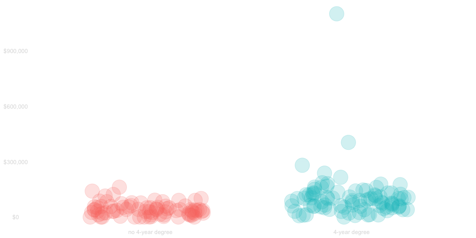
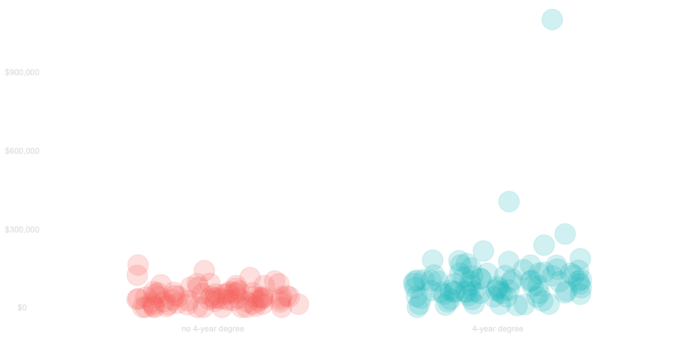
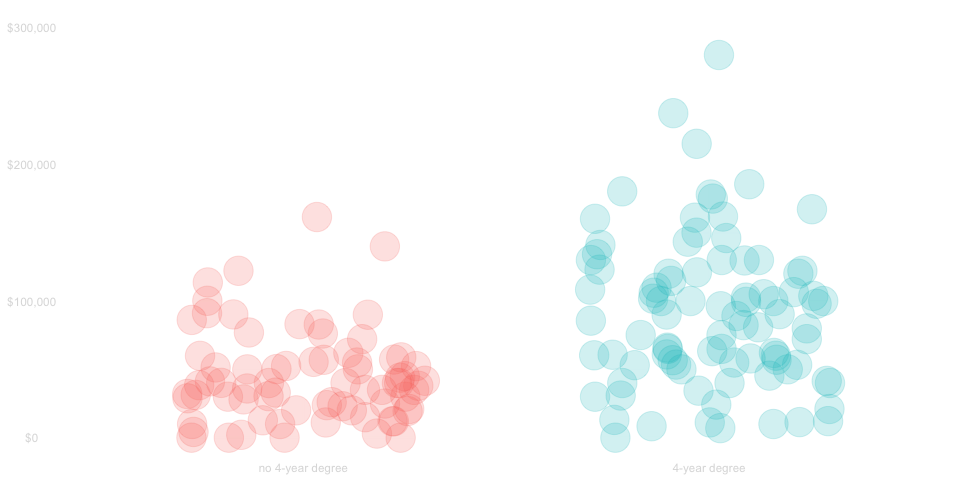
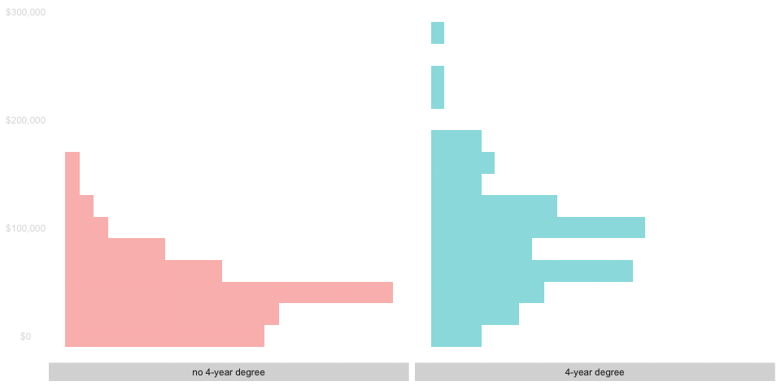
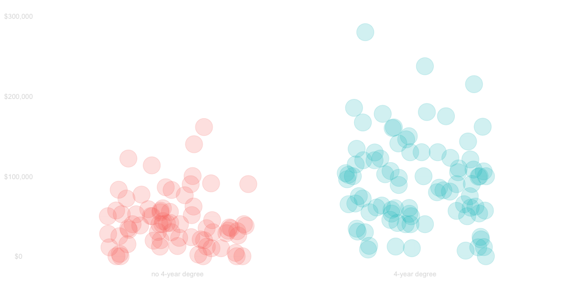
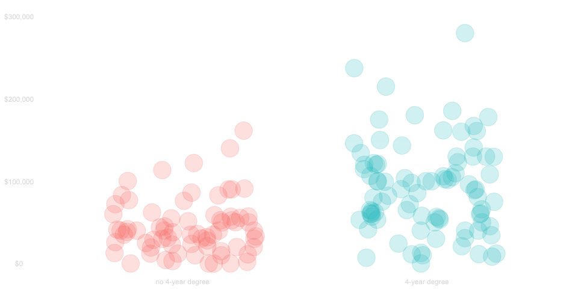
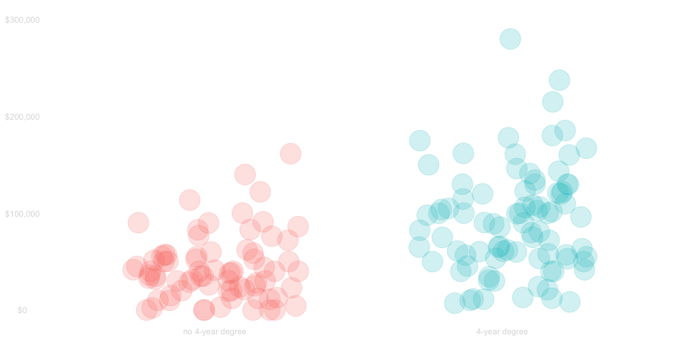
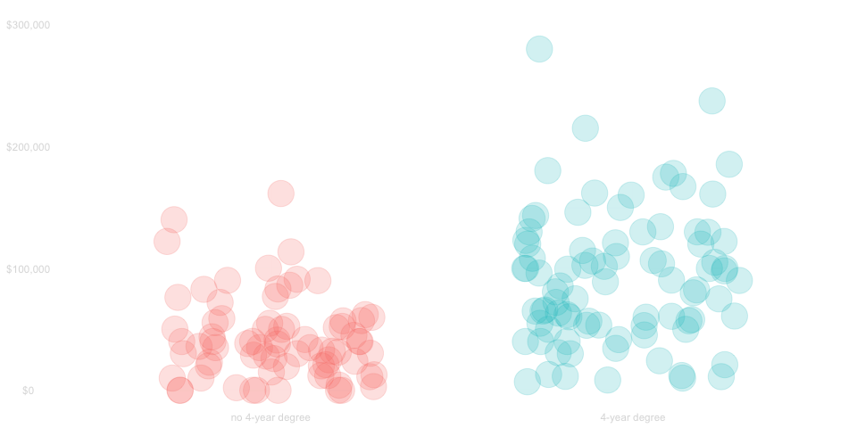
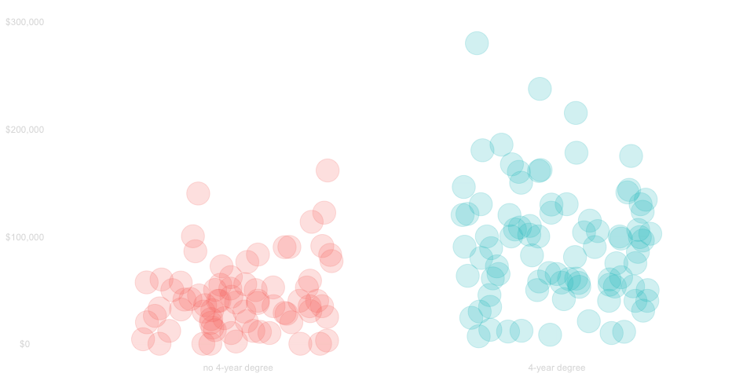
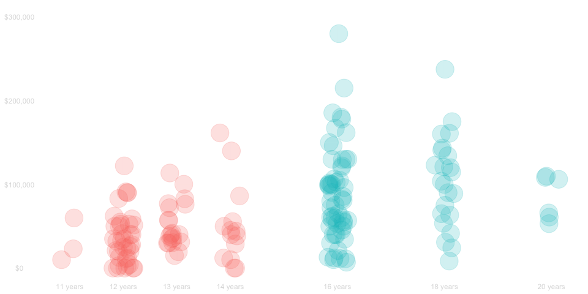

::: {.cell hash='lecture5-AKC_cache/revealjs/setup_0621afd8b608f612abc3feacd01eb370'}

:::

::: {.cell hash='lecture5-AKC_cache/revealjs/data-setup_71600be3103ea96eed403b49fd27762b'}

:::

::: {.cell hash='lecture5-AKC_cache/revealjs/unnamed-chunk-1_a2486487741e4873c060a6d56d22ae16'}

:::


## Overview
- Today, we'll work with data from the 2022 Current Population Survey.
- We'll look at the relationship between income and education.
- We've already compared people  [with]{.twocolor-green} and [without]{.twocolor-red} 4-year degrees.
- That's a way of summarizing what we see in the data based on a *binary covariate*
$$ 
X_i = \begin{cases} 
  1 & \text{ if } \ \text{person}_i \ \text{has a 4-year degree} \\
  0 & \text{ otherwise }
  \end{cases}
$$
- Today, we'll talk about summaries based on *non-binary covariates*
    - e.g.,  the years of education they have
    - e.g.,  the size of the city they live in
- We're going to be generalizing a lot of ideas and techniques we used with binary ones.
- We'll start with a thorough review to get you thinking about them in a way that generalizes.

# Review 

## Sampling Scheme

:::: columns

::: column
### The Sample
We'll look at the survey recipients who

  - were California residents 
  - between 25 and 35
  - who lived alone

This sample includes 166 people.
:::

::: column
### The finite population
It's approximately correct to think of them as  

- being chosen randomly
- with equal probability
- from the set of all people meeting these criteria

There are a lot of people like this. \
Roughly 2500 times that many.
:::
::::

A Picture

 - Left: Some dots in California
 - Right: More dots in California, some colored the same way as the left ones

Arrow right to left


## An infinite-population approximation

We can think of the people in our finite population as a large number of independent draws

  - from an infinite population of people 
  - meeting those critera
  - that *could exist*. 

That's an approximation, but it makes our life simple. \
It implies the people in our sample are drawn the same way the same population.

A Picture

 - Left: Some dots in California
 - Right: More dots in California, some colored the same way as the left ones
 - Below: Some kind of population heat map of california. 

Arrows 

- right to left (the finite pop version)
- below to both (commutative diagram)

## Subsamples and Subpopulations
TODO

## Comparing incomes by eyeballing a table

::: {.hidden}
$$
\DeclareMathOperator{\E}{E}
\DeclareMathOperator{\Var}{Var}
\require{color}
\definecolor{twocolor-red}{HTML}{F8766D}    % red   used by ggplot in plots w/ 2 colors 
\definecolor{twocolor-green}{HTML}{00BFC4}  % green used by ggplot in plots w/ 2 colors
$$ 

::: {.cell hash='lecture5-AKC_cache/revealjs/unnamed-chunk-2_8e3784c7c4140e89c00f683960f511e7'}

:::

:::

:::: columns

::: column


::: {.cell hash='lecture5-AKC_cache/revealjs/unnamed-chunk-3_d27b1f17baf9449c4f99a0a30a86fe9e'}
::: {.cell-output-display}
`````{=html}
<table class="table" style="margin-left: auto; margin-right: auto;">
 <thead>
  <tr>
   <th style="text-align:left;">   </th>
   <th style="text-align:left;"> income </th>
   <th style="text-align:left;"> degree </th>
  </tr>
 </thead>
<tbody>
  <tr>
   <td style="text-align:left;background-color: #00BFC4 !important;"> 68 </td>
   <td style="text-align:left;background-color: #00BFC4 !important;"> $100k </td>
   <td style="text-align:left;background-color: #00BFC4 !important;"> 4-year degree </td>
  </tr>
  <tr>
   <td style="text-align:left;background-color: #00BFC4 !important;"> 129 </td>
   <td style="text-align:left;background-color: #00BFC4 !important;"> $30k </td>
   <td style="text-align:left;background-color: #00BFC4 !important;"> 4-year degree </td>
  </tr>
  <tr>
   <td style="text-align:left;background-color: #00BFC4 !important;"> 162 </td>
   <td style="text-align:left;background-color: #00BFC4 !important;"> $58k </td>
   <td style="text-align:left;background-color: #00BFC4 !important;"> 4-year degree </td>
  </tr>
  <tr>
   <td style="text-align:left;background-color: #00BFC4 !important;"> 43 </td>
   <td style="text-align:left;background-color: #00BFC4 !important;"> $105k </td>
   <td style="text-align:left;background-color: #00BFC4 !important;"> 4-year degree </td>
  </tr>
  <tr>
   <td style="text-align:left;background-color: #F8766D !important;"> 14 </td>
   <td style="text-align:left;background-color: #F8766D !important;"> $59k </td>
   <td style="text-align:left;background-color: #F8766D !important;"> no 4-year degree </td>
  </tr>
  <tr>
   <td style="text-align:left;background-color: #F8766D !important;"> 51 </td>
   <td style="text-align:left;background-color: #F8766D !important;"> $36k </td>
   <td style="text-align:left;background-color: #F8766D !important;"> no 4-year degree </td>
  </tr>
  <tr>
   <td style="text-align:left;background-color: #F8766D !important;"> 85 </td>
   <td style="text-align:left;background-color: #F8766D !important;"> $23k </td>
   <td style="text-align:left;background-color: #F8766D !important;"> no 4-year degree </td>
  </tr>
  <tr>
   <td style="text-align:left;background-color: #00BFC4 !important;"> 21 </td>
   <td style="text-align:left;background-color: #00BFC4 !important;"> $86k </td>
   <td style="text-align:left;background-color: #00BFC4 !important;"> 4-year degree </td>
  </tr>
  <tr>
   <td style="text-align:left;background-color: #F8766D !important;"> 106 </td>
   <td style="text-align:left;background-color: #F8766D !important;"> $15k </td>
   <td style="text-align:left;background-color: #F8766D !important;"> no 4-year degree </td>
  </tr>
  <tr>
   <td style="text-align:left;background-color: #00BFC4 !important;"> 74 </td>
   <td style="text-align:left;background-color: #00BFC4 !important;"> $107k </td>
   <td style="text-align:left;background-color: #00BFC4 !important;"> 4-year degree </td>
  </tr>
  <tr>
   <td style="text-align:left;background-color: #00BFC4 !important;"> 7 </td>
   <td style="text-align:left;background-color: #00BFC4 !important;"> $102k </td>
   <td style="text-align:left;background-color: #00BFC4 !important;"> 4-year degree </td>
  </tr>
  <tr>
   <td style="text-align:left;background-color: #00BFC4 !important;"> 73 </td>
   <td style="text-align:left;background-color: #00BFC4 !important;"> $13k </td>
   <td style="text-align:left;background-color: #00BFC4 !important;"> 4-year degree </td>
  </tr>
</tbody>
</table>

`````
:::
:::

::: 

::: column

- A table including all 166 people in our sample would be big.
- It'd be hard to look at it all at once, but we can look at a small part of it.
- I'm showing  randomly-chosen people on the left. 


What does this table tell us about who makes more?  \
Is it people people [with]{.twocolor-green} or [without]{.twocolor-red} four year degrees?

::: fragment
- Most [with]{.twocolor-green} 4-year degrees make more than most [without]{.twocolor-red}. 
- But not all of them. 


We can get an idea of what's going on by looking at the table, \
but it helps to use other visualizations that let us look at all the data.
:::

:::

::::


## Comparing Incomes using a Scatter Plot

:::: {.r-stack }

::: {.fragment .fade-out data-fragment-index="0"}

::: {.cell hash='lecture5-AKC_cache/revealjs/unnamed-chunk-4_85dc76c9f2f775ac0d93c50863acfe58'}
::: {.cell-output-display}

:::
:::


- Here I've plotted one dot per person. 
- There's lot of people, so the dots are all lying on top of one another. 
- You can see what most people make by looking for a dark band.
:::

::: {.fragment .current-visible data-fragment-index="0"}

::: {.cell hash='lecture5-AKC_cache/revealjs/unnamed-chunk-5_66d0cc518c6cd236a4fb2e449032f6ef'}
::: {.cell-output-display}

:::
:::


- But you really have to look carefully to compare them.
- It's hard to see much because so little space is given to what most people make.
- We need to do that to include people who make *a lot* of money.
::: 

::: {.fragment .current-visible}

::: {.cell hash='lecture5-AKC_cache/revealjs/unnamed-chunk-6_83b9800981faf9c6f3c6b5778e4bc461'}
::: {.cell-output-display}

:::
:::


- We can see things better when we zoom in on people who make $\le \$300$k. 
- This leaves out a few millionaires, but that's mostly fine. We can do that.
- And if that's still hard to work with, we can use another visualization.
:::

::::

## Comparing incomes using a Histogram


::: {.cell hash='lecture5-AKC_cache/revealjs/unnamed-chunk-7_10c0dfe5c3ec4a32d8b40a2c60af6455'}
::: {.cell-output-display}

:::
:::


- In this histogram, the length of the bar at each income level  
  shows the fraction of people that make roughly that much.
- You can see what most people make by looking for the peak.
- Compared to the scatter plot, we've traded darkness for length.


# Review Questions

# Question 1

##

::: {.cell hash='lecture5-AKC_cache/revealjs/unnamed-chunk-8_eedaa25d683d035a6f535d08d8701b55'}
::: {.cell-output-display}

:::
:::


**Q**. Which group tends to make more money? 

::: {.fragment}
People with 4 year degrees tend to make more.
:::

# Question 2

##

::: {.cell hash='lecture5-AKC_cache/revealjs/unnamed-chunk-9_e0a153fd2b73c369bc694c065481f693'}
::: {.cell-output-display}

:::
:::


**Q**. Roughly how much more?

::: {.fragment}
 Typically \$50k more, comparing the two peaks in the histogram.
:::

# Question 3

##


::: {.cell hash='lecture5-AKC_cache/revealjs/unnamed-chunk-10_696cc8b11995ecc77c7da38f7052d827'}
::: {.cell-output-display}

:::
:::


How would we calculate the difference in **mean income** between people in our sample with and without 4-year degrees?

### Outline
::: {.fragment}
1. We calculate the mean income among the *subsample* [with]{.twocolor-green} 4-year degrees.
2. We do the same for the subsample [without]{.twocolor-red} degrees. 
3. We subtract.
:::

## Step 1


::: {.cell hash='lecture5-AKC_cache/revealjs/unnamed-chunk-11_2232b9104ca9cefaa97ff0fdc1d14680'}
::: {.cell-output-display}

:::
:::


We calculate the mean income among the *subsample* [with]{.twocolor-green} 4-year degrees.

:::: {.r-stack}

::: {.fragment .current-visible data-frame-index="1"}

We can write it out in mathematical notation.

$$
\hat\mu(\text{with}) = \frac{\sum_{i : X_i=\text{with}} Y_i }{ \sum_{i : X_i=\text{with}} 1 }
$$
:::

::: {.fragment .current-visible data-frame-index="2"}

::: {.cell hash='lecture5-AKC_cache/revealjs/unnamed-chunk-12_dc4bf0c397de3fc923524a1843ba8e99'}

:::


Writing it in *R* actually gives us an answer.


::: {.cell hash='lecture5-AKC_cache/revealjs/unnamed-chunk-13_78c68fb717f9430c015d090a87e80c0f'}

```{.r .cell-code}
mu.hat.with = mean(Y[X == '4-year degree'])
```
:::


What we get is roughly \$`{r} as.integer(round(mu.hat.with, digits=-3))`.
:::

:::: 

## Step 2 

::: {.cell hash='lecture5-AKC_cache/revealjs/unnamed-chunk-14_2f788ac3ef647def1d4f1e743a9dd378'}
::: {.cell-output-display}

:::
:::


We do the same for the subsample [without]{.twocolor-red} degrees. 

:::: {.r-stack}

::: {.fragment .current-visible data-frame-index="1"}

We can write it out in mathematical notation.

$$
\hat\mu(\text{with}) = \frac{\sum_{i : X_i=\text{without}} Y_i }{ \sum_{i : X_i=\text{without}} 1 }
$$
:::

::: {.fragment .current-visible data-frame-index="2"}

Writing it in *R* actually gives us an answer.


::: {.cell hash='lecture5-AKC_cache/revealjs/unnamed-chunk-15_dc702042937be0ff6fb0e83ffa603dab'}

```{.r .cell-code}
mu.hat.without = mean(Y[X != '4-year degree'])
```
:::


What we get is roughly \$`{r} as.integer(round(mu.hat.without, digits=-3))`.
:::

:::: 


## Step 3

::: {.cell hash='lecture5-AKC_cache/revealjs/unnamed-chunk-16_91d9a8e31f130ece7b87ac49185dfa92'}
::: {.cell-output-display}

:::
:::


We subtract.

:::: {.r-stack}

::: {.fragment .current-visible data-frame-index="1"}
Here's the math.
$$
\hat \Delta = \hat\mu(\text{with}) - \hat\mu(\text{without})  \vphantom{ \frac{\sum_{i : X_i=\text{without}} Y_i} { \sum_{i : X_i=\text{without}} 1 } }
$$
:::

::: {.fragment .current-visible data-frame-index="2"}
Here's the code.

::: {.cell hash='lecture5-AKC_cache/revealjs/unnamed-chunk-17_9cb3a1d3357c0efe930fe95cbbcdc7ff'}

```{.r .cell-code}
difference = mu.hat.with - mu.hat.without
```
:::


What we get is roughly \$`{r} as.integer(round(difference, digits=-3))`.
:::

::::

# Question 4

## 

::: {.cell hash='lecture5-AKC_cache/revealjs/unnamed-chunk-18_97591830d97b8e2bcd511db5906213c8'}
::: {.cell-output-display}

:::
:::

What *Summary of the Population* does this estimate?

::: fragment

- The difference in mean income among *subpopulations* with and without 4-year degrees. \
- That's a difference in conditional expectations.
$$
\Delta = \mu(\text{with})-\mu(\text{without}) \quad \text{ where } \quad \mu(x)=\E[Y_i \mid X_i=x]
$$
:::

# Question 5

##

$$\text{What is our estimator's bias,} \ \E \hat\Delta - \Delta ? $$

::: {.fragment }
#### It's zero. Why?
:::

$$
$$

:::: {.r-stack}

::: {.fragment .current-visible data-frame-index="2"}
#### Part of the story: subsample means are **unbiased** estimators of subpopulation means.

  - In particular, $\hat\mu(x)$ is an unbiased estiate of $\mu(x)$.
  $$
  \E\hat\mu(x)=\mu(x)
  $$
  - We proved this in Homework ? using the law of iterated expectations.
  
$$
TODO: Proof
$$

:::

::: {.fragment .current-visible data-frame-index="3"}
#### The rest: Expectation is **linear**. 

  - The expectation of a difference is the difference in expectations.
  - Subtracting unbiased estimates of our subpopulation means gives us \
    an unbiased estimate of the **difference in those subpopulation means**.
$$ 
\begin{aligned}
\E \hat\Delta 
&= \E \left\{ \hat\mu(\text{with}) - \hat\mu(\text{without}) \right\} && \text{definition} \\
&= \E \hat\mu(\text{with}) - \E \hat \mu(\text{without}) && \text{linearity} \\
&= \mu(\text{with}) - \mu(\text{without})  && \text{unbiasedness} \\
&= \Delta && \text{definition} 
\end{aligned}
$$
:::

::::

# Question 6

##

How can we approximate the *sampling distribution* of this estimator?

$$
$$

TODO: Picture of sampling dist vs approximation

### Outline 

::: fragment
1. We find normal approximations to the sampling distributions of each of our subsample means.
2. We characterize their difference as another normal distribution. 
3. We calculate its mean.
4. We calculate its variance.
:::

## Step 1

We observe that our subsample means are *approximately independent and normal* 
$$
\hat\mu(x) \approx Z_x \quad \text{ for } \quad Z_x \sim N\left( \E \hat\mu(x), \ \Var \hat\mu(x) \right)
$$
and
$$
Z_{x} \quad \text{ is independent of } \quad Z_{x'}  \quad  \text{ when } \quad x \neq x'. 
$$

They're approximately independent because our subsamples are *disjoint*, i.e., nobody is in both.


## Step 2

We'll approximate the difference in our subsample means by 
the corresponding difference of *independent normals*.
$$
\hat\mu(\text{with}) - \hat\mu(\text{without}) \approx Z_{\text{with}} - Z_{\text{without}}
$$
Then use the rule for subtracting independent normals: subtract the means; add the variances.
$$
\begin{aligned}
Z_{\text{with}} - Z_{\text{without}} &\sim  N\left( \mu_{\Delta}, \sigma^2_\Delta \right) \\
\text{ where } \quad    \mu_{\Delta} &= \E \hat\mu(\text{with})  - \E \hat\mu(\text{without}) \\
\text{ and  } \ \ \quad \sigma^2_\Delta &= \Var \hat\mu(\text{with}) + \Var \hat\mu(\text{without}) 
\end{aligned}
$$ 

## Step 3
We subtract the means, i.e., we calculate this difference. 
$$
\mu_{\Delta} = \E \hat\mu(\text{with})  - \E \hat\mu(\text{without}). 
$$
We know, from our last question, that this is the population summary we want.
$$\mu_{\Delta} = \hat\mu(\text{with})  - \hat\mu(\text{without}) = \Delta$$

## Step 4
We add the variances, i.e., we calculate this sum.
$$ 
\sigma^2_\Delta = \Var \hat\mu(\text{with}) + \Var \hat\mu(\text{without})
$$
The **variance** of each subsample mean $\hat\mu(x)$ is determined by 

1. The conditional variance of the terms in it
2. The size of the subsample.

$$ 
\sigma^2_\Delta = \frac{\Var(Y_i \mid X_i = \text{with})}{n_\text{with}} + \frac{\Var(Y_i \mid X_i = \text{without})}{n_{\text{without}}} 
$$

TODO: Do we define $n_\text{with}$ and $n_\text{with}$ properly as expectations of inverses of proportions?

## Summary.

We can approximate the sampling distribution of our estimator
by that of a *normal random variable* with the mean we want.
$$ 
\begin{aligned}
\hat\mu(\text{with}) - \hat\mu(\text{without}) &\approx Z_{\Delta} \quad \text{ for } \quad Z_{\Delta} \sim N(\Delta, \sigma^2_\Delta) \\
\text{ where } \quad \sigma^2_\Delta &= \frac{\Var(Y_i \mid X_i = \text{with})}{n_\text{with}} + \frac{\Var(Y_i \mid X_i = \text{without})}{n_{\text{without}}}
\end{aligned}
$$


# Question 7

##
How can we use this to calculate a 95\% confidence interval for this summary $\Delta$?

$$ $$

### Outline
::: fragment

1. We transform our estimate into a *pivot*: a random variable with an known sampling distribution.
2. We choose an interval that contains the pivot with 95\% probability.
3. We invert our transformation to get an interval for our estimate.

TODO: Fix up to deal with approximate pivots.
:::


## Step 1
t-stat calculation + picture of std normal reference distn

## Step 2
formula + picture of interval in reference distribution

## Step 3
formula + picture of transformed reference distributon

## Summary
something

# Beyond Binary Comparisons

## 
- Using two categories is throwing away a lot of information about education. \
- We can, for example, categorize people by the **years of education** they've had. 


::: {.cell hash='lecture5-AKC_cache/revealjs/unnamed-chunk-19_212e6e440172ec7cae35277f9307342f'}
::: {.cell-output-display}

:::
:::


:::: {.r-stack}

::: {.fragment .current-visible data-frame-index="0"}
### We haven't lost anything.

- You have a four year degree if, and only if, you have $12+4=6$ years of education.
- Thinking visually, we can get the plot we had before by shuffling the red and green dots.
- This means we can still see how much more people with 4 year degrees make.
- But not shuffling lets us see some new stuff, too. 

### What else is there to see?
:::

::: {.fragment .current-visible data-frame-index="1"}

### In visual terms
$$
$$

### Meaning 
$$
$$

:::

::: {.fragment .current-visible data-frame-index="2"}

### One thing I see
The centers of our subsamples are going up as we move to the right.

### Meaning

Even among people with (and without) a 4-year degree, \
people with more education tend to make more money.

:::

::::

## Including Years of Education
- This does, of course, require that our survey asks about years of education. 
- And it does, more or less, so we can make a table like this.


::: {.cell hash='lecture5-AKC_cache/revealjs/unnamed-chunk-20_ea2863df31d92166fadbe752f2178c6e'}
::: {.cell-output-display}
`````{=html}
<table class="table" style="margin-left: auto; margin-right: auto;">
 <thead>
  <tr>
   <th style="text-align:left;">   </th>
   <th style="text-align:left;"> income </th>
   <th style="text-align:left;"> degree </th>
   <th style="text-align:left;"> education </th>
  </tr>
 </thead>
<tbody>
  <tr>
   <td style="text-align:left;background-color: #00BFC4 !important;"> 68 </td>
   <td style="text-align:left;background-color: #00BFC4 !important;"> $100k </td>
   <td style="text-align:left;background-color: #00BFC4 !important;"> 4-year degree </td>
   <td style="text-align:left;background-color: #00BFC4 !important;"> 16 years </td>
  </tr>
  <tr>
   <td style="text-align:left;background-color: #00BFC4 !important;"> 129 </td>
   <td style="text-align:left;background-color: #00BFC4 !important;"> $30k </td>
   <td style="text-align:left;background-color: #00BFC4 !important;"> 4-year degree </td>
   <td style="text-align:left;background-color: #00BFC4 !important;"> 16 years </td>
  </tr>
  <tr>
   <td style="text-align:left;background-color: #00BFC4 !important;"> 162 </td>
   <td style="text-align:left;background-color: #00BFC4 !important;"> $58k </td>
   <td style="text-align:left;background-color: #00BFC4 !important;"> 4-year degree </td>
   <td style="text-align:left;background-color: #00BFC4 !important;"> 16 years </td>
  </tr>
  <tr>
   <td style="text-align:left;background-color: #00BFC4 !important;"> 43 </td>
   <td style="text-align:left;background-color: #00BFC4 !important;"> $105k </td>
   <td style="text-align:left;background-color: #00BFC4 !important;"> 4-year degree </td>
   <td style="text-align:left;background-color: #00BFC4 !important;"> 16 years </td>
  </tr>
  <tr>
   <td style="text-align:left;background-color: #F8766D !important;"> 14 </td>
   <td style="text-align:left;background-color: #F8766D !important;"> $59k </td>
   <td style="text-align:left;background-color: #F8766D !important;"> no 4-year degree </td>
   <td style="text-align:left;background-color: #F8766D !important;"> 12 years </td>
  </tr>
  <tr>
   <td style="text-align:left;background-color: #F8766D !important;"> 51 </td>
   <td style="text-align:left;background-color: #F8766D !important;"> $36k </td>
   <td style="text-align:left;background-color: #F8766D !important;"> no 4-year degree </td>
   <td style="text-align:left;background-color: #F8766D !important;"> 13 years </td>
  </tr>
  <tr>
   <td style="text-align:left;background-color: #F8766D !important;"> 85 </td>
   <td style="text-align:left;background-color: #F8766D !important;"> $23k </td>
   <td style="text-align:left;background-color: #F8766D !important;"> no 4-year degree </td>
   <td style="text-align:left;background-color: #F8766D !important;"> 11 years </td>
  </tr>
  <tr>
   <td style="text-align:left;background-color: #00BFC4 !important;"> 21 </td>
   <td style="text-align:left;background-color: #00BFC4 !important;"> $86k </td>
   <td style="text-align:left;background-color: #00BFC4 !important;"> 4-year degree </td>
   <td style="text-align:left;background-color: #00BFC4 !important;"> 16 years </td>
  </tr>
  <tr>
   <td style="text-align:left;background-color: #F8766D !important;"> 106 </td>
   <td style="text-align:left;background-color: #F8766D !important;"> $15k </td>
   <td style="text-align:left;background-color: #F8766D !important;"> no 4-year degree </td>
   <td style="text-align:left;background-color: #F8766D !important;"> 13 years </td>
  </tr>
  <tr>
   <td style="text-align:left;background-color: #00BFC4 !important;"> 74 </td>
   <td style="text-align:left;background-color: #00BFC4 !important;"> $107k </td>
   <td style="text-align:left;background-color: #00BFC4 !important;"> 4-year degree </td>
   <td style="text-align:left;background-color: #00BFC4 !important;"> 16 years </td>
  </tr>
  <tr>
   <td style="text-align:left;background-color: #00BFC4 !important;"> 7 </td>
   <td style="text-align:left;background-color: #00BFC4 !important;"> $102k </td>
   <td style="text-align:left;background-color: #00BFC4 !important;"> 4-year degree </td>
   <td style="text-align:left;background-color: #00BFC4 !important;"> 16 years </td>
  </tr>
  <tr>
   <td style="text-align:left;background-color: #00BFC4 !important;"> 73 </td>
   <td style="text-align:left;background-color: #00BFC4 !important;"> $13k </td>
   <td style="text-align:left;background-color: #00BFC4 !important;"> 4-year degree </td>
   <td style="text-align:left;background-color: #00BFC4 !important;"> 16 years </td>
  </tr>
</tbody>
</table>

`````
:::
:::

- The survey doesn't ask exactly this *how many years* question.
- It takes a little pre-processing to get this.

## Pre-processing


::: {.cell hash='lecture5-AKC_cache/revealjs/unnamed-chunk-21_adf52ad5d3c9a381ea33fdb18ff96906'}

```{.r .cell-code}
education=case_match(cps.data$a_hga,
                          0  ~ 0,   # child
                          31 ~ 0,   # < grade 1
                          32 ~ 4,   #  grade 1-4
                          33 ~ 6,   #  grade 5-6
                          34 ~ 8,   #  grade 7-8 
                          35 ~ 9,   #  grade 9
                          36 ~ 10,  #  grade 10
                          37 ~ 11,  #  grade 11
                          38 ~ 11,  #  grade 12 no diploma
                          39 ~ 12,  #  high school grad
                          40 ~ 13,  #  some college
                          41 ~ 14,  #  associate degree (vocational)
                          42 ~ 14,  #  associate degree (academic)
                          43 ~ 16,  #  bachelors degree
                          44 ~ 18,  #  masters degree
                          45 ~ 20,  #  professional school degree
                          46 ~ 20)  #  doctorate
```
:::


- We've had to make a few things up in translation.
  - There's no differentiation between a 1 or 2-year masters; we assume 2.
  - We're assuming professional and doctoral degrees take 4 years; that's approximate.
  - Nobody has 17 or 19 years in our plots; that's why.
- That's part of data analysis. 
- Ultimately, you'll want to be careful about quirks introduced by translation.
- But it's easier to pretend we've really measured years of education. Let's do that to start.

## Subsamples and Subpopulations
New def of covariate, new def of conditional mean.

## Exercise 1
Calculate old subpop means using new ones
## Exercise 2
Calculate old subsample means using new ones

## New Questions

1. What's the typical difference in income between people with *exactly* 16 years of education
   and *exactly* 12?
    - This is a different question than the one we addressed in review, but it has a similar structure.
    - We want a summary of income differences in two groups. Those can be subsamples or subpopulations.
    - We can calculate and relate these summaries exactly like we did in review.
2. What's the typical difference in income between people with 4-year degrees and people without them?
    - That's exactly the question we talked about in review.
    - We'll talk about how to calculate it a different way that'll generalize better to other questions.
    - We can check our work. Obviously our answers should be exactly the same as we got earlier.
3. How much change would we expect in a similar population in which people tend to get an additional year of education?
    - This is a question unlike the ones we talked about earlier.
    - We'll need to be a bit careful about what we mean.
    - But once we've gotten there, we can base our calculations on the ones we did in the last question.

## Most of the Remainder
We'll answer the questions

## Hopefully this fits at the end
- We'll explain why we might need an unsaturated model and how that results in bias.
- We'll imagine a reality in which we know whether there are 1 or 2 year masters degrees
  and think of the bias associated with grouping them for Question 3.

